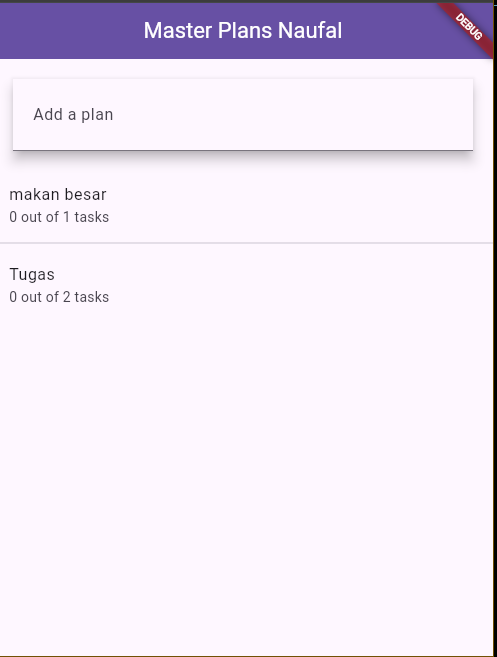

# PEMROGRAMAN DART - WEEK 10 - PRAKTIKUM

**Nama  :** Ahmad Naufal Ilham  
**NIM   :** 2341720047  
**Absen :** 04  

# Tugas Praktikum 1
# Soal 1
Selesaikan langkah-langkah praktikum tersebut, lalu dokumentasikan berupa GIF hasil akhir praktikum beserta penjelasannya di file README.md! Jika Anda menemukan ada yang error atau tidak berjalan dengan baik, silakan diperbaiki.

**Langkah 1** 

Buatlah sebuah project flutter baru dengan nama master_plan di folder src week-10 repository GitHub Anda atau sesuai style laporan praktikum yang telah disepakati. Lalu buatlah susunan folder dalam project seperti gambar berikut ini.


**Langkah 2** 

Praktik terbaik untuk memulai adalah pada lapisan data (data layer). Ini akan memberi Anda gambaran yang jelas tentang aplikasi Anda, tanpa masuk ke detail antarmuka pengguna Anda. Di folder model, buat file bernama task.dart dan buat class Task. Class ini memiliki atribut description dengan tipe data String dan complete dengan tipe data Boolean, serta ada konstruktor. Kelas ini akan menyimpan data tugas untuk aplikasi kita. Tambahkan kode berikut:
``` dart
class Task {
  final String description;
  final bool complete;

  const Task({this.complete = false, this.description = ''});
}
```

**Langkah 3** 

Kita juga perlu sebuah List untuk menyimpan daftar rencana dalam aplikasi to-do ini. Buat file plan.dart di dalam folder models dan isi kode seperti berikut.
``` dart
import 'task.dart';

class Plan {
  final String name;
  final List<Task> tasks;

  const Plan({this.name = '', this.tasks = const []});
}
```

**Langkah 4** 

Kita dapat membungkus beberapa data layer ke dalam sebuah file yang nanti akan mengekspor kedua model tersebut. Dengan begitu, proses impor akan lebih ringkas seiring berkembangnya aplikasi. Buat file bernama data_layer.dart di folder models. Kodenya hanya berisi export seperti berikut.
``` dart
export 'plan.dart';
export 'task.dart';
```

**Langkah 5** 

Ubah isi kode main.dart sebagai berikut.
``` dart
import 'package:flutter/material.dart';
import './views/plan_screen.dart';

void main() => runApp(MasterPlanApp());

class MasterPlanApp extends StatelessWidget {
  const MasterPlanApp({super.key});

  @override
  Widget build(BuildContext context) {
    return MaterialApp(
      theme: ThemeData(primarySwatch: Colors.purple),
      home: PlanScreen(),
    );
  }
}
```

**Langkah 6** 

Pada folder views, buatlah sebuah file plan_screen.dart dan gunakan templat StatefulWidget untuk membuat class PlanScreen. Isi kodenya adalah sebagai berikut. Gantilah teks ‘Namaku' dengan nama panggilan Anda pada title AppBar.
``` dart
import '../models/data_layer.dart';
import 'package:flutter/material.dart';

class PlanScreen extends StatefulWidget {
  const PlanScreen({super.key});

  @override
  State createState() => _PlanScreenState();
}

class _PlanScreenState extends State<PlanScreen> {
  Plan plan = const Plan();

  @override
  Widget build(BuildContext context) {
    return Scaffold(
      appBar: AppBar(title: const Text('Master Plan Naufal')),
      body: _buildList(),
      floatingActionButton: _buildAddTaskButton(),
    );
  }
}
```

**Langkah 7** 

Anda akan melihat beberapa error di langkah 6, karena method yang belum dibuat. Ayo kita buat mulai dari yang paling mudah yaitu tombol Tambah Rencana. Tambah kode berikut di bawah method build di dalam class _PlanScreenState.
``` dart
Widget _buildAddTaskButton() {
  return FloatingActionButton(
    child: const Icon(Icons.add),
    onPressed: () {
      setState(() {
        plan = Plan(
          name: plan.name,
          tasks: List<Task>.from(plan.tasks)..add(const Task()),
        );
      });
    },
  );
}
```

**Langkah 8** 

Kita akan buat widget berupa List yang dapat dilakukan scroll, yaitu ListView.builder. Buat widget ListView seperti kode berikut ini.
``` dart
Widget _buildList() {
  return ListView.builder(
    itemCount: plan.tasks.length,
    itemBuilder: (context, index) => _buildTaskTile(plan.tasks[index], index),
  );
}
```

**Langkah 9** 

Dari langkah 8, kita butuh ListTile untuk menampilkan setiap nilai dari plan.tasks. Kita buat dinamis untuk setiap index data, sehingga membuat view menjadi lebih mudah. Tambahkan kode berikut ini.
``` dart
Widget _buildTaskTile(Task task, int index) {
  return ListTile(
    leading: Checkbox(
      value: task.complete,
      onChanged: (selected) {
        setState(() {
          plan = Plan(
            name: plan.name,
            tasks: List<Task>.from(plan.tasks)
              ..[index] = Task(
                description: task.description,
                complete: selected ?? false,
              ),
          );
        });
      },
    ),
    title: TextFormField(
      initialValue: task.description,
      onChanged: (text) {
        setState(() {
          plan = Plan(
            name: plan.name,
            tasks: List<Task>.from(plan.tasks)
              ..[index] = Task(description: text, complete: task.complete),
          );
        });
      },
    ),
  );
}
```

**Langkah 10** 

Anda dapat menambah tugas sebanyak-banyaknya, menandainya jika sudah beres, dan melakukan scroll jika sudah semakin banyak isinya. Namun, ada salah satu fitur tertentu di iOS perlu kita tambahkan. Ketika keyboard tampil, Anda akan kesulitan untuk mengisi yang paling bawah. Untuk mengatasi itu, Anda dapat menggunakan ScrollController untuk menghapus focus dari semua TextField selama event scroll dilakukan. Pada file plan_screen.dart, tambahkan variabel scroll controller di class State tepat setelah variabel plan.
``` dart
late ScrollController scrollController;
```

**Langkah 11** 

Tambahkan method initState() setelah deklarasi variabel scrollController seperti kode berikut.
``` dart
@override
void initState() {
  super.initState();
  scrollController = ScrollController()
    ..addListener(() {
      FocusScope.of(context).requestFocus(FocusNode());
    });
}
```

**Langkah 12** 

Tambahkan controller dan keyboard behavior pada ListView di method _buildList seperti kode berikut ini.
``` dart
Widget _buildList() {
  return ListView.builder(
    controller: scrollController,
    itemCount: plan.tasks.length,
    itemBuilder: (context, index) => _buildTaskTile(plan.tasks[index], index),
  );
}
```

**Langkah 13** 

Terakhir, tambahkan method dispose() berguna ketika widget sudah tidak digunakan lagi.
``` dart
@override
void dispose() {
  scrollController.dispose();
  super.dispose();
}
```

**Langkah 14** 

Lakukan Hot restart (bukan hot reload) pada aplikasi Flutter Anda. Anda akan melihat tampilan akhir seperti gambar berikut. Jika masih terdapat error, silakan diperbaiki hingga bisa running.


# Soal 2
Jelaskan maksud dari langkah 4 pada praktikum tersebut! Mengapa dilakukan demikian?

File data_layer.dart dibuat sebagai barrel file — yaitu file yang digunakan untuk mengumpulkan dan mengekspor beberapa file lain dalam satu tempat.

Dengan cara ini, kamu cukup mengimpor data_layer.dart saat ingin menggunakan model Plan dan Task, tanpa perlu mengimpor keduanya satu-satu.

Mengapa dilakukan demikian?
- Merampingkan import
- Struktur kode lebih rapi
- Meningkatkan maintainability
- Best practice di Flutter / Dart


# Soal 3
Mengapa perlu variabel plan di langkah 6 pada praktikum tersebut? Mengapa dibuat konstanta ?

Variabel plan di langkah 6 dibuat karena halaman PlanScreen membutuhkan sebuah model data untuk menyimpan dan menampilkan daftar rencana (Plan) beserta task-nya. Pada tahap awal praktikum, plan berfungsi sebagai penyimpanan data sementara yang digunakan UI untuk menampilkan list nantinya.

Mengapa dibuat const Plan()?
1. Menghemat memori
    - Objek immutable yang sama tidak dibuat ulang, sehingga lebih efisien.
2. Menjamin tidak ada perubahan awal
    - Karena di tahap awal, Plan hanya sebagai initial object tanpa data.
3. Good practice untuk model stateless
    - Nanti jika ingin memodifikasi task, biasanya yang diubah bukan objek Plan asli, melainkan list di dalamnya atau diganti dengan copy baru.

# Soal 4
Lakukan capture hasil dari Langkah 9 berupa GIF, kemudian jelaskan apa yang telah Anda buat!


Pada langkah ini, dibuat widget _buildTaskTile() yang terdiri dari:

1. Checkbox → Mengubah status complete.
2. TextFormField → Mengubah description.

Setiap perubahan akan:
- Membuat objek Task baru.
- Membuat objek Plan baru yang berisi daftar tugas terbaru.
- Memanggil setState() sehingga tampilan diperbarui.

# Soal 5
Apa kegunaan method pada Langkah 11 dan 13 dalam lifecyle state ?

initState()
1. Inisialisasi ScrollController pertama kali
- initState() dipanggil hanya sekali ketika widget pertama kali dibuat.
- Jadi ini tempat yang tepat untuk mendaftarkan listener pada ScrollController.
2. Menambahkan Scroll Listener
- Listener tersebut memanggil:
``` dart
FocusScope.of(context).requestFocus(FocusNode());
```
- Artinya: saat user melakukan scroll, fokus input (misal TextField) akan ditutup/di-unfocus, sehingga keyboard otomatis menyembunyikan diri.

dispose()
1. Membersihkan resource
- Dipanggil saat widget sudah tidak digunakan (misal pindah halaman).
- scrollController.dispose() membebaskan memory & listener.
2. Mencegah memory leak
- Jika tidak di-dispose, controller tetap berada di memori dan bisa menyebabkan aplikasi lambat atau crash.

# Soal 6
Kumpulkan laporan praktikum Anda berupa link commit atau repository GitHub ke dosen yang telah disepakati !

# Tugas Praktikum 2
# Soal 1
Selesaikan langkah-langkah praktikum tersebut, lalu dokumentasikan berupa GIF hasil akhir praktikum beserta penjelasannya di file README.md! Jika Anda menemukan ada yang error atau tidak berjalan dengan baik, silakan diperbaiki sesuai dengan tujuan aplikasi tersebut dibuat.

**Langkah 1** 

Buat folder baru provider di dalam folder lib, lalu buat file baru dengan nama plan_provider.dart berisi kode seperti berikut.
``` dart
import 'package:flutter/material.dart';
import '../models/data_layer.dart';

class PlanProvider extends InheritedNotifier<ValueNotifier<Plan>> {
  const PlanProvider({
    super.key,
    required super.child,
    required ValueNotifier<Plan> super.notifier,
  });

  static ValueNotifier<Plan> of(BuildContext context) {
    return context
        .dependOnInheritedWidgetOfExactType<PlanProvider>()!
        .notifier!;
  }
}
```

**Langkah 2** 

Gantilah pada bagian atribut home dengan PlanProvider seperti berikut. Jangan lupa sesuaikan bagian impor jika dibutuhkan.
``` dart
return MaterialApp(
  theme: ThemeData(primarySwatch: Colors.purple),
  home: PlanProvider(
    notifier: ValueNotifier<Plan>(const Plan()),
    child: const PlanScreen(),
   ),
);
```

**Langkah 3**

Tambahkan dua method di dalam model class Plan seperti kode berikut.
``` dart
int get completedCount => tasks
  .where((task) => task.complete)
  .length;

String get completenessMessage =>
  '$completedCount out of ${tasks.length} tasks';
```

**Langkah 4** 

Edit PlanScreen agar menggunakan data dari PlanProvider. Hapus deklarasi variabel plan (ini akan membuat error). Kita akan perbaiki pada langkah 5 berikut ini.

**Langkah 5** 

Tambahkan BuildContext sebagai parameter dan gunakan PlanProvider sebagai sumber datanya. Edit bagian kode seperti berikut.
``` dart
Widget _buildAddTaskButton(BuildContext context) {
  ValueNotifier<Plan> planNotifier = PlanProvider.of(context);
  return FloatingActionButton(
    child: const Icon(Icons.add),
    onPressed: () {
      Plan currentPlan = planNotifier.value;
      planNotifier.value = Plan(
        name: currentPlan.name,
        tasks: List<Task>.from(currentPlan.tasks)..add(const Task()),
      );
    },
  );
}
```

**Langkah 6** 

Tambahkan parameter BuildContext, gunakan PlanProvider sebagai sumber data. Ganti TextField menjadi TextFormField untuk membuat inisial data provider menjadi lebih mudah.
``` dart
Widget _buildTaskTile(Task task, int index, BuildContext context) {
    ValueNotifier<List<Plan>> planNotifier = PlanProvider.of(context);
    Plan currentPlan = widget.plan;
    int planIndex = planNotifier.value.indexWhere(
      (p) => p.name == currentPlan.name,
    );

    return ListTile(
      leading: Checkbox(
        value: task.complete,
        onChanged: (selected) {
          List<Task> newTasks = List<Task>.from(currentPlan.tasks)
            ..[index] = Task(
              description: task.description,
              complete: selected ?? false,
            );

          planNotifier.value = List<Plan>.from(planNotifier.value)
            ..[planIndex] = Plan(name: currentPlan.name, tasks: newTasks);

          setState(() {
            widget.plan = Plan(name: currentPlan.name, tasks: newTasks);
          });
        },
      ),
      title: TextFormField(
        decoration: const InputDecoration(border: UnderlineInputBorder()),
        initialValue: task.description,
        onChanged: (text) {
          List<Task> newTasks = List<Task>.from(currentPlan.tasks)
            ..[index] = Task(description: text, complete: task.complete);

          planNotifier.value = List<Plan>.from(planNotifier.value)
            ..[planIndex] = Plan(name: currentPlan.name, tasks: newTasks);

          setState(() {
            widget.plan = Plan(name: currentPlan.name, tasks: newTasks);
          });
        },
      ),
    );
```

**Langkah 7** 

Sesuaikan parameter pada bagian _buildTaskTile seperti kode berikut.
``` dart
Widget _buildList(Plan plan) {
   return ListView.builder(
     controller: scrollController,
     itemCount: plan.tasks.length,
     itemBuilder: (context, index) =>
        _buildTaskTile(plan.tasks[index], index, context),
   );
}
```

**Langkah 8** 

Edit method build sehingga bisa tampil progress pada bagian bawah (footer). Caranya, bungkus (wrap) _buildList dengan widget Expanded dan masukkan ke dalam widget Column seperti kode pada Langkah 9.

**Langkah 9**

Terakhir, tambahkan widget SafeArea dengan berisi completenessMessage pada akhir widget Column. Perhatikan kode berikut ini. 
``` dart
@override
Widget build(BuildContext context) {
   return Scaffold(
     appBar: AppBar(title: const Text('Master Plan Naufal')),
     body: ValueListenableBuilder<Plan>(
       valueListenable: PlanProvider.of(context),
       builder: (context, plan, child) {
         return Column(
           children: [
             Expanded(child: _buildList(plan)),
             SafeArea(child: Text(plan.completenessMessage))
           ],
         );
       },
     ),
     floatingActionButton: _buildAddTaskButton(context),
   );
}
```

Output


# Soal 2
Jelaskan mana yang dimaksud InheritedWidget pada langkah 1 tersebut! Mengapa yang digunakan InheritedNotifier?
``` dart
InheritedNotifier<ValueNotifier<Plan>>
```
InheritedWidget adalah salah satu mekanisme state-management dasar bawaan Flutter.
Fungsinya: menyediakan data dari widget di atas (ancestor) ke widget-widget di bawahnya (descendant) tanpa perlu mengoper data secara manual melalui parameter (props drilling).

Kenapa menggunakan InheritedNotifier?
- Memudahkan widget anak menerima perubahan state
- Otomatis memberi tahu (notify) widget yang depend on data ketika data berubah
- Tidak perlu panggil setState() di widget lain
- Efisien: hanya widget yang membutuhkan data yang rebuild

# Soal 3
Jelaskan maksud dari method di langkah 3 pada praktikum tersebut! Mengapa dilakukan demikian?

1) completedCount
- Ini adalah getter yang menghitung berapa jumlah task yang sudah selesai
- .where((task) => task.complete) → filter task yang nilai complete-nya true
- .length → hitung jumlahnya
Artinya:
- Mengambil semua task yang selesai dan menghitung berapa banyak

2) completenessMessage
- Getter untuk menghasilkan kalimat status progress task
- Menggunakan nilai dari completedCount
- Contoh output: "3 out of 5 tasks"
Artinya:
- Memberikan pesan deskriptif progress yang bisa langsung ditampilkan di UI

# Soal 4
Lakukan capture hasil dari Langkah 9 berupa GIF, kemudian jelaskan apa yang telah Anda buat!


Dari hasil implementasi, aplikasi sekarang mampu menampilkan perkembangan penyelesaian tugas secara langsung. Setiap kali pengguna menambahkan atau mengedit task, data pada provider akan ter-update, dan tampilan ikut berubah otomatis tanpa perlu pemanggilan setState() di halaman tersebut. Hal ini membuktikan bahwa pengelolaan state sudah terpisah dari UI, dan pembaruan tampilan berjalan reaktif melalui mekanisme listener pada ValueNotifier.

# Soal 5
Kumpulkan laporan praktikum Anda berupa link commit atau repository GitHub ke dosen yang telah disepakati !

# Tugas Praktikum 3
# Soal 1
Selesaikan langkah-langkah praktikum tersebut, lalu dokumentasikan berupa GIF hasil akhir praktikum beserta penjelasannya di file README.md! Jika Anda menemukan ada yang error atau tidak berjalan dengan baik, silakan diperbaiki sesuai dengan tujuan aplikasi tersebut dibuat.

**Langkah 1** 

Perhatikan kode berikut, edit class PlanProvider sehingga dapat menangani List Plan.
``` dart
class PlanProvider extends
InheritedNotifier<ValueNotifier<List<Plan>>> {
  const PlanProvider({super.key, required Widget child, required
ValueNotifier<List<Plan>> notifier})
     : super(child: child, notifier: notifier);

  static ValueNotifier<List<Plan>> of(BuildContext context) {
    return context.
dependOnInheritedWidgetOfExactType<PlanProvider>()!.notifier!;
  }
}
```

**Langkah 2** 

Langkah sebelumnya dapat menyebabkan error pada main.dart dan plan_screen.dart. Pada method build, gantilah menjadi kode seperti ini.
``` dart
Widget build(BuildContext context) {
  return PlanProvider(
    notifier: ValueNotifier<List<Plan>>(const []),
    child: MaterialApp(
      title: 'State management app',
      theme: ThemeData(
        primarySwatch: Colors.blue,
      ),
      home: const PlanScreen(),
    ),
  );
}
```

**Langkah 3** 

Tambahkan variabel plan dan atribut pada constructor-nya seperti berikut.
``` dart
final Plan plan;
const PlanScreen({super.key, required this.plan});
```

**Langkah 4** 

Itu akan terjadi error setiap kali memanggil PlanProvider.of(context). Itu terjadi karena screen saat ini hanya menerima tugas-tugas untuk satu kelompok Plan, tapi sekarang PlanProvider menjadi list dari objek plan tersebut.

**Langkah 5** 

Tambahkan getter pada _PlanScreenState seperti kode berikut.
``` dart
class _PlanScreenState extends State<PlanScreen> {
  late ScrollController scrollController;
  Plan get plan => widget.plan;
```

**Langkah 6** 

Pada bagian ini kode tetap seperti berikut.
``` dart
@override
void initState() {
   super.initState();
   scrollController = ScrollController()
    ..addListener(() {
      FocusScope.of(context).requestFocus(FocusNode());
    });
}
```

**Langkah 7** 

Pastikan Anda telah merubah ke List dan mengubah nilai pada currentPlan seperti kode berikut ini.
``` dart
  @override
  Widget build(BuildContext context) {
    ValueNotifier<List<Plan>> plansNotifier = PlanProvider.of(context);

    return Scaffold(
      appBar: AppBar(title: Text(_plan.name)),
      body: ValueListenableBuilder<List<Plan>>(
        valueListenable: plansNotifier,
        builder: (context, plans, child) {
          Plan currentPlan = plans.firstWhere((p) => p.name == plan.
name);
          return Column(
            children: [
              Expanded(child: _buildList(currentPlan)),
              SafeArea(child: Text(currentPlan.
completenessMessage)),
            ],);},),
      floatingActionButton: _buildAddTaskButton(context,)
  ,);
 }

  Widget _buildAddTaskButton(BuildContext context) {
    ValueNotifier<List<Plan>> planNotifier = PlanProvider.
of(context);
    return FloatingActionButton(
      child: const Icon(Icons.add),
      onPressed: () {
        Plan currentPlan = plan;
        int planIndex =
            planNotifier.value.indexWhere((p) => p.name == currentPlan.name);
        List<Task> updatedTasks = List<Task>.from(currentPlan.tasks)
          ..add(const Task());
        planNotifier.value = List<Plan>.from(planNotifier.value)
          ..[planIndex] = Plan(
            name: currentPlan.name,
            tasks: updatedTasks,
          );
        plan = Plan(
          name: currentPlan.name,
          tasks: updatedTasks,
        );},);
  }
```

**Langkah 8** 

Pastikan ubah ke List dan variabel planNotifier seperti kode berikut ini.
``` dart
  Widget _buildTaskTile(Task task, int index, BuildContext context)
{
    ValueNotifier<List<Plan>> planNotifier = PlanProvider.
of(context);

    return ListTile(
      leading: Checkbox(
         value: task.complete,
         onChanged: (selected) {
           Plan currentPlan = plan;
           int planIndex = planNotifier.value
              .indexWhere((p) => p.name == currentPlan.name);
           planNotifier.value = List<Plan>.from(planNotifier.value)
             ..[planIndex] = Plan(
               name: currentPlan.name,
               tasks: List<Task>.from(currentPlan.tasks)
                 ..[index] = Task(
                   description: task.description,
                   complete: selected ?? false,
                 ),);
         }),
      title: TextFormField(
        initialValue: task.description,
        onChanged: (text) {
          Plan currentPlan = plan;
          int planIndex =
             planNotifier.value.indexWhere((p) => p.name ==
currentPlan.name);
          planNotifier.value = List<Plan>.from(planNotifier.value)
            ..[planIndex] = Plan(
              name: currentPlan.name,
              tasks: List<Task>.from(currentPlan.tasks)
                ..[index] = Task(
                  description: text,
                  complete: task.complete,
                ),
            );
},),);}
```

**Langkah 9** 

Pada folder view, buatlah file baru dengan nama plan_creator_screen.dart dan deklarasikan dengan StatefulWidget bernama PlanCreatorScreen. Gantilah di main.dart pada atribut home menjadi seperti berikut.
``` dart
home: const PlanCreatorScreen(),
```

**Langkah 10** 

Kita perlu tambahkan variabel TextEditingController sehingga bisa membuat TextField sederhana untuk menambah Plan baru. Jangan lupa tambahkan dispose ketika widget unmounted seperti kode berikut.
``` dart
final textController = TextEditingController();

@override
void dispose() {
  textController.dispose();
  super.dispose();
}
```

**Langkah 11** 

Letakkan method Widget build berikut di atas void dispose. Gantilah ‘Namaku' dengan nama panggilan Anda.
``` dart
@override
Widget build(BuildContext context) {
  return Scaffold(
    appBar: AppBar(title: const Text('Master Plans Naufal')),
    body: Column(children: [
      _buildListCreator(),
      Expanded(child: _buildMasterPlans())
    ]),
  );
}
```

**Langkah 12** 

Buatlah widget berikut setelah widget build.
``` dart
Widget _buildListCreator() {
  return Padding(
     padding: const EdgeInsets.all(20.0),
     child: Material(
       color: Theme.of(context).cardColor,
       elevation: 10,
       child: TextField(
          controller: textController,
          decoration: const InputDecoration(
             labelText: 'Add a plan',
             contentPadding: EdgeInsets.all(20)),
          onEditingComplete: addPlan),
     ));
}
```

**Langkah 13** 

Tambahkan method berikut untuk menerima inputan dari user berupa text plan.
``` dart
void addPlan() {
  final text = textController.text;
    if (text.isEmpty) {
      return;
    }
    final plan = Plan(name: text, tasks: []);
    ValueNotifier<List<Plan>> planNotifier =
PlanProvider.of(context);
    planNotifier.value = List<Plan>.from(planNotifier.value)..
add(plan);
    textController.clear();
    FocusScope.of(context).requestFocus(FocusNode());
    setState(() {});
}
```

**Langkah 14** 

Tambahkan widget seperti kode berikut.
``` dart
Widget _buildMasterPlans() {
  ValueNotifier<List<Plan>> planNotifier = PlanProvider.of(context);
    List<Plan> plans = planNotifier.value;

    if (plans.isEmpty) {
      return Column(
         mainAxisAlignment: MainAxisAlignment.center,
         children: <Widget>[
           const Icon(Icons.note, size: 100, color: Colors.grey),
           Text('Anda belum memiliki rencana apapun.',
              style: Theme.of(context).textTheme.headlineSmall)
         ]);
    }
    return ListView.builder(
        itemCount: plans.length,
        itemBuilder: (context, index) {
          final plan = plans[index];
          return ListTile(
              title: Text(plan.name),
              subtitle: Text(plan.completenessMessage),
              onTap: () {
                Navigator.of(context).push(
                   MaterialPageRoute(builder: (_) =>
PlanScreen(plan: plan,)));
              });
        });
}
```

Output

<table>
  <tr>
    <td></td>
    <td></td>
    <td></td>
  </tr>
</table>

# Soal 2
Berdasarkan Praktikum 3 yang telah Anda lakukan, jelaskan maksud dari gambar diagram berikut ini!


Diagram tersebut menggambarkan perbedaan struktur aplikasi sebelum dan sesudah penerapan navigasi antar layar.

1. Sebelum Navigasi (Satu Layar / Single Screen)

Pada kondisi awal, aplikasi hanya terdiri dari satu tampilan, PlanCreatorScreen.
Di layar ini pengguna dapat:
- Membuat rencana baru dengan memasukkan nama plan
- Melihat daftar plan yang sudah dibuat
Semua aktivitas dilakukan dalam satu halaman.
Meskipun sudah menggunakan PlanProvider untuk menyimpan state, datanya baru dimanfaatkan dalam satu screen saja tanpa perpindahan halaman.

2. Sesudah Navigasi (Multi-Screen)

Pada versi dengan navigasi, ketika pengguna memilih salah satu plan dari daftar, aplikasi akan membuka layar baru menggunakan Navigator.push(), yaitu PlanScreen.
Di halaman ini pengguna bisa:
- Menampilkan daftar tugas (Task) dari plan yang dipilih
- Menambah tugas baru ke dalam plan
- Melihat status kemajuan penyelesaian tugas

State masih tetap dikelola oleh PlanProvider, tetapi sekarang state tersebut digunakan di lebih dari satu screen.

Dengan pendekatan ini:
- Data plan tetap konsisten antar layar
- Perubahan pada task langsung tercermin dalam keseluruhan aplikasi
- State tidak terikat pada satu widget saja, melainkan diangkat ke level lebih tinggi (Lift State Up) sehingga dapat diakses lintas screen

# Soal 3
Lakukan capture hasil dari Langkah 14 berupa GIF, kemudian jelaskan apa yang telah Anda buat!

<table>
  <tr>
    <td></td>
    <td></td>
    <td></td>
  </tr>
</table>

Pada praktikum ketiga, aplikasi diperluas sehingga dapat menangani lebih dari satu rencana sekaligus (multi-plan).

Beberapa kemampuan yang berhasil diimplementasikan meliputi:
- Pengguna bisa membuat rencana baru melalui halaman PlanCreatorScreen.
- Semua rencana yang sudah dibuat ditampilkan dalam daftar menggunakan ListView.
- Saat pengguna memilih salah satu rencana, aplikasi melakukan navigasi menuju PlanScreen.
- Di halaman PlanScreen, pengguna dapat menambah daftar tugas serta memberi tanda pada tugas yang sudah selesai.
- Aplikasi juga menampilkan informasi kemajuan, berupa perbandingan antara jumlah tugas yang selesai dengan jumlah total tugas.
- Seluruh data tersimpan secara terpusat melalui PlanProvider, sehingga perubahan pada satu bagian aplikasi tetap konsisten dan tidak hilang meski berpindah layar.

# Soal 4
Kumpulkan laporan praktikum Anda berupa link commit atau repository GitHub ke dosen yang telah disepakati !
