# PEMROGRAMAN DART - WEEK 11 - PRAKTIKUM

**Nama  :** Ahmad Naufal Ilham  
**NIM   :** 2341720047  
**Absen :** 04  

# Praktikum 1
**Langkah 1**

Buatlah sebuah project flutter baru dengan nama books di folder src week-11 repository GitHub Anda.
Kemudian Tambahkan dependensi http dengan mengetik perintah berikut di terminal.
``` dart
flutter pub add http
```

**Langkah 2**

Jika berhasil install plugin, pastikan plugin http telah ada di file pubspec ini seperti berikut.
``` dart
dependencies:
  flutter:
    sdk: flutter
  cupertino_icons: ^1.0.8
  http: ^1.5.0
```

**Langkah 3**

Ketiklah kode seperti berikut ini.
Soal 1
Tambahkan nama panggilan Anda pada title app sebagai identitas hasil pekerjaan Anda.
``` dart
import 'dart:async';
import 'package:flutter/material.dart';
import 'package:http/http.dart' as http;

void main() {
  runApp(const MyApp());
}

class MyApp extends StatelessWidget {
  const MyApp({super.key});

  @override
  Widget build(BuildContext context) {
    return MaterialApp(
      title: 'Future Demo - Naufal',
      theme: ThemeData(
        primarySwatch: Colors.blue,
        visualDensity: VisualDensity.adaptivePlatformDensity,
      ),
      home: const FuturePage(),
    );
  }
}

class FuturePage extends StatefulWidget {
  const FuturePage({super.key});

  @override
  State<FuturePage> createState() => _FuturePageState();
}

class _FuturePageState extends State<FuturePage> {
  String result = '';
  
  @override
  Widget build(BuildContext context) {
    return Scaffold(
      appBar: AppBar(
        title: const Text('Back from the Future - Naufal'),
      ),
      body: Center(
        child: Column(children: [
          const Spacer(),
          ElevatedButton(
            child: const Text('GO!'),
            onPressed: () {},
          ),
          const Spacer(),
          Text(result),
          const Spacer(),
          const CircularProgressIndicator(),
          const Spacer(),
        ]),
      ),
    );
  }
}
```

**Langkah 4**

Tambahkan method ini ke dalam class _FuturePageState yang berguna untuk mengambil data dari API Google Books.
``` dart
Future<http.Response> getData() async {
    const authority = 'www.googleapis.com';
    const path = '/books/v1/volumes/AVjZVuvZsHYC';
    Uri url = Uri.https(authority, path);
    return http.get(url);
  }
```
Soal 2
1. Carilah judul buku favorit Anda di Google Books, lalu ganti ID buku pada variabel path di kode tersebut. Caranya ambil di URL browser Anda seperti gambar berikut ini.
- Judul Buku : Dimensi Manusia & Ruang Interior
- ID Buku : AVjZVuvZsHYC

2. Kemudian cobalah akses di browser URI tersebut dengan lengkap seperti ini. Jika menampilkan data JSON, maka Anda telah berhasil. Lakukan capture milik Anda dan tulis di README pada laporan praktikum

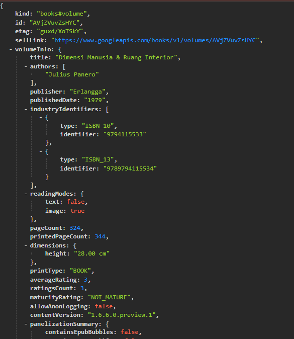

**Langkah 5**

Tambahkan kode pada onPressed di ElevatedButton seperti berikut.
``` dart
ElevatedButton(
  onPressed: () {
    setState(() {});
    getData()
        .then((value) {
          result = value.body.toString().substring(0, 450);
          setState(() {});
        })
        .catchError((_) {
          result = 'An error occurred';
          setState(() {});
        });
  },
  child: Text('Go!'),
),
```
Soal 3
Jelaskan maksud kode langkah 5 tersebut terkait substring dan catchError!
Penjelasan substring:
Kode value.body.toString().substring(0, 450); digunakan untuk memotong isi teks hasil response agar hanya menampilkan 450 karakter pertama saja. Tujuannya supaya data yang ditampilkan di layar tidak terlalu panjang, sehingga tampilan tetap rapi dan mudah dibaca.

Penjelasan catchError:
catchError berfungsi untuk menangkap dan menangani kesalahan yang mungkin muncul saat proses getData() dijalankan. Jika terjadi error — seperti gagal terhubung ke internet atau server tidak merespons — maka variabel result akan diisi dengan pesan “Terjadi kesalahan”, dan tampilan aplikasi akan diperbarui agar pengguna mengetahui adanya masalah.

Output

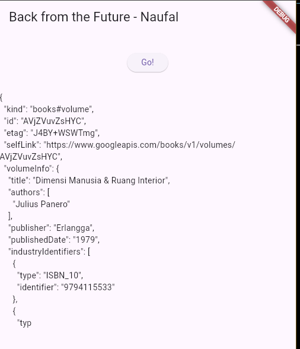

# Praktikum 2
**Langkah 1**

Tambahkan tiga method berisi kode seperti berikut di dalam class _FuturePageState.
``` dart
Future<int> returnOneAsync() async {
  await Future.delayed(const Duration(seconds: 3));
  return 1;
}

Future<int> returnTwoAsync() async {
  await Future.delayed(const Duration(seconds: 3));
  return 2;
}

Future<int> returnThreeAsync() async {
  await Future.delayed(const Duration(seconds: 3));
  return 3;
}
```

**Langkah 2**

Lalu tambahkan lagi method ini di bawah ketiga method sebelumnya.
``` dart
Future count() async {
  int total = 0;
  total = await returnOneAsync();
  total += await returnTwoAsync();
  total += await returnThreeAsync();
  setState(() {
    result = total.toString();
  });
}
```

**Langkah 3**

Lakukan comment kode sebelumnya, ubah isi kode onPressed() menjadi seperti berikut.
``` dart
ElevatedButton(
  child: Text('GO!'),
  onPressed: () {
    count();
  },
),
```

**Langkah 4**

Akhirnya, run atau tekan F5 jika aplikasi belum running. Maka Anda akan melihat seperti gambar berikut, hasil angka 6 akan tampil setelah delay 9 detik.

Soal 4
Jelaskan maksud kode langkah 1 dan 2 tersebut!

- Penjelasan Langkah 1:
Ketiga method pada langkah 1 (returnOneAsync, returnTwoAsync, dan returnThreeAsync) merupakan fungsi asynchronous yang memakai await Future.delayed(Duration(seconds: 3)) untuk menirukan proses yang memakan waktu, seperti permintaan data ke server.
Setelah menunggu selama 3 detik, masing-masing fungsi akan mengembalikan nilai 1, 2, dan 3 secara berurutan.

- Penjelasan Langkah 2:
Fungsi count() berfungsi untuk:
- Membuat variabel total sebagai penampung hasil.
- Menjalankan ketiga fungsi asynchronous tadi secara berurutan menggunakan await, sehingga total waktu eksekusi menjadi sekitar 9 detik (3 detik × 3 fungsi).
  - await returnOneAsync() → jeda 3 detik
  - await returnTwoAsync() → jeda 3 detik berikutnya
  - await returnThreeAsync() → jeda 3 detik lagi
- Menjumlahkan nilai yang diperoleh dari ketiga fungsi tersebut ke dalam total.
- Memanggil setState() agar tampilan aplikasi diperbarui sesuai hasil perhitungan, yaitu total = 6.

Output

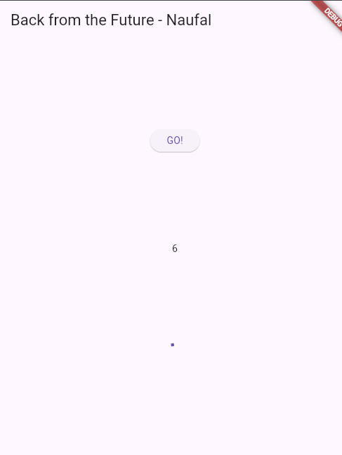

# Praktikum 3
**Langkah 1**

Pastikan telah impor package async berikut.
``` dart
import 'package:async/async.dart';
```

**Langkah 2**

Tambahkan variabel late dan method di class _FuturePageState seperti ini.
``` dart
late Completer completer;

Future getNumber() {
  completer = Completer<int>();
  calculate();
  return completer.future;
}

Future calculate() async {
  await Future.delayed(const Duration(seconds : 5));
  completer.complete(42);
}
```

**Langkah 3**

Tambahkan kode berikut pada fungsi onPressed(). Kode sebelumnya bisa Anda comment.
``` dart
getNumber().then((value) {
  setState(() {
    result = value.toString();
  });
});
```

**Langkah 4**

Terakhir, run atau tekan F5 untuk melihat hasilnya jika memang belum running. Bisa juga lakukan hot restart jika aplikasi sudah running. Maka hasilnya akan seperti gambar berikut ini. Setelah 5 detik, maka angka 42 akan tampil.
Soal 5
Jelaskan maksud kode langkah 2 tersebut!
- Dengan Completer, kita bisa menentukan sendiri kapan sebuah Future dianggap selesai.
- Fungsi getNumber() membuat sebuah Future baru dan kemudian memanggil calculate().
- Di dalam calculate(), proses menunggu dilakukan selama 5 detik, lalu Future diselesaikan dengan perintah completer.complete(42).
- Akibatnya, setelah tombol ditekan, aplikasi akan menunggu 5 detik terlebih dahulu sebelum menampilkan hasil berupa angka 42 pada tampilan UI.

Output

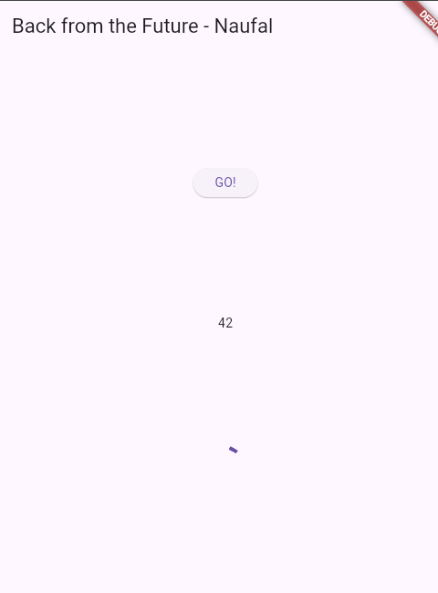

**Langkah 5**

Gantilah isi code method calculate() seperti kode berikut, atau Anda dapat membuat calculate2()
``` dart
calculate() async {
  try {
    await new Future.delayed(const Duration(seconds: 5));
    completer.complete(42);
    // throw Exception();
  } catch (_) {
    completer.completeError({});
  }
}
```

**Langkah 6**

Ganti menjadi kode seperti berikut di onPressed().
``` dart
getNumber().then((value) {
  setState(() {
    result = value.toString();
  });
}).catchError((e) {
  result = 'An error occurred';
});
```
Soal 6
Jelaskan maksud perbedaan kode langkah 2 dengan langkah 5-6 tersebut!
- Pada langkah 2, fungsi calculate() dianggap selalu berhasil dijalankan, sehingga Future langsung diselesaikan menggunakan complete(42) tanpa kemungkinan gagal.
- Namun pada langkah 5, fungsinya dibuat lebih realistis, di mana proses perhitungan bisa saja menimbulkan error. Karena itu, digunakan completer.completeError(e) untuk menandai bahwa Future berakhir dengan kesalahan.
- Kemudian di langkah 6, bagian tombol dilengkapi dengan penanganan error menggunakan .catchError(...), agar ketika terjadi kegagalan, aplikasi tidak berhenti tiba-tiba dan menampilkan pesan "An error occurred" sebagai gantinya.

Output


# Praktikum 4
**Langkah 1**

Tambahkan method ini ke dalam class _FuturePageState
``` dart
void returnFG() {
  FutureGroup<int> futureGroup = FutureGroup<int>();
  futureGroup.add(returnOneAsync());
  futureGroup.add(returnTwoAsync());
  futureGroup.add(returnThreeAsync());
  futureGroup.close();
  futureGroup.future.then((List<int> value) {
    int total = 0;
    for (var element in value) {
      total += element;
    }
    setState(() {
      result = total.toString();
    });
  });
}
```

**Langkah 2**

Anda bisa hapus atau comment kode sebelumnya, kemudian panggil method dari langkah 1 tersebut.
``` dart
onPressed: () {
  returnFG();
}
```

**Langkah 3**

Anda akan melihat hasilnya dalam 3 detik berupa angka 6 lebih cepat dibandingkan praktikum sebelumnya menunggu sampai 9 detik.
Soal 7
Output


**Langkah 4**

Anda dapat menggunakan FutureGroup dengan Future.wait seperti kode berikut.
``` dart
final futures = Future.wait<int>([
  returnOneAsync(),
  returnTwoAsync(),
  returnThreeAsync(),
]);
```
Soal 8
Jelaskan maksud perbedaan kode langkah 1 dan 4!
- Pada langkah 1, digunakan FutureGroup untuk mengelola dan menggabungkan beberapa Future secara manual, sehingga setiap Future dimasukkan satu per satu sebelum dijalankan bersamaan.
- Sementara pada langkah 4, digunakan Future.wait, yang memungkinkan menjalankan banyak Future secara paralel hanya dengan satu perintah sederhana, tanpa perlu menambahkannya satu per satu seperti pada FutureGroup.

# Praktikum 5
**Langkah 1**

Tambahkan method ini ke dalam class _FuturePageState
``` dart
Future returnError() async {
  await Future.delayed(const Duration(seconds: 2));
  throw Exception('Something terrible happened!');
}
```

**Langkah 2**

Ganti dengan kode berikut di ElevatedButton
``` dart
returnError()
  .then((value) {
    setState(() {
      result = 'Success';
    });
  })
  .catchError((onError) {
    setState(() {
      result = onError.toString();
    });
  })
  .whenComplete(() => print('Complete'));
```

**Langkah 3**

Lakukan run dan klik tombol GO! maka akan menghasilkan seperti gambar berikut.
Pada bagian debug console akan melihat teks Complete seperti berikut.

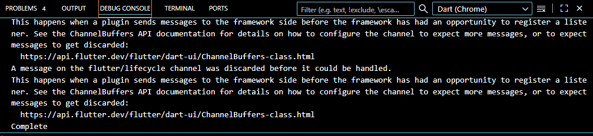

Soal 9
Output

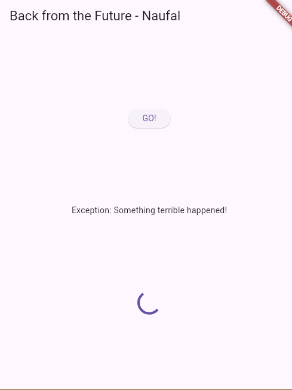

**Langkah 4**

Tambahkan kode ini di dalam class _FutureStatePage
``` dart

```
Soal 10
Panggil method handleError() tersebut di ElevatedButton, lalu run. Apa hasilnya? Jelaskan perbedaan kode langkah 1 dan 4!
Saat method handleError() dijalankan, pesan kesalahan akan muncul di tampilan aplikasi, sementara teks "complete" akan tercetak di debug console.

Perbedaan utama antara langkah 1 dan langkah 4 terletak pada cara menangani error.
Pada langkah 1, digunakan kombinasi .then(), .catchError(), dan .whenComplete(), di mana setiap tahap menangani proses sukses, error, dan penyelesaian dengan gaya callback khas Future.
Sedangkan pada langkah 4, digunakan pendekatan try-catch-finally yang membuat alur penanganan error menjadi lebih rapi, mudah dibaca, dan menyerupai logika kode sinkron biasa.

# Praktikum 6
**Langkah 1**

Tambahkan plugin geolocator dengan mengetik perintah berikut di terminal.
``` dart
flutter pub add geolocator
```

**Langkah 2**

Jika Anda menargetkan untuk platform Android, maka tambahkan baris kode berikut di file android/app/src/main/androidmanifest.xml
``` dart
<uses-permission android:name="android.permission.ACCESS_FINE_LOCATION"/>
<uses-permission android:name="android.permission.ACCESS_COARSE_LOCATION"/>
```
Jika Anda menargetkan untuk platform iOS, maka tambahkan kode ini ke file Info.plist
``` dart
<key>NSLocationWhenInUseUsageDescription</key>
<string>This app needs to access your location</string>
```

**Langkah 3**

Tambahkan file baru ini di folder lib project Anda dengan nama geolocation.dart.

**Langkah 4**

Buat class LocationScreen di dalam file geolocation.dart

**Langkah 5**

``` dart
import 'package:flutter/material.dart';
import 'package:geolocator/geolocator.dart';

class LocationScreen extends StatefulWidget {
  const LocationScreen({super.key});

  @override
  State<LocationScreen> createState() => _LocationScreenState();
}

class _LocationScreenState extends State<LocationScreen> {
  String myPosition = "";

  @override
  void initState() {
    super.initState();
    getPosition().then((Position myPos) {
      myPosition =
          'latitude: ${myPos.latitude.toString()} - Longitude: ${myPos.longitude.toString()}';
      setState(() {
        myPosition = myPosition;
      });
    });
  }

  @override
  Widget build(BuildContext context) {
    return Scaffold(
      appBar: AppBar(title: const Text('Current Location - Naufal')),
      body: Center(child: Text(myPosition)),
    );
  }

  Future<Position> getPosition() async {
    await Geolocator.requestPermission();
    await Geolocator.isLocationServiceEnabled();
    Position? position = await Geolocator.getCurrentPosition();
    return position;
  }
}
```
Soal 11
Tambahkan nama panggilan Anda pada tiap properti title sebagai identitas pekerjaan Anda.

**Langkah 6**

Panggil screen baru tersebut di file main Anda seperti berikut.
``` dart
home: const LocationScreen(),
```

**Langkah 7**

Run project Anda di device atau emulator (bukan browser), maka akan tampil seperti berikut ini.

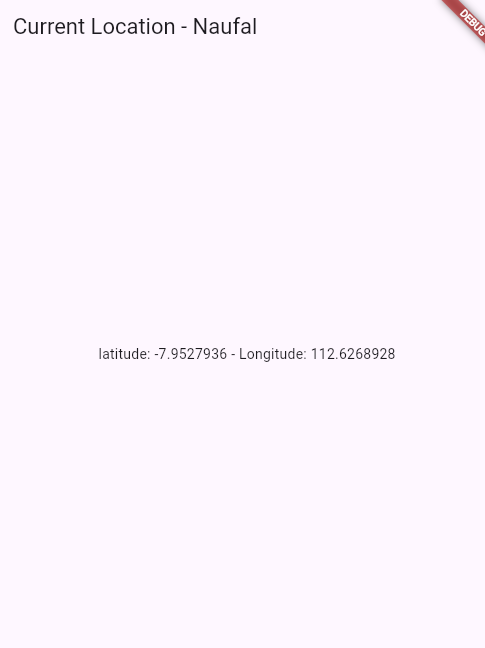

**Langkah 8**

Tambahkan widget loading seperti kode berikut. Lalu hot restart, perhatikan perubahannya.
``` dart
@override
Widget build(BuildContext context) {
  final myWidget = myPosition == ''
      ? const CircularProgressIndicator()
      : const Text(myPosition);

  return Scaffold(
    appBar: AppBar(title: Text('Current Location - Naufal')),
    body: Center(child: myWidget),
  );
}
```
Soal 12
Jika Anda tidak melihat animasi loading tampil, kemungkinan itu berjalan sangat cepat. Tambahkan delay pada method getPosition() dengan kode await Future.delayed(const Duration(seconds: 3));
``` dart
Future<Position> getPosition() async {
  await Geolocator.requestPermission();
  await Geolocator.isLocationServiceEnabled();
  await Future.delayed(const Duration(seconds: 3));
  Position? position = await Geolocator.getCurrentPosition();
  return position;
}
```

Apakah Anda mendapatkan koordinat GPS ketika run di browser? Mengapa demikian?
Saya masih bisa mendapatkan koordinat GPS saat aplikasi dijalankan di browser, karena browser sudah memiliki API Geolocation bawaan. API ini memungkinkan browser untuk mengakses lokasi perangkat secara langsung, asalkan pengguna memberikan izin lokasi ketika diminta melalui pop-up permission di browser.

Output

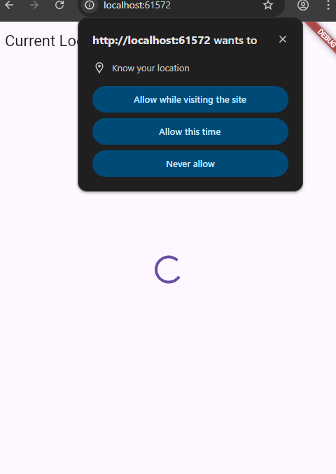

# Praktikum 7
**Langkah 1**

Buka file geolocation.dart kemudian ganti isi method dengan kode ini.
``` dart
Future<Position> getPosition() async {
  await Geolocator.isLocationServiceEnabled();
  await Future.delayed(const Duration(seconds: 3));
  Position position = await Geolocator.getCurrentPosition();
  return position;
}
```

**Langkah 2**

Tambah variabel ini di class _LocationScreenState
``` dart
Future<Position>? position;
```

**Langkah 3**

Tambah method ini dan set variabel position
``` dart
@override
void initState() {
  super.initState();
  position = getPosition();
}
```

**Langkah 4**

Ketik kode berikut dan sesuaikan. Kode lama bisa Anda comment atau hapus.
``` dart
@override
Widget build(BuildContext context) {
  return Scaffold(
    appBar: AppBar(title: Text('Current Location - Naufal')),
    body: Center(child: FutureBuilder(
      future: position,
      builder: (BuildContext context, AsyncSnapshot<Position>
          snapshot) {
        if (snapshot.connectionState ==
            ConnectionState.waiting) {
          return const CircularProgressIndicator();
        }
        else if (snapshot.connectionState ==
            ConnectionState.done) {
          return Text(snapshot.data.toString());
        }
        else {
          return const Text('');
        }
      },
    )),
  );
}
```
Soal 13
Apakah ada perbedaan UI dengan praktikum sebelumnya? Mengapa demikian?
- Tampilan utama memang tidak berubah, tetapi mekanisme pembaruan UI-nya berbeda.
- Jika sebelumnya pembaruan dilakukan secara manual menggunakan setState(), kini dengan FutureBuilder, tampilan akan menyesuaikan secara otomatis mengikuti status dari Future.
- Pendekatan ini membuat kode lebih sederhana, terstruktur, dan responsif terhadap perubahan data.

Output

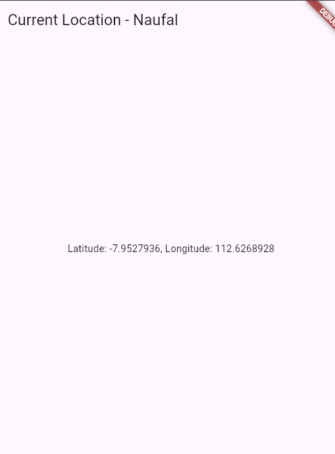

**Langkah 5**

Tambahkan kode berikut untuk menangani ketika terjadi error. Kemudian hot restart.
``` dart
else if (snapshot.connectionState == ConnectionState.done) {
  if (snapshot.hasError) {
     return Text('Something terrible happened!');
  }
  return Text(snapshot.data.toString());
}
```
Soal 14
Apakah ada perbedaan UI dengan langkah sebelumnya? Mengapa demikian?
Tidak, tampilannya masih sama, tetapi kini saat terjadi error, antarmuka akan menampilkan pesan kesalahan. Hal ini karena sudah ditambahkan pengecekan snapshot.hasError, sehingga aplikasi tidak berhenti tiba-tiba dan pengguna tetap mendapatkan informasi yang jelas mengenai masalah yang terjadi.

Output


# Praktikum 8
**Langkah 1**

Buatlah file baru ini di project lib Anda.

**Langkah 2**

``` dart
import 'package:flutter/material.dart';

class NavigationFirst extends StatefulWidget {
  const NavigationFirst({super.key});

  @override
  State<NavigationFirst> createState() => _NavigationFirstState();
}

class _NavigationFirstState extends State<NavigationFirst> {
  Color color = Colors.red.shade200;

  @override
  Widget build(BuildContext context) {
    return Scaffold(
      backgroundColor: color,
      appBar: AppBar(
        title: const Text('Navigation First Screen - Naufal'),
      ),
      body: Center(
        child: ElevatedButton(
          child: const Text('Change Color'),
          onPressed: () {
            _navigateAndGetColor(context);
          },
        ),
      ),
    );
  }
}
```
Soal 15
Tambahkan nama panggilan Anda pada tiap properti title sebagai identitas pekerjaan Anda.

Silakan ganti dengan warna tema favorit Anda.

**Langkah 3**

Tambahkan method ini.
``` dart
  Future _navigateAndGetColor(BuildContext context) async {
    color =
        await Navigator.push(
          context,
          MaterialPageRoute(builder: (context) => const NavigationSecond()),
        ) ??
        Colors.orange.shade200;
    setState(() {});
  }
```

**Langkah 4**

Buat file baru ini di project lib Anda. Silakan jika ingin mengelompokkan view menjadi satu folder dan sesuaikan impor yang dibutuhkan.

**Langkah 5**

``` dart
import 'package:flutter/material.dart';

class NavigationSecond extends StatefulWidget {
  const NavigationSecond({super.key});

  @override
  State<NavigationSecond> createState() => _NavigationSecondState();
}

class _NavigationSecondState extends State<NavigationSecond> {
  @override
  Widget build(BuildContext context) {
    Color color;
    return Scaffold(
      appBar: AppBar(title: const Text('Navigation Second Screen - Naufal')),
      body: Center(
        child: Column(
          mainAxisAlignment: MainAxisAlignment.spaceEvenly,
          children: [
            ElevatedButton(
              child: const Text('Red'),
              onPressed: () {
                color = Colors.red.shade200;
                Navigator.pop(context, color);
              },
            ),
            ElevatedButton(
              child: const Text('Green'),
              onPressed: () {
                color = Colors.green.shade200;
                Navigator.pop(context, color);
              },
            ),
            ElevatedButton(
              child: const Text('Blue'),
              onPressed: () {
                color = Colors.blue.shade200;
                Navigator.pop(context, color);
              },
            ),
          ],
        ),
      ),
    );
  }
}
```

**Langkah 6**

Lakukan edit properti home.
``` dart
home: const NavigationFirst(),
```

**Langkah 7**

Lakukan run, jika terjadi error silakan diperbaiki.
Soal 16
Cobalah klik setiap button, apa yang terjadi ? Mengapa demikian ?
- Saat salah satu tombol warna ditekan di halaman kedua, aplikasi akan mengirimkan data warna yang dipilih kembali ke halaman pertama melalui perintah Navigator.pop(context, color).
- Di halaman pertama, nilai tersebut diterima menggunakan await Navigator.push(), lalu dilakukan setState() untuk mengubah warna latar belakang sesuai pilihan pengguna.
- Proses ini dimungkinkan karena Navigator dapat mengirimkan data balik dari halaman yang dikunjungi ke halaman pemanggilnya.

Gantilah 3 warna pada langkah 5 dengan warna favorit Anda!
``` dart
ElevatedButton(
  child: const Text('Red'),
  onPressed: () {
    color = Colors.red.shade200;
    Navigator.pop(context, color);
  },
),
ElevatedButton(
  child: const Text('Green'),
  onPressed: () {
    color = Colors.green.shade200;
    Navigator.pop(context, color);
  },
),
ElevatedButton(
  child: const Text('Blue'),
  onPressed: () {
    color = Colors.blue.shade200;
    Navigator.pop(context, color);
  },
),
```

Output

<p align="center">
  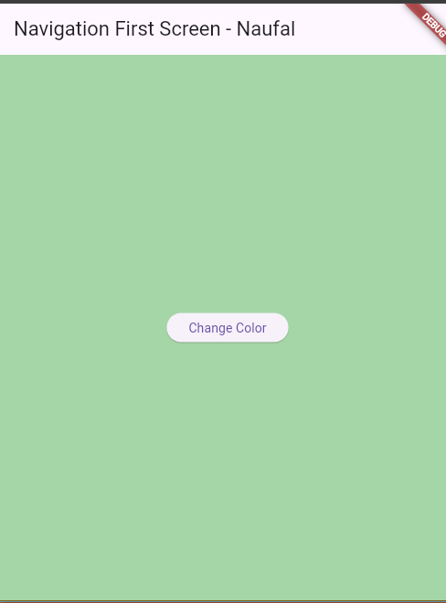
  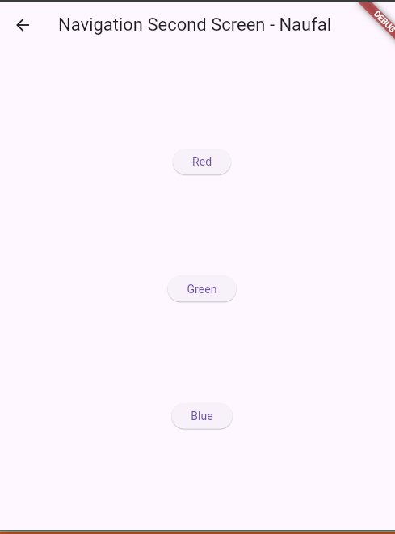
</p>

# Praktikum 9
**Langkah 1**

Buat file dart baru di folder lib project Anda.

**Langkah 2**

``` dart
import 'package:flutter/material.dart';

class NavigationDialogScreen extends StatefulWidget {
  const NavigationDialogScreen({super.key});

  @override
  State<NavigationDialogScreen> createState() => _NavigationDialogScreenState();
}

class _NavigationDialogScreenState extends State<NavigationDialogScreen> {
  Color color = Colors.orange.shade200;

  @override
  Widget build(BuildContext context) {
    return Scaffold(
      backgroundColor: color,
      appBar: AppBar(
        title: const Text('Navigation Dialog Screen - Naufal'),
      ),
      body: Center(
        child: ElevatedButton(
          child: const Text('Change Color'),
          onPressed: () {},
        ),
      ),
    );
  }
}
```

**Langkah 3**

``` dart
_showColorDialog(BuildContext context) async {
  await showDialog(
    barrierDismissible: false,
    context: context,
    builder: (_) {
      return AlertDialog(
        title: const Text('Very important question'),
        content: const Text('Please choose a color'),
        actions: <Widget>[
          TextButton(
            child: const Text('Red'),
            onPressed: () {
              Color color = Colors.red.shade700;
              Navigator.pop(context, color);
            },
          ),
          TextButton(
            child: const Text('Green'),
            onPressed: () {
              Color color = Colors.green.shade700;
              Navigator.pop(context, color);
            },
          ),
          TextButton(
            child: const Text('Blue'),
            onPressed: () {
              Color color = Colors.blue.shade700;
              Navigator.pop(context, color);
            },
          ),
        ],
      );
    },
  );
  setState(() {});
}
```

**Langkah 4**

``` dart
onPressed() {
  _showColorDialog(context);
}
```

**Langkah 5**

Ubah properti home
``` dart
home: const NavigationDialogScreen(),
```

**Langkah 6**

Coba ganti warna background dengan widget dialog tersebut. Jika terjadi error, silakan diperbaiki. Jika berhasil, akan tampil seperti gambar berikut.
Soal 17
Cobalah klik setiap button, apa yang terjadi ? Mengapa demikian ?
- Saat pengguna menekan salah satu tombol pada dialog, dialog akan ditutup dan mengirimkan nilai warna yang dipilih melalui Navigator.pop(context, color).
- Nilai tersebut diterima kembali oleh method _showColorDialog() karena pemanggilannya menggunakan await showDialog().
- Setelah data warna diterima, fungsi setState() dijalankan untuk memperbarui warna latar belakang halaman sesuai pilihan pengguna.
- Hal ini dimungkinkan karena dialog dapat mengembalikan nilai layaknya proses return data dalam navigasi Flutter.

Gantilah 3 warna pada langkah 3 dengan warna favorit Anda!
``` dart
TextButton(
  child: const Text('Red'),
  onPressed: () {
    Color color = Colors.red.shade700;
    Navigator.pop(context, color);
  },
),
TextButton(
  child: const Text('Green'),
  onPressed: () {
    Color color = Colors.green.shade700;
    Navigator.pop(context, color);
  },
),
TextButton(
  child: const Text('Blue'),
  onPressed: () {
    Color color = Colors.blue.shade700;
    Navigator.pop(context, color);
  },
),
```

Output


