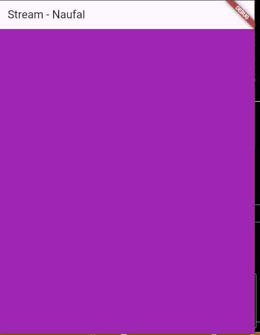
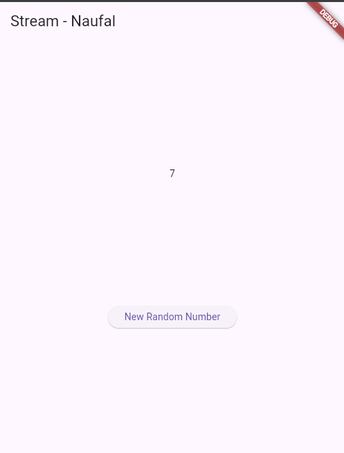
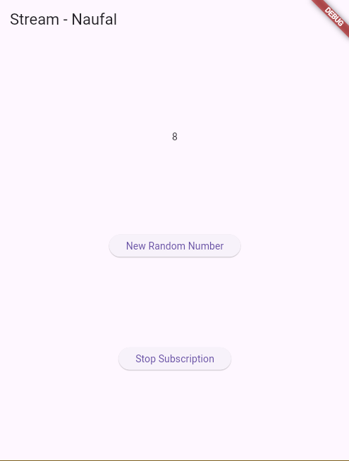
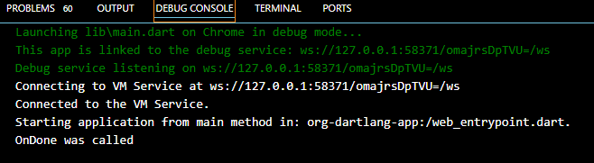

# PEMROGRAMAN DART - WEEK 12 - PRAKTIKUM

**Nama  :** Ahmad Naufal Ilham  
**NIM   :** 2341720047  
**Absen :** 04 

# Praktikum 1 - Dart Streams
**Langkah 1 - Buat Project Baru**

Buatlah sebuah project flutter baru dengan nama stream_nama (beri nama panggilan Anda) di folder week-12/src/ repository GitHub Anda.

**Langkah 2 - Buka file main.dart**

Ketiklah kode seperti berikut ini.
``` dart
import 'package:flutter/material.dart';

void main() {
  runApp(const MyApp());
}

class MyApp extends StatelessWidget {
  const MyApp({super.key});

  @override
  Widget build(BuildContext context) {
    return MaterialApp(
      title: 'Stream - Naufal',
      theme: ThemeData(
        primarySwatch: Colors.blue,
      ),
      home: const StreamHomePage(),
    );
  }
}

class StreamHomePage extends StatefulWidget {
  const StreamHomePage({super.key});

  @override
  State<StreamHomePage> createState() => _StreamHomePageState();
}

class _StreamHomePageState extends State<StreamHomePage> {
  @override
  Widget build(BuildContext context) {
    return Container();
  }
}
```

Soal 1

1. Tambahkan nama panggilan Anda pada title app sebagai identitas hasil pekerjaan Anda.

2. Gantilah warna tema aplikasi sesuai kesukaan Anda.

**Langkah 3 - Buat file baru stream.dart**

Buat file baru di folder lib project Anda. Lalu isi dengan kode berikut.
``` dart
import 'package:flutter/material.dart';

class ColorStream {

}
```

**Langkah 4 - Tambah variabel colors**

Tambahkan variabel di dalam class ColorStream seperti berikut.
``` dart
final List<Color> colors = [
  Colors.blueGrey,
  Colors.amber,
  Colors.deepPurple,
  Colors.lightBlue,
  Colors.teal,
  Colors.green,
  Colors.red,
  Colors.orange,
  Colors.purple,
  Colors.yellow,
];
```

Soal 2

1. Tambahkan 5 warna lainnya sesuai keinginan Anda pada variabel colors tersebut.

**Langkah 5 - Tambah method getColors()**

Di dalam class ColorStream ketik method seperti kode berikut. Perhatikan tanda bintang di akhir keyword async* (ini digunakan untuk melakukan Stream data)
``` dart
Stream<Color> getColors() async* {

}
```

**Langkah 6 - Tambah perintah yield*.**

Tambahkan kode berikut ini.
``` dart
yield* Stream.periodic(
  const Duration(seconds: 1), (int t) {
    int index = t % colors.length;
    return colors[index];
});
```

Soal 3

1. Jelaskan fungsi keyword yield* pada kode tersebut!

Fungsi yield*

yield* pada async* digunakan untuk:

- Mengalirkan seluruh nilai yang berasal dari Stream lain tanpa harus memanggil yield satu per satu.
- Menggabungkan atau meneruskan Stream eksternal ke Stream yang sedang dibuat.
- Dengan kata lain, Stream yang kamu buat akan mengeluarkan semua data yang dipancarkan oleh Stream lain secara otomatis.

2. Apa maksud isi perintah kode tersebut?

- Stream.periodic() membuat sebuah aliran data yang memancarkan nilai baru setiap interval waktu tertentu, dalam hal ini setiap 1 detik.
- Argumen (int t) berfungsi sebagai penghitung otomatis yang bertambah mulai dari 0, kemudian 1, 2, 3, dan seterusnya.
- Ekspresi t % colors.length dipakai untuk memilih indeks warna secara bergantian. Jika indeks mencapai batas akhir list, maka ia kembali ke posisi awal.
- Setiap detik, stream menghasilkan satu warna berdasarkan indeks tersebut.
- Akibatnya, warna latar belakang aplikasi berubah setiap detik secara berulang-ulang mengikuti urutan warna yang ada.

**Langkah 7 - Buka main.dart**

Ketik kode impor file ini pada file main.dart
``` dart
import 'stream.dart';
```

**Langkah 8 - Tambah variabel**

Ketik dua properti ini di dalam class _StreamHomePageState
``` dart
Color bgColor = Colors.blueGrey;
late ColorStream colorStream;
```

**Langkah 9 - Tambah method changeColor()**

Tetap di file main, Ketik kode seperti berikut
``` dart
void changeColor() async {
  await for (var eventColor in colorStream.getColors()) {
    setState(() {
      bgColor = eventColor;
    });
  }
}
```

**Langkah 10 - Lakukan override initState()**

Ketika kode seperti berikut
``` dart
@override
void initState() {
  super.initState();
  colorStream = ColorStream();
  changeColor();
}
```

**Langkah 11 - Ubah isi Scaffold()**

Sesuaikan kode seperti berikut.
``` dart
return Scaffold(
  appBar: AppBar(
    title: const Text('Stream - Naufal'),
  ),
  body: Container(
    decoration: BoxDecoration(color: bgColor),
  ),
);
```

**Langkah 12 - Run**

Lakukan running pada aplikasi Flutter Anda, maka akan terlihat berubah warna background setiap detik.

<p align="center">
  
  
</p>

Soal 4

1. Capture hasil praktikum Anda berupa GIF dan lampirkan di README.

**Langkah 13 - Ganti isi method changeColor()**

Anda boleh comment atau hapus kode sebelumnya, lalu ketika kode seperti berikut.
``` dart
colorStream.getColors().listen((eventColor) {
  setState(() {
    bgColor = eventColor;
  });
});
```

Soal 5

1. Jelaskan perbedaan menggunakan listen dan await for (langkah 9) !

- await for
    - Digunakan untuk mengambil nilai dari stream secara berurutan, satu event pada satu waktu. Cara kerjanya seperti melakukan perulangan yang menunggu setiap data muncul sebelum lanjut ke data berikutnya. Biasanya dipakai kalau kita ingin mengeksekusi semua data dalam stream sampai stream berakhir.
- listen()
    - Metode ini mendaftarkan sebuah fungsi yang akan dijalankan setiap kali stream mengirimkan event baru. Proses ini tidak menghentikan eksekusi kode lain, karena callback akan dipanggil secara otomatis di background. Cocok digunakan jika ingin menerima update dari stream tanpa harus menunggu seluruh proses selesai.

# Praktikum 2 - Stream controllers dan sinks
**Langkah 1 - Buka file stream.dart**

Lakukan impor dengan mengetik kode ini.
``` dart
import 'dart:async';
```

**Langkah 2 - Tambah class NumberStream**

Tetap di file stream.dart tambah class baru seperti berikut.
``` dart
class NumberStream {
  
}
```

**Langkah 3 - Tambah StreamController**

Di dalam class NumberStream buatlah variabel seperti berikut.
``` dart
final StreamController<int> controller = StreamController<int>();
```

**Langkah 4 - Tambah method addNumberToSink**\

Tetap di class NumberStream buatlah method ini
``` dart
void addNumberToSink(int newNumber) {
  controller.sink.add(newNumber);
}
```

**Langkah 5 - Tambah method close()**

``` dart
close() {
  controller.close();
}
```

**Langkah 6 - Buka main.dart**

Ketik kode import seperti berikut
``` dart
import 'dart:async';
import 'dart:math';
```

**Langkah 7 - Tambah variabel**

Di dalam class _StreamHomePageState ketik variabel berikut
``` dart
int lastNumber = 0;
late StreamController numberStreamController;
late NumberStream numberStream;
```

**Langkah 8 - Edit initState()**

``` dart
@override
void initState() {
  numberStream = NumberStream();
  numberStreamController = numberStream.controller;
  Stream stream = numberStreamController.stream;
  stream.listen((event) {
    setState(() {
      lastNumber = event;
    });
  });
  super.initState();
}
```

**Langkah 9 - Edit dispose()**

``` dart
@override
void dispose() {
  numberStreamController.close();
  super.dispose();
}
```

**Langkah 10 - Tambah method addRandomNumber()**

``` dart
void addRandomNumber() {
  Random random = Random();
  int myNum = random.nextInt(10);
  numberStream.addNumberToSink(myNum);
}
```

**Langkah 11 - Edit method build()**

``` dart
body: SizedBox(
  width: double.infinity,
  child: Column(
    mainAxisAlignment: MainAxisAlignment.spaceEvenly,
    crossAxisAlignment: CrossAxisAlignment.center,
    children: [
      Text(lastNumber.toString()),
      ElevatedButton(
        onPressed: () => addRandomNumber(),
        child: Text('New Random Number'),
      ),
    ],
  ),
),
```

**Langkah 12 - Run**

Lakukan running pada aplikasi Flutter Anda, maka akan terlihat seperti gambar berikut.



Soal 6

1. Jelaskan maksud kode langkah 8 dan 10 tersebut!

- Langkah 8

Objek NumberStream dibuat untuk memulai proses streaming data. Dari objek tersebut, kamu mengambil StreamController dan kemudian memperoleh aliran datanya (stream). Stream ini kemudian dipantau menggunakan listen(). Setiap kali stream mengirim angka baru, listener akan memicu setState() dan menyimpan angka terbaru ke dalam variabel lastNumber. Dengan begitu, tampilan aplikasi selalu diperbarui secara otomatis setiap kali ada angka baru yang masuk.

- Langkah 10

Fungsi addRandomNumber() bertugas membuat angka acak antara 0 sampai 9 dengan menggunakan Random().nextInt(10). Angka tersebut kemudian dikirim ke stream melalui addNumberToSink(). Begitu angka dikirim, listener yang sudah dipasang pada langkah 8 langsung menerimanya, sehingga angka baru tersebut segera terlihat pada UI.

2. Capture hasil praktikum Anda berupa GIF dan lampirkan di README.

**Langkah 13 - Buka stream.dart**

Tambahkan method berikut ini.
``` dart
addError() {
  controller.sink.addError('error');
}
```

**Langkah 14 - Buka main.dart**

Tambahkan method onError di dalam class StreamHomePageState pada method listen di fungsi initState() seperti berikut ini.
``` dart
stream.listen((event) {
  setState(() {
    lastNumber = event;
  });
}).onError((error) {
  setState(() {
    lastNumber = -1;
  });
});
```

**Langkah 15 - Edit method addRandomNumber()**

Lakukan comment pada dua baris kode berikut, lalu ketik kode seperti berikut ini.
``` dart
void addRandomNumber() {
  Random random = Random();
  //int myNum = random.nextInt(10);
  //numberStream.addNumberToSink(myNum);
  numberStream.addError();
}
```

Soal 7

1. Jelaskan maksud kode langkah 13 sampai 15 tersebut!

- Langkah 13

Ditambahkan sebuah method addError() yang berfungsi mengirimkan error ke dalam stream memakai controller.sink.addError('error'). Tujuannya adalah untuk menguji bahwa stream tidak hanya bisa mengirim data normal, tetapi juga bisa memunculkan event error.

- Langkah 14

Pada bagian listener, ditambahkan callback untuk menangani error melalui parameter onError. Saat stream memancarkan error, nilai lastNumber akan diset menjadi -1. Dengan begitu, antarmuka aplikasi bisa menunjukkan bahwa sedang terjadi kesalahan pada aliran data.

- Langkah 15

Fungsi addRandomNumber() dimodifikasi sehingga tombol tidak lagi mengirim angka acak. Kini tombol tersebut digunakan untuk memicu error dengan memanggil addError(). Setiap kali tombol ditekan, stream akan menghasilkan event error yang langsung ditangkap oleh onError, dan UI akan menampilkan nilai -1 sebagai tanda bahwa error terjadi.

2. Kembalikan kode seperti semula pada Langkah 15, comment addError() agar Anda dapat melanjutkan ke praktikum 3 berikutnya.

``` dart
void addRandomNumber() {
  Random random = Random();
  int myNum = random.nextInt(10);
  numberStream.addNumberToSink(myNum);
  // numberStream.addError();
} 
```

# Praktikum 3 - Injeksi data ke streams
**Langkah 1 - Buka main.dart**

Tambahkan variabel baru di dalam class _StreamHomePageState
``` dart
late StreamTransformer transformer;
```

**Langkah 2 - Tambahkan kode ini di initState**

``` dart
transformer = StreamTransformer<int, int>.fromHandlers(
  handleData: (value, sink) {
    sink.add(value * 10);
  },
  handleError: (error, trace, sink) {
    sink.add(-1);
  },
  handleDone: (sink) => sink.close(),
);
```

**Langkah 3 - Tetap di initState**

Lakukan edit seperti kode berikut.
``` dart
stream.transform(transformer).listen((event) {
  setState(() {
    lastNumber = event;
  });
}).onError((error) {
  setState(() {
    lastNumber = -1;
  });
});
super.initState();
```

**Langkah 4 - Run**

Terakhir, run atau tekan F5 untuk melihat hasilnya jika memang belum running. Bisa juga lakukan hot restart jika aplikasi sudah running. Maka hasilnya akan seperti gambar berikut ini. Anda akan melihat tampilan angka dari 0 hingga 90.


Soal 8

1. Jelaskan maksud kode langkah 1-3 tersebut!

- Langkah 1

Sebuah variabel StreamTransformer ditambahkan untuk menyimpan logika transformasi yang akan diterapkan pada stream. Dengan transformer ini, setiap event yang lewat dapat diolah atau dimodifikasi terlebih dahulu sebelum akhirnya diterima oleh listener.

- Langkah 2

Transformer dibuat menggunakan StreamTransformer.fromHandlers.
Pada bagian handleData, setiap nilai yang masuk diubah dengan cara mengalikannya 10.
Bagian handleError mengganti error menjadi angka -1.
Sementara handleDone digunakan untuk menutup aliran ketika proses selesai.
Secara keseluruhan, transformer ini bekerja sebagai tahap penyaringan dan pengolahan data sebelum data muncul di antarmuka.

- Langkah 3

Stream kemudian dipasangkan dengan transformer melalui pemanggilan stream.transform(transformer). Dengan begitu, setiap event yang diterima listener sudah berupa hasil transformasi. Data yang sudah diolah akan diperbarui ke UI melalui setState(), sedangkan error yang muncul akan dikonversi menjadi -1 dan ditampilkan melalui onError.

2. Capture hasil praktikum Anda berupa GIF dan lampirkan di README.

# Praktikum 4 - Subscribe ke stream events
**Langkah 1 - Tambah variabel**

Tambahkan variabel berikut di class _StreamHomePageState
``` dart
late StreamSubscription subscription;
```

**Langkah 2 - Edit initState()**

Edit kode seperti berikut ini.
``` dart
@override
void initState() {
  numberStream = NumberStream();
  numberStreamController = numberStream.controller;
  Stream stream = numberStreamController.stream;
  subscription = stream.listen((event) {
    setState(() {
      lastNumber = event;
    });
  });
  super.initState();
}
```

**Langkah 3 - Tetap di initState()**

Tambahkan kode berikut ini.
``` dart
subscription.onError((error) {
  setState(() {
    lastNumber = -1;
  });
});
```

**Langkah 4 - Tambah properti onDone()**

Tambahkan dibawahnya kode ini setelah onError
``` dart
subscription.onDone(() {
  print('OnDone was called');
});
```

**Langkah 5 - Tambah method baru**

Ketik method ini di dalam class _StreamHomePageState
``` dart
void stopStream() {
  numberStreamController.close();
}
```

**Langkah 6 - Pindah ke method dispose()**

Jika method dispose() belum ada, Anda dapat mengetiknya dan dibuat override. Ketik kode ini didalamnya.
``` dart
subscription.cancel();
```

**Langkah 7 - Pindah ke method build()**

Tambahkan button kedua dengan isi kode seperti berikut ini.
``` dart
ElevatedButton(
  onPressed: () => stopStream(),
  child: const Text('Stop Subscription'),
)
```

**Langkah 8 - Edit method addRandomNumber()**

Edit kode seperti berikut ini.
``` dart
void addRandomNumber() {
  Random random = Random();
  int myNum = random.nextInt(10);
  if (!numberStreamController.isClosed) {
    numberStream.addNumberToSink(myNum);
  } else {
    setState(() {
      lastNumber = -1;
    });
  }
}
```

**Langkah 9 - Run**

Anda akan melihat dua button seperti gambar berikut.



**Langkah 10 - Tekan button ‘Stop Subscription'**

Anda akan melihat pesan di Debug Console seperti berikut.



Soal 9

1. Jelaskan maksud kode langkah 2, 6 dan 8 tersebut!

- Langkah 2

Stream mulai dipantau menggunakan stream.listen(). Setiap kali ada event baru, nilainya langsung disimpan ke lastNumber melalui setState() supaya tampilannya ikut berubah. Dengan memakai StreamSubscription, aktivitas mendengarkan stream dapat dikelola — seperti menambahkan penanganan error atau menghentikan proses kapan pun diperlukan.

- Langkah 6

Pemanggilan subscription.cancel() dilakukan ketika widget dibersihkan (disposed). Tindakan ini menghentikan proses mendengarkan stream, sehingga widget tidak lagi menerima event baru. Ini juga mencegah error yang bisa muncul jika stream menghasilkan data setelah widget tidak aktif.

- Langkah 8

Fungsi addRandomNumber() hanya akan mengirim angka baru jika controller masih terbuka (!isClosed). Jika aliran sudah berhenti, nilai yang ditampilkan di UI akan diset ke -1. Mekanisme ini memastikan bahwa stream tidak menerima kiriman data ketika sudah tidak aktif, sehingga menghindari masalah atau error yang tidak diinginkan.

2. Capture hasil praktikum Anda berupa GIF dan lampirkan di README.

# Praktikum 5
**Langkah 1 - Buka file main.dart**

Ketik variabel berikut di class _StreamHomePageState
``` dart
late StreamSubscription subscription2;
String values = '';
```

**Langkah 2 - Edit initState()**

Ketik kode seperti berikut.
``` dart
subscription = stream.listen((event) {
  setState(() {
    values += '$event - ';
  });
});

subscription2 = stream.listen((event) {
  setState(() {
    values += '$event - ';
  });
});
```

**Langkah 3 - Run**

Lakukan run maka akan tampil error seperti gambar berikut.


Soal 10

1. Jelaskan mengapa error itu bisa terjadi ?

Error muncul karena stream bawaan dari StreamController bersifat single subscription, artinya hanya boleh memiliki satu pendengar. Ketika ada dua listener (subscription dan subscription2) mencoba mendengarkan aliran data yang sama, listener kedua ditolak dan muncullah error “Bad state: Stream has already been listened to”.
Jika ingin satu stream didengarkan oleh banyak listener, stream tersebut harus diubah menjadi broadcast stream.

**Langkah 4 - Set broadcast stream**

Ketik kode seperti berikut di method initState()
``` dart

```

**Langkah 5 - Edit method build()**

Tambahkan text seperti berikut
``` dart

```

**Langkah 6 - Run**

Tekan button ‘New Random Number' beberapa kali, maka akan tampil teks angka terus bertambah sebanyak dua kali.

Soal 11

1. Jelaskan mengapa hal itu bisa terjadi ?


2. Capture hasil praktikum Anda berupa GIF dan lampirkan di README.

# Praktikum 6
**Langkah 1**
**Langkah 2**
**Langkah 3**
**Langkah 4**
**Langkah 5**
**Langkah 6**
**Langkah 7**
**Langkah 8**

# Praktikum 7
**Langkah 1**
**Langkah 2**
**Langkah 3**
**Langkah 4**
**Langkah 5**
**Langkah 6**
**Langkah 7**
**Langkah 8**
**Langkah 9**
**Langkah 10**
**Langkah 11**
**Langkah 12**
**Langkah 13**
