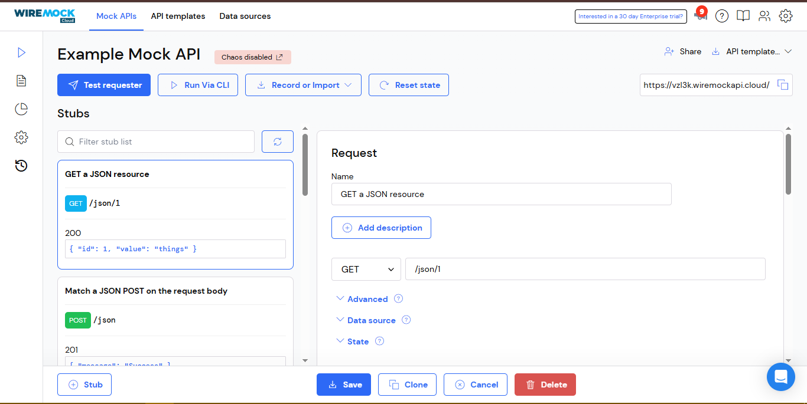
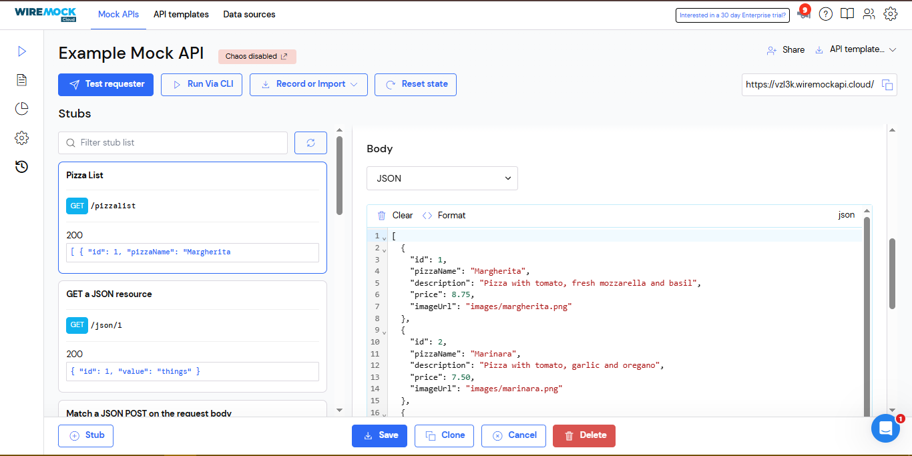

# PEMROGRAMAN DART - WEEK 14 - PRAKTIKUM

**Nama  :** Ahmad Naufal Ilham  
**NIM   :** 2341720047  
**Absen :** 04 

# Praktikum 1: Membuat layanan Mock API

**Langkah 1**

Daftar untuk layanan Mock Lab di https://app.wiremock.cloud/ dan daftar ke situs tersebut, buat nama pengguna dan kata sandi Anda.

**Langkah 2**

Masuk ke layanan tersebut, buka "Example Mock API", dan klik pada bagian Stubs dari API contoh. Kemudian, klik pada entri pertama—yaitu, Get a JSON resource. Anda harus melihat layar yang mirip dengan berikut ini:



**Langkah 3**

Klik pada tombol New. Untuk Namanya, ketik Pizza List, biarkan GET sebagai verb, dan di kotak teks di dekat verb GET, ketik /pizzalist. Kemudian, di bagian Response, untuk status 200, pilih JSON sebagai format dan tempel konten JSON yang tersedia di https://bit.ly/pizzalist.



**Langkah 4**

Tekan tombol Save di bagian bawah halaman untuk menyimpan stub. Ini menyelesaikan pengaturan untuk layanan mock backend.

**Langkah 5**

Kembali ke proyek Flutter Anda, tambahkan dependensi http dengan mengetik di Terminal Anda:
``` dart

```

**Langkah 6**
**Langkah 7**
**Langkah 8**
**Langkah 9**
**Langkah 10**

# Praktikum 2: Mengirim Data ke Web Service (POST)

**Langkah 1**
**Langkah 2**
**Langkah 3**
**Langkah 4**
**Langkah 5**
**Langkah 6**
**Langkah 7**
**Langkah 8**
**Langkah 9**
**Langkah 10**
**Langkah 11**
**Langkah 12**
**Langkah 13**
**Langkah 14**
**Langkah 15**
**Langkah 16**

# Praktikum 3: Memperbarui Data di Web Service (PUT)

**Langkah 1**
**Langkah 2**
**Langkah 3**
**Langkah 4**
**Langkah 5**
**Langkah 6**
**Langkah 7**
**Langkah 8**
**Langkah 9**
**Langkah 10**
**Langkah 11**

# Praktikum 4: Menghapus Data dari Web Service (DELETE)

**Langkah 1**
**Langkah 2**
**Langkah 3**
**Langkah 4**
**Langkah 5**
**Langkah 6**