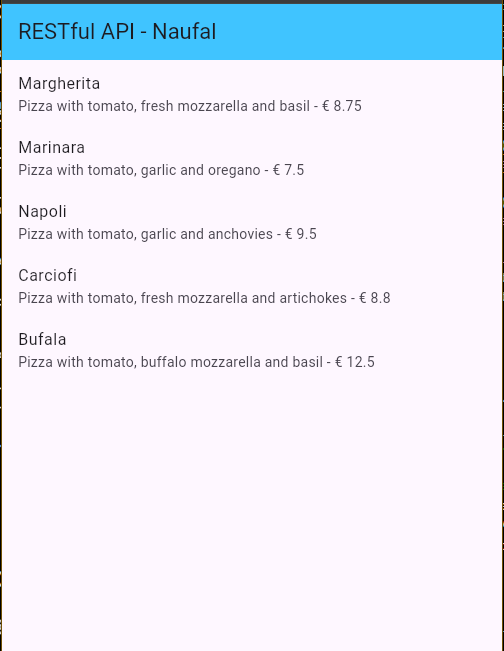
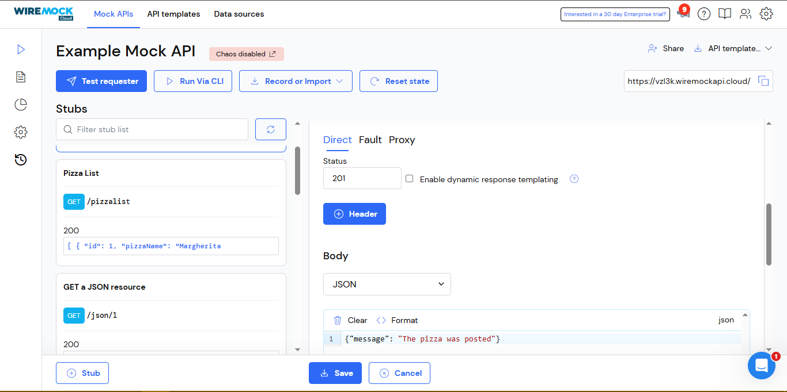
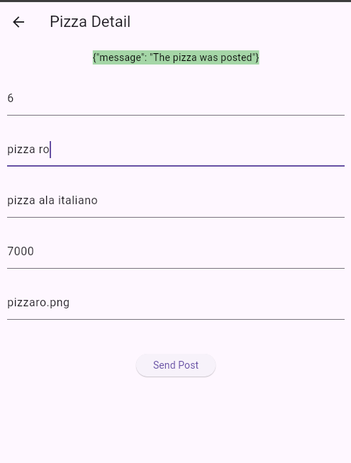
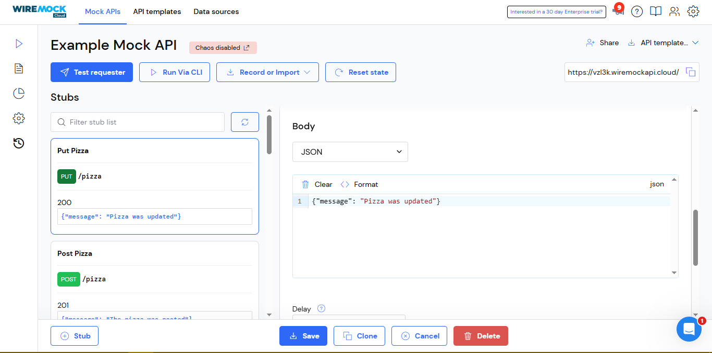
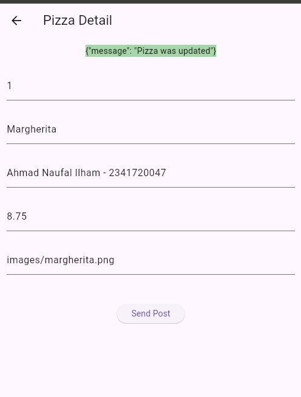
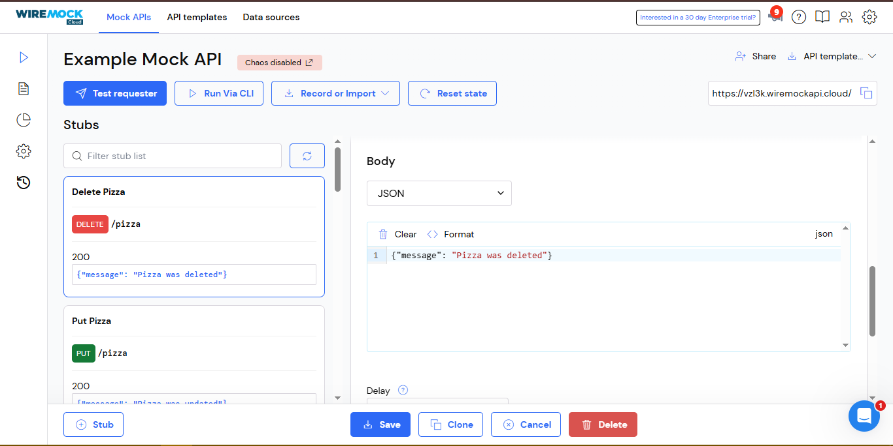
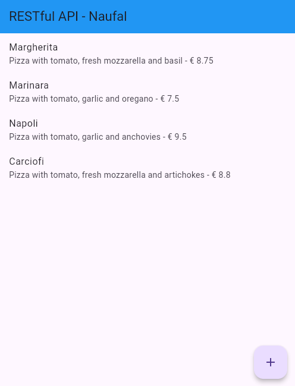
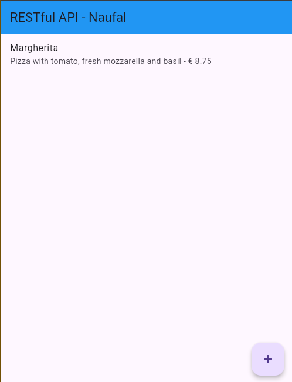

# PEMROGRAMAN DART - WEEK 14 - PRAKTIKUM

**Nama  :** Ahmad Naufal Ilham  
**NIM   :** 2341720047  
**Absen :** 04 

# Praktikum 1: Membuat layanan Mock API

**Langkah 1**

Daftar untuk layanan Mock Lab di https://app.wiremock.cloud/ dan daftar ke situs tersebut, buat nama pengguna dan kata sandi Anda.

**Langkah 2**

Masuk ke layanan tersebut, buka "Example Mock API", dan klik pada bagian Stubs dari API contoh. Kemudian, klik pada entri pertama—yaitu, Get a JSON resource. Anda harus melihat layar yang mirip dengan berikut ini:


**Langkah 3**

Klik pada tombol New. Untuk Namanya, ketik Pizza List, biarkan GET sebagai verb, dan di kotak teks di dekat verb GET, ketik /pizzalist. Kemudian, di bagian Response, untuk status 200, pilih JSON sebagai format dan tempel konten JSON yang tersedia di https://bit.ly/pizzalist.


**Langkah 4**

Tekan tombol Save di bagian bawah halaman untuk menyimpan stub. Ini menyelesaikan pengaturan untuk layanan mock backend.

**Langkah 5**

Kembali ke proyek Flutter Anda, tambahkan dependensi http dengan mengetik di Terminal Anda:
``` dart
flutter pub add http
```

**Langkah 6**

Di folder lib dalam proyek Anda, tambahkan file baru bernama httphelper.dart.

**Langkah 7**

Di file httphelper.dart, tambahkan kode berikut:
``` dart
import 'dart:io'; 
import 'package:http/http.dart' as http; 
import 'dart:convert'; 
import 'pizza.dart'; 

class HttpHelper {
  final String authority = 'vzl3k.wiremockapi.cloud';
  final String path = 'pizzalist';
  Future<List<Pizza>> getPizzaList() async {
    final Uri url = Uri.https(authority, path);
    final http.Response result = await http.get(url);
    if (result.statusCode == HttpStatus.ok) {
      final jsonResponse = json.decode(result.body);
      //provide a type argument to the map method to avoid type 
      //error
      List<Pizza> pizzas =
          jsonResponse.map<Pizza>((i) => 
            Pizza.fromJson(i)).toList();
      return pizzas;
    } else {
      return [];
    }
  }
}
```

**Langkah 8**

Di file main.dart, di kelas _MyHomePageState, tambahkan metode bernama callPizzas. Ini mengembalikan Future dari List objek Pizza dengan memanggil metode getPizzaList dari kelas HttpHelper, sebagai berikut:
``` dart
Future<List<Pizza>> callPizzas() async {
  HttpHelper helper = HttpHelper(); 
  List<Pizza> pizzas = await helper.getPizzaList(); 
  return pizzas; 
} 
```

**Langkah 9**

Di metode build dari kelas _MyHomePageState, di body Scaffold, tambahkan FutureBuilder yang membangun ListView dari widget ListTile yang berisi objek Pizza:
``` dart
Widget build(BuildContext context) {
  return Scaffold(
    appBar: AppBar(
      title: const Text('RESTful API - Naufal'),
      backgroundColor: Colors.lightBlueAccent,
    ),
    body: FutureBuilder(
      future: callPizzas(),
      builder: (BuildContext context, AsyncSnapshot<List<Pizza>> snapshot) {
        if (snapshot.hasError) {
          return const Text('Something went wrong');
        }
        if (!snapshot.hasData) {
          return const CircularProgressIndicator();
        }
        return ListView.builder(
          itemCount: (snapshot.data == null) ? 0 : snapshot.data!.length,
          itemBuilder: (BuildContext context, int position) {
            return ListTile(
              title: Text(snapshot.data![position].pizzaName),
              subtitle: Text(
                snapshot.data![position].description +
                    ' - € ' +
                    snapshot.data![position].price.toString(),
              ),
            );
          },
        );
      },
    ),
  );
}
```

**Langkah 10**

Jalankan aplikasi. Anda harus melihat layar yang mirip dengan berikut ini:



Soal 1
- Tambahkan nama panggilan Anda pada title app sebagai identitas hasil pekerjaan Anda.
- Gantilah warna tema aplikasi sesuai kesukaan Anda.

# Praktikum 2: Mengirim Data ke Web Service (POST)

**Langkah 1**

Masuk ke layanan Mock Lab dihttps://app.wiremock.cloud/ dan klik pada bagian Stubs dari API contoh. Kemudian, buat stub baru.

**Langkah 2**

Lengkapi permintaan sebagai berikut:
- Nama: Post Pizza
- Verb: POST
- Alamat: /pizza
- Status: 201
- Tipe Body: json
- Body: {"message": "The pizza was posted"}



**Langkah 3**

Tekan tombol Save.

**Langkah 4**

Di proyek Flutter, di file httphelper.dart, di kelas HttpHelper, buat metode baru bernama postPizza, sebagai berikut:
``` dart
Future<String> postPizza(Pizza pizza) async {
  const postPath = '/pizza';
  String post = json.encode(pizza.toJson());
  Uri url = Uri.https(authority, postPath);
  http.Response r = await http.post(
    url,
    body: post,
  );
  return r.body;
}
```

**Langkah 5**

Di proyek, buat file baru bernama pizza_detail.dart.

**Langkah 6**

Di bagian atas file baru, tambahkan impor yang diperlukan:
``` dart
import 'package:flutter/material.dart';
import 'pizza.dart';
import 'httphelper.dart';
```

**Langkah 7**

Buat StatefulWidget bernama PizzaDetailScreen:
``` dart
class PizzaDetailScreen extends StatefulWidget {
  const PizzaDetailScreen({super.key});
  @override
  State<PizzaDetailScreen> createState() => _PizzaDetailScreenState();
}

class _PizzaDetailScreenState extends State<PizzaDetailScreen> {
  @override
  Widget build(BuildContext context) {
    return Placeholder();
  }
}
```

**Langkah 8**

Di bagian atas kelas _PizzaDetailScreenState, tambahkan lima TextEditingController. Ini akan berisi data untuk objek Pizza yang akan diposting nanti. Juga, tambahkan String yang akan berisi hasil dari permintaan POST:
``` dart
final TextEditingController txtId = TextEditingController();
final TextEditingController txtName = TextEditingController();
final TextEditingController txtDescription = TextEditingController();
final TextEditingController txtPrice = TextEditingController();
final TextEditingController txtImageUrl = TextEditingController();
String operationResult = '';
```

**Langkah 9**

Override metode dispose() untuk membuang controller:
``` dart
@override
void dispose() {
  txtId.dispose();
  txtName.dispose();
  txtDescription.dispose();
  txtPrice.dispose();
  txtImageUrl.dispose();
  super.dispose();
}
```

**Langkah 10**

Di metode build() dari kelas, kembalikan Scaffold, yang AppBar-nya berisi Text "Pizza Detail" dan body-nya berisi Padding dan SingleChildScrollView yang berisi Column:
``` dart
return Scaffold(
  appBar: AppBar(
    title: const Text('Pizza Detail'),
  ),
  body: Padding(
      padding: const EdgeInsets.all(12),
      child: SingleChildScrollView(
        child: Column(children: []),
      )));
```

**Langkah 11**

Untuk properti children dari Column, tambahkan beberapa Text yang akan berisi hasil dari post, lima TextField, masing-masing terikat ke TextEditingController mereka sendiri, dan ElevatedButton untuk menyelesaikan aksi POST (metode postPizza akan dibuat selanjutnya). Juga, tambahkan SizedBox untuk menjauhkan widget di layar:
``` dart
Text(
  operationResult,
  style: TextStyle(
      backgroundColor: Colors.green[200],
      color: Colors.black),
),
const SizedBox(
  height: 24,
),
TextField(
  controller: txtId,
  decoration: const InputDecoration(hintText: 'Insert ID'),
),
const SizedBox(
  height: 24,
),
TextField(
  controller: txtName,
  decoration: const InputDecoration(hintText: 'Insert Pizza Name'),
),
const SizedBox(
  height: 24,
),
TextField(
  controller: txtDescription,
  decoration: const InputDecoration(hintText: 'Insert Description'),
),
const SizedBox(
  height: 24,
),
TextField(
  controller: txtPrice,
  decoration: const InputDecoration(hintText: 'Insert Price'),
),
const SizedBox(
  height: 24,
),
TextField(
  controller: txtImageUrl,
  decoration: const InputDecoration(hintText: 'Insert Image Url'),
),
const SizedBox(
  height: 48,
),
ElevatedButton(
    child: const Text('Send Post'),
    onPressed: () {
      postPizza();
    })           
```

**Langkah 12**

Di bagian bawah kelas _PizzaDetailScreenState, tambahkan metode postPizza:
``` dart
Future postPizza() async {
  HttpHelper helper = HttpHelper();
  Pizza pizza = Pizza();
  pizza.id = int.tryParse(txtId.text);
  pizza.pizzaName = txtName.text;
  pizza.description = txtDescription.text;
  pizza.price = double.tryParse(txtPrice.text);
  pizza.imageUrl = txtImageUrl.text;
  String result = await helper.postPizza(pizza);
  setState(() {
    operationResult = result;
  });
}
```

**Langkah 13**

Di file main.dart, impor file pizza_detail.dart

**Langkah 14**

Di Scaffold dari metode build() kelas _MyHomePageState, tambahkan FloatingActionButton yang akan navigasi ke rute PizzaDetail:
```
floatingActionButton: FloatingActionButton(
    child: const Icon(Icons.add),
    onPressed: () {
    Navigator.push(
        context,
        MaterialPageRoute(builder: (context) => const PizzaDetailScreen()),
    );
    },
),
```

**Langkah 15**

Jalankan aplikasi. Di layar utama, tekan FloatingActionButton untuk navigasi ke rute PizzaDetail.

**Langkah 16**

Tambahkan detail pizza di field teks dan tekan tombol Send Post. Anda seharusnya melihat hasil yang sukses, seperti yang ditunjukkan pada Gambar berikut ini:



Soal 2
- Tambahkan field baru dalam JSON maupun POST ke Wiremock!

# Praktikum 3: Memperbarui Data di Web Service (PUT)

**Langkah 1**

Masuk ke layanan Wiremock dihttps://app.wiremock.cloud dan klik pada bagian Stubs dari API contoh. Kemudian, buat stub baru.

**Langkah 2**

Lengkapi permintaan sebagai berikut:
- Nama: Put Pizza
- Verb: PUT
- Alamat: /pizza
- Status: 200
- Tipe Body: json
- Body: {"message": "Pizza was updated"}



**Langkah 3**

Klik tombol Save.

**Langkah 4**

Di proyek Flutter, tambahkan metode putPizza ke kelas HttpHelper di file http_helper.dart:
``` dart
Future<String> putPizza(Pizza pizza) async {
  const putPath = '/pizza';
  String put = json.encode(pizza.toJson());
  Uri url = Uri.https(authority, putPath);
  http.Response r = await http.put(
    url,
    body: put,
  );
  return r.body;
}
```

**Langkah 5**

Di kelas PizzaDetailScreen di file pizza_detail.dart, tambahkan dua properti, sebuah Pizza dan sebuah boolean, dan di konstruktor, atur kedua properti tersebut:
``` dart
final Pizza pizza;
  final bool isNew;
  const PizzaDetailScreen({
    super.key,
    required this.pizza,
    required this.isNew,
  });
```

**Langkah 6**

Di kelas PizzaDetailScreenState, override metode initState. Ketika properti isNew dari kelas PizzaDetail bukan baru, itu mengatur konten TextField dengan nilai-nilai objek Pizza yang diteruskan:
``` dart
@override
void initState() {
  if (!widget.isNew) {
    txtId.text = widget.pizza.id.toString();
    txtName.text = widget.pizza.pizzaName;
    txtDescription.text = widget.pizza.description;
    txtPrice.text = widget.pizza.price.toString();
    txtImageUrl.text = widget.pizza.imageUrl;
  }
  super.initState();
}
```

**Langkah 7**

Edit metode savePizza sehingga memanggil metode helper.postPizza ketika isNew benar, dan helper.putPizza ketika salah:
``` dart
Future savePizza() async {
...
    final result = await (widget.isNew
  ? helper.postPizza(pizza)
  : helper.putPizza(pizza));    
  setState(() {
      operationResult = result;
    });
  }
```

**Langkah 8**

Di file main.dart, di metode build dari _MyHomePageState, tambahkan properti onTap ke ListTile sehingga ketika pengguna mengetuknya, aplikasi akan mengubah rute dan menampilkan layar PizzaDetail, meneruskan pizza saat ini dan false untuk parameter isNew:
``` dart
    return ListTile(
      title: Text(snapshot.data![position].pizzaName),
      subtitle: Text(
        snapshot.data![position].description +
            ' - € ' +
            snapshot.data![position].price.toString(),
      ),
      onTap: () {
        Navigator.push(
          context,
          MaterialPageRoute(
            builder: (context) => PizzaDetailScreen(
              pizza: snapshot.data![position],
              isNew: false,
            ),
          ),
        );
      },
    );
```

**Langkah 9**

Di floatingActionButton, teruskan Pizza baru dan true untuk parameter isNew ke rute PizzaDetail:
``` dart
floatingActionButton: FloatingActionButton(
    child: Icon(Icons.add),
    onPressed: () {
    Navigator.push(
        context,
        MaterialPageRoute(
        builder: (context) =>
            PizzaDetailScreen(pizza: Pizza(), isNew: true),
        ),
    );
    },
),
```

**Langkah 10**

Jalankan aplikasi. Di layar utama, ketuk Pizza apa pun untuk navigasi ke rute PizzaDetail.

**Langkah 11**

Edit detail pizza di field teks dan tekan tombol Save. Anda seharusnya melihat pesan yang menunjukkan bahwa detail pizza telah diperbarui.



Soal 3
- Ubah salah satu data dengan Nama dan NIM Anda, lalu perhatikan hasilnya di Wiremock.

# Praktikum 4: Menghapus Data dari Web Service (DELETE)

**Langkah 1**

Masuk ke layanan Wiremock dihttps://app.wiremock.cloud dan klik pada bagian Stubs dari API contoh. Kemudian, buat stub baru.

**Langkah 2**

Lengkapi permintaan dengan data berikut:
- Nama: Delete Pizza
- Verb: DELETE
- Alamat: /pizza
- Status: 200
- Tipe Body: json
- Body: {"message": "Pizza was deleted"}

**Langkah 3**

Simpan stub baru.



**Langkah 4**

Di proyek Flutter, tambahkan metode deletePizza ke kelas HttpHelper di file http_helper.dart:
``` dart
  Future<String> deletePizza(int id) async {
    const deletePath = '/pizza';
    Uri url = Uri.https(authority, deletePath);
    http.Response r = await http.delete(url);
    return r.body;
  }
```

**Langkah 5**

Di file main.dart, di metode build dari kelas _MyHomePageState, refactor itemBuilder dari ListView.builder sehingga ListTile terkandung dalam widget Dismissible, sebagai berikut:
``` dart
return ListView.builder(
    itemCount: (snapshot.data == null) ? 0 : snapshot.data!.length,
    itemBuilder: (BuildContext context, int position) {
    return Dismissible(
        key: Key(position.toString()),
        onDismissed: (item) {
        HttpHelper helper = HttpHelper();
        snapshot.data!.removeWhere(
            (element) => element.id == snapshot.data![position].id,
        );
        helper.deletePizza(snapshot.data![position].id);
        },
        child: ListTile(
        ...
```

**Langkah 6**

Jalankan aplikasi. Ketika Anda swipe elemen apa pun dari daftar pizza, ListTile akan menghilang.

<p align="center">
  
  
</p>

Soal 4
- Capture hasil aplikasi Anda berupa GIF di README dan lakukan commit hasil jawaban Soal 4 dengan pesan "W14: Jawaban Soal 4"