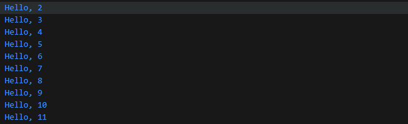
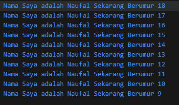
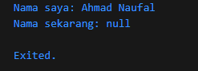
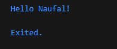

# **PEMROGRAMAN DART - WEEK 2 - PRAKTIKUM**

Nama  : Ahmad Naufal Ilham  
NIM   : 2341720047

# **Soal 1**
## **Modifikasilah kode pada baris 3 di VS Code atau Editor Code favorit Anda berikut ini agar mendapatkan keluaran (output) sesuai yang diminta!**

```dart
void main(){
  for (int i = 0; i < 10>; i++) {
    print('hello ${i + 2}');
  }
}
```


## **Output yang diminta (Gantilah Fulan dengan nama Anda):**
```dart
Nama Saya adalah Fulan Sekarang berumur 18
Nama Saya adalah Fulan Sekarang berumur 17
Nama Saya adalah Fulan Sekarang berumur 16
Nama Saya adalah Fulan Sekarang berumur 15
Nama Saya adalah Fulan Sekarang berumur 14
Nama Saya adalah Fulan Sekarang berumur 13
Nama Saya adalah Fulan Sekarang berumur 12
Nama Saya adalah Fulan Sekarang berumur 11
Nama Saya adalah Fulan Sekarang berumur 10
Nama Saya adalah Fulan Sekarang berumur 9
```
## **Jawaban**

```dart
void main(){
  hello();
  for (int i = 18; i >8; i--) {
    print('Nama Saya adalah Naufal Sekarang Berumur ${i}');
  }
}
```



# **Soal 2**
## **Mengapa sangat penting untuk memahami bahasa pemrograman Dart sebelum kita menggunakan framework Flutter ? Jelaskan!**

1. Kode flutter hanya bisa bahasa pemrograman Dart.
2. Belajar Flutter lebih cepat kalau sudah paham Dart.
3. Error & debugging di Flutter sama dengan error Dart.

# **Soal 3**
## **Rangkumlah materi dari codelab ini menjadi poin-poin penting yang dapat Anda gunakan untuk membantu proses pengembangan aplikasi mobile menggunakan framework Flutter.**

1. Dart adalah Inti dari Flutter
- Dart adalah bahasa pemrograman yang menjadi fondasi penuh Flutter—dari UI hingga logika, plugin, dan manajemen dependensi menggunakan syntax dan fitur Dart.

2. Evolusi dan Keunggulan Dart
- Diluncurkan pada 2011 untuk pengembangan web, Dart kini fokus pada mobile dengan Flutter.
- Kelebihannya meliputi:
    - Productive tooling (plugin IDE, paket ekosistem luas)
    - Garbage collection
    - Type annotations (opsional) + static typing dengan type inference → membantu mendeteksi bug lebih dini
    - Portabilitas tinggi: Dart bisa dikompilasi ke JavaScript atau kode native (ARM/x86)

3. Cara Kerja Eksekusi Dart
- Dart mendukung dua mode kompilasi:
    - JIT (Just-In-Time) — cepat untuk development, memungkinkan fitur hot reload
    - AOT (Ahead-Of-Time) — optimal untuk performa final app, meski tanpa hot reload

4. Dasar Sintaks dan Struktur Bahasa Dart
- Sintaks yang familiar bagi yang pernah punya pengalaman bahasa seperti C atau JavaScript:
    - Primitive types
    - Control flow (percabangan, perulangan)
    - Function—including main() sebagai entry point program

5. Object Oriented Programming di Dart
- Dart adalah bahasa OOP penuh, mendukung konsep seperti enkapsulasi, inheritance, abstraction, composition, dan polymorphism
- main() adalah function biasa (bukan method)—method terikat pada class dan instance

6. Operator sebagai Method
- Semua operator seperti +, ==, dan lainnya adalah method yang didefinisikan di dalam class:
    - Misalnya x == y sama dengan x.==(y)
    - Memudahkan operator overloading dan keberlanjutan konsep OOP
- Beberapa operator dasar:
    - Arithmetic: +, -, *, /, ~/ (integer division), %
    - Shortcut: +=, -=, *=, /=, ~/=
    - Increment/Decrement: ++, --
    - Comparison: ==, !=, >, <, >=, <= — == membandingkan isi, bukan reference seperti di Java
    - Logical: !, ||, &&

7. DartPad: Tools Eksperimen Cepat
- DartPad adalah tool online yang mendukung kode Dart inti (kecuali dart:io) untuk dicoba langsung tanpa setup lokal
- Bisa dijalankan langsung di DartPad atau disimpan jadi file .dart lalu dieksekusi di komputer lokal melalui dart hello_world.dart

# **Soal 4**
## **Buatlah penjelasan dan contoh eksekusi kode tentang perbedaan Null Safety dan Late variabel !**

1. Null Safety
Null Safety adalah fitur Dart untuk mencegah error karena variabel bernilai null.
- Variabel default-nya non-nullable → tidak bisa menyimpan null.
- Kalau mau bisa null, harus ditandai dengan tanda ?.

Contoh Null Safety

```dart
void main() {
  String? nama;                 // deklarasi nullable (bisa null / string)
  nama = "Ahmad Naufal ";       // sekarang diisi string
  print("Nama saya: $nama");

  nama = null;                  // juga boleh null
  print("Nama sekarang: $nama");
}
```
Output



2. Late Variable
Late dipakai kalau kita ingin menunda inisialisasi variabel non-nullable sampai nanti, tapi kita janji akan mengisinya sebelum dipakai.

Contoh Late Variable

```dart
void main() {
  late String message;

  // message belum diisi, jadi kalau dipanggil sekarang akan error
  // print(message); // Error

  // Inisialisasi di kemudian waktu
  message = "Hello Naufal!";
  print(message); // Hello Naufal!
}
```

Output



## **Kumpulkan jawaban Anda kepada dosen pengampu sesuai kesepakatan di kelas.**