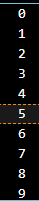

# PEMROGRAMAN DART - WEEK 3 - PRAKTIKUM*

**Nama  :** Ahmad Naufal Ilham  
**NIM   :** 2341720047  
**Absen :** 04  

# Soal 1
## Silakan selesaikan Praktikum 1 sampai 3, lalu dokumentasikan berupa screenshot hasil pekerjaan beserta penjelasannya!

## Praktikum 1 : Menerapkan Control Flows ("if/else")
**Langkah 1**

```dart
void main() {
  String test = "test2";
  if (test == "test1") {
    print("Test1");
  } else if (test == "test2") {
    print("Test2");
  } else {
    print("Something else");
  }

  if (test == "Test2") print("Test 2 Again");
}
```

**Langkah 2**

Silakan coba eksekusi (Run) kode pada langkah 1 tersebut. Apa yang terjadi? Jelaskan!

**Output**


- String test = "test2"; → variabel test berisi teks "test2".
- if (test == "test1") → "test2" == "test1" → false → tidak dieksekusi.
- else if (test == "test2") → "test2" == "test2" → true → mencetak Test2.
- if (test == "test2") print("Test 2 Again"); → "test2" == "test2" → akan mencetak "Test 2 Again".

**Langkah 3**

```dart
  bool test = true;
  if (test) {
    print("Kebenaran");
  }
```

**Output**


Karena sebelumnya String sehingga terjadi error sehingga harus diubah tipe datanya menjadi boolean agar sesuai

# Praktikum 2: Menerapkan Perulangan "while" dan "do-while"
**Langkah 1**

```dart
void main() {
  int counter = 0;
  while (counter < 33) {
    print(counter);
    counter++;
  }
}
```

**Output**



**Langkah 2**

Silakan coba eksekusi (Run) kode pada langkah 1 tersebut. Apa yang terjadi? Jelaskan! Lalu perbaiki jika terjadi error.

- int counter = 0; → variabel counter dimulai dari 0.
- while (counter < 33) → loop terus berjalan selama counter kurang dari 33.
- print(counter); → setiap putaran mencetak nilai counter.
- counter++; → setelah mencetak, nilai counter bertambah 1.
- Ketika counter mencapai 33, kondisi counter < 33 menjadi false, sehingga loop berhenti.

**langkah 3**

```dart
void main() {
  int counter = 0;
  do {
    print(counter);
    counter++;
  } while (counter < 77);
}
```

**Output**


- do { ... } while (kondisi); → berbeda dengan while, blok do selalu dijalankan minimal sekali, baru dicek kondisinya.
- counter dimulai dari 0.
- Blok print(counter); counter++; dieksekusi, lalu dicek counter < 77.
- Perulangan berhenti ketika counter = 77.

# Praktikum 3: Menerapkan Perulangan "for" dan "break-continue"
**Langkah 1 - 3**

```dart
void main() {
  for (int index = 10; index < 27; index++) {
    if (index == 21) {
      break; 
    } else if (index > 1 && index < 7) {
      continue;
    }

    print(index);
  }
}
```

**Output**


**Penjelasan**

- for (int index = 10; index < 27; index++) → Loop dimulai dari 10, berjalan sampai index = 26.
- if (index == 21) break; → Saat index = 21, perulangan dihentikan sepenuhnya. Jadi angka 21 sampai 26 tidak akan dicetak.
- else if (index > 1 && index < 7) → Kondisi ini tidak pernah terpenuhi, karena index mulai dari 10. Jadi continue di sini tidak berpengaruh.
- print(index); → Akan mencetak semua angka dari 10 sampai 20.

# Soal 2
## Buatlah sebuah program yang dapat menampilkan bilangan prima dari angka 0 sampai 201 menggunakan Dart. Ketika bilangan prima ditemukan, maka tampilkan nama lengkap dan NIM Anda.

**Kode**

```dart
void main() {
  String nama = "Ahmad Naufal Ilham"; 
  String nim = "2341720047";         

  for (int i = 0; i <= 201; i++) {
    if (prima(i)) {
      print("$i adalah bilangan prima -> $nama - $nim");
    } else {
      print(i);
    }
  }
}

bool prima(int n) {
  if (n < 2) return false;
  for (int i = 2; i <= n ~/ 2; i++) {
    if (n % i == 0) return false;
  }
  return true;
}
```

**Output**


