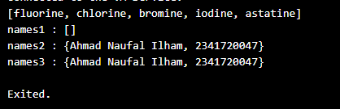
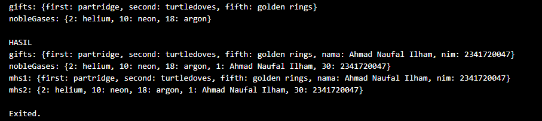

# PEMROGRAMAN DART - WEEK 4 - PRAKTIKUM*

**Nama  :** Ahmad Naufal Ilham  
**NIM   :** 2341720047  
**Absen :** 04  

# Soal 1
## Silakan selesaikan Praktikum 1 sampai 5, lalu dokumentasikan berupa screenshot hasil pekerjaan Anda beserta penjelasannya!

## Praktikum 1 : Eksperimen Tipe Data List
**Langkah 1**

``` dart
var list = [1, 2, 3];
assert(list.length == 3);
assert(list[1] == 2);
print(list.length);
print(list[1]);

list[1] = 1;
assert(list[1] == 1);
print(list[1]);
```

**Langkah 2**
Silakan coba eksekusi (Run) kode pada langkah 1 tersebut. Apa yang terjadi? Jelaskan!

Output


``` dart
- var list = [1, 2, 3]; membuat list integer dengan tiga elemen.
- assert(list.length == 3); memeriksa bahwa panjang list adalah 3.
- assert(list[1] == 2); memeriksa bahwa elemen index 1 adalah 2
- print(list.length); // outpput 3
- print(list[1]); // outpput 2
- list[1] = 1; mengganti elemen ke-1 (indeks 1) dari nilai 2 menjadi 1.
- assert(list[1] == 1) kondisi benar (elemen index 1 sekarang = 1).
- print(list[1]); // output 1
```

**Langkah 3**
``` dart
void main() {
  final List<String?> list = List<String?>.filled(5, null);

  list[1] = "Ahmad Naufal Ilham";
  list[2] = "2341720047";

  print(list);
}
```

Output


1. List<String?>.filled(5, null)
- Membuat sebuah list dengan panjang 5 elemen.
- Tipe datanya String?, artinya elemen list boleh berisi String atau null.
- Semua elemen awalnya diisi dengan null.
- Jadi pada awalnya:
[null, null, null, null, null]

2. list[1] = "Ahmad Naufal Ilham";
- Mengganti elemen indeks 1 dengan string "Ahmad Naufal Ilham".
- Hasil sementara:
[null, Ahmad Naufal Ilham, null, null, null]

3. list[2] = "2341720047";
- Mengganti elemen indeks 2 dengan string "2341720047".
- Hasil akhir list:
[null, Ahmad Naufal Ilham, 2341720047, null, null]

4. print(list);
- Akan mencetak isi list tersebut ke layar.
- Output:
[null, Ahmad Naufal Ilham, 2341720047, null, null]

## Praktikum 2 : Eksperimen Tipe Data Set
**Langkah 1**
``` dart
void main() {
  var halogens = {'fluorine', 'chlorine', 'bromine', 'iodine', 'astatine'};
  print(halogens);
}
```

**Langkah 2**
Output


1. Deklarasi set
``` dart
var halogens = {'fluorine', 'chlorine', 'bromine', 'iodine', 'astatine'};
```
Variable halogens dideklarasikan sebagai Set yang berisi 5 elemen String unsur halogen.
2. Print
``` dart
print(halogens);
```
Fungsi print akan menampilkan isi Set tersebut.

**Langkah 3**
``` dart
var names1 = <String>{};
Set<String> names2 = {}; 
var names3 = {}; 

print(names1);
print(names2);
print(names3);
```
Kenapa Error?
- var names3 = {}; membuat Map kosong, bukan Set.
- Kalau hanya diprint, tidak masalah → outputnya {}.
- Kalau dipakai method Set (add, contains, dll), baru error.

``` dart
void main() {
  var halogens = ['fluorine', 'chlorine', 'bromine', 'iodine', 'astatine'];
  print(halogens);

  var names1 = <String>[];
  Set<String> names2 = {};
  var names3 = <String>{};


  names2.add("Ahmad Naufal Ilham");
  names2.add("2341720047");
  names3.addAll(["Ahmad Naufal Ilham", "2341720047"]);

  print("names1 : $names1");
  print("names2 : $names2");
  print("names3 : $names3");
}
```

Output



Penjelasan
- names1 → List kosong → [].
- names2 & names3 → Set kosong (hanya bisa simpan elemen unik, tidak ada duplikat).
- Setelah add dan addAll, keduanya berisi:
``` dart
{Ahmad Naufal Ilham, 2341720047}
```

Perbedaan :
- List ([]) → terurut, bisa duplikat, akses pakai indeks.
- Set ({}) → tidak terurut, elemen unik, tidak ada indeks.

## Praktikum 3 : Eksperimen Tipe Data Maps
**Langkah 1**
``` dart
void main() {
  var gifts = {
    // Key:    Value
    'first': 'partridge',
    'second': 'turtledoves',
    'fifth': 1
  };

  var nobleGases = {
    2: 'helium',
    10: 'neon',
    18: 2,
  };

  print(gifts);
  print(nobleGases);
}
```
**Langkah 2**
``` dart
void main() {
  var gifts = {
    // Key:    Value
    'first': 'partridge',
    'second': 'turtledoves',
    'fifth': 1              // ❌ Error
  };

  var nobleGases = {
    2: 'helium',
    10: 'neon',
    18: 2,          // ❌ Error
  };
}

void main() {
  var gifts = {
    'first': 'partridge',
    'second': 'turtledoves',
    'fifth': 'golden rings'  // ✅ Diperbaiki
  };

  var nobleGases = {
    2: 'helium',
    10: 'neon',
    18: 'argon',  // ✅ Diperbaiki 
  };

  print(gifts);
  print(nobleGases);
}
```

Output


Penjelasan
- Kurung kurawal {} dengan format key: value berarti Map di Dart.
- Pada kode pertama terjadi error karena tipe value di dalam Map tidak konsisten:
- gifts ada String tapi juga angka 1.
- nobleGases ada String tapi juga angka 2.
- Dart maunya semua value dalam satu Map konsisten tipenya.

Setelah diperbaiki:
- gifts semua valuenya String ('partridge', 'turtledoves', 'golden rings').
- nobleGases semua valuenya String ('helium', 'neon', 'argon').

**Langkah 3**
```dart
void main() {
  var gifts = {
    'first': 'partridge',
    'second': 'turtledoves',
    'fifth': 'golden rings',
  };

  var nobleGases = {2: 'helium', 10: 'neon', 18: 'argon'};

  print('gifts: $gifts');
  print('nobleGases: $nobleGases');

  var mhs1 = Map<String, String>();
  mhs1['first'] = 'partridge';      // sebelumnya gifts
  mhs1['second'] = 'turtledoves';       // sebelumnya gifts
  mhs1['fifth'] = 'golden rings';       // sebelumnya gifts

  var mhs2 = Map<int, String>();
  mhs2[2] = 'helium';       // sebelumnya nobleGases
  mhs2[10] = 'neon';        // sebelumnya nobleGases
  mhs2[18] = 'argon';       // sebelumnya nobleGases

  gifts['nama'] = 'Ahmad Naufal Ilham';
  gifts['nim'] = '2341720047';

  nobleGases[1] = 'Ahmad Naufal Ilham';
  nobleGases[30] = '2341720047';

  mhs1['nama'] = 'Ahmad Naufal Ilham';
  mhs1['nim'] = '2341720047';

  mhs2[1] = 'Ahmad Naufal Ilham';
  mhs2[30] = '2341720047';

  print('\nHASIL');
  print('gifts: $gifts');
  print('nobleGases: $nobleGases');
  print('mhs1: $mhs1');
  print('mhs2: $mhs2');
}
```
Output



Penjelasan
1. Inisialisasi Map dengan literal {}
``` dart
var gifts = {'first': 'partridge', 'second': 'turtledoves', 'fifth': 'golden rings'};
var nobleGases = {2: 'helium', 10: 'neon', 18: 'argon'};
```
- gifts → key berupa String
- nobleGases → key berupa int
2. Inisialisasi Map dengan constructor Map<>()
``` dart
var mhs1 = Map<String, String>();
var mhs2 = Map<int, String>();
```
- mhs1 → key String, value String
- mhs2 → key int, value String
3. Menambahkan data baru ke dalam Map
``` dart
gifts['nama'] = 'Ahmad Naufal Ilham';
gifts['nim'] = '2341720047';
```
- Begitu juga pada nobleGases, mhs1, dan mhs2.
4. Menampilkan hasil akhir
``` dart
print('gifts: $gifts');
print('nobleGases: $nobleGases');
print('mhs1: $mhs1');
print('mhs2: $mhs2');
```

## Praktikum 4 : Eksperimen Tipe Data List: Spread dan Control-flow Operators
**Langkah 1**
``` dart
void main() {
  var list = [1, 2, 3];
  var list2 = [0, ...list];
  print(list1);
  print(list2);
  print(list2.length);
}
``` 

**Langkah 2**
``` dart
void main() {
  var list = [1, 2, 3];
  var list2 = [0, ...list];
  print(list1);         // List 1 tidak terdefinisi
  print(list2);
  print(list2.length);
}
``` 
Setelah diperbaiki
``` dart
void main() {
  var list = [1, 2, 3];
  var list2 = [0, ...list];
  print(list);         
  print(list2);
  print(list2.length);
}
``` 

Output


**Langkah 3**
``` dart
// kode tambahan
list1 = [1, 2, null];           // error karena list 1 tidak terdefinisi
print(list1);
var list3 = [0, ...?list1];
print(list3.length);
```

Setelah diperbaiki dan menambahkan nim
```dart
List<int?> list1 = [1, 2, null]; 
print("list1: $list1");
var list3 = [0, ...list1]; 
print("list3.length: ${list3.length}");

var nim = ['2', '3', '4', '1', '7', '2', '0', '0', '4', '7'];
var listWithNIM = [...list, ...nim];
print("nim: $nim");
print("listWithNIM: $listWithNIM");
```

Output


**Langkah 4**
``` dart
var nav = ['Home', 'Furniture', 'Plants', if (promoActive) 'Outlet'];
print(nav);
```

Perbaikan dan menambah deklarasi promoActive
``` dart
List<String> createNav(bool promoActive) {
    return ['Home', 'Furniture', 'Plants', if (promoActive) 'Outlet'];
}
print("Test promoActive = true:");
var navTrue = createNav(true);
print("nav: $navTrue");

print("Test promoActive = false:");
var navFalse = createNav(false);
print("nav: $navFalse");
```

Output


**Langkah 5**
``` dart
var nav2 = ['Home', 'Furniture', 'Plants', if (login case 'Manager') 'Inventory'];
print(nav2);
```

Perbaikan dan menambah deklarasi login
``` dart
String login = 'Manager';
var navManager = [
    'Home',
    'Furniture',
    'Plants',
    if (login case 'Manager') 'Inventory',
];
print("nav (login='Manager'): $navManager");

login = 'User';
var navUser = [
    'Home',
    'Furniture',
    'Plants',
    if (login case 'Manager') 'Inventory',
];
print("nav (login='User'): $navUser");

login = 'Admin';
var navAdmin = [
    'Home',
    'Furniture',
    'Plants',
    if (login case 'Manager') 'Inventory',
];
print("nav (login='Admin'): $navAdmin");
```

Output


**Langkah 6**
``` dart
var listOfInts = [1, 2, 3];
var listOfStrings = ['#0', for (var i in listOfInts) '#$i'];
assert(listOfStrings[1] == '#1');
print(listOfStrings);
```

Output


Penjelasan
collection for
- collection for adalah fitur di Dart yang memungkinkan kita menggunakan perulangan (for) langsung di dalam collection seperti List, Set, atau Map.
Manfaat 
- Lebih ringkas → kode jadi pendek dan mudah dibaca.
- Dinamis → isi koleksi bisa dibentuk berdasarkan kondisi atau perulangan.
- Lebih deklaratif → kita langsung melihat struktur koleksinya tanpa logika tambahan di luar.
- Menghindari kode berulang → tidak perlu list.add() berulang-ulang.

## Praktikum 5 : Eksperimen Tipe Data Records
**Langkah 1**
``` dart
void main() {
  var record = ('first', a: 2, b: true, 'last');
  print(record)     // error karena tidak ada ";"
}
```

**Langkah 2**
Perbaikan
``` dart
void main() {
  var record = ('first', a: 2, b: true, 'last');
  print(record);
}
```

Output


Penjelasan
Record di Dart digunakan untuk menyimpan beberapa nilai berbeda dalam satu variabel.

**Langkah 3**
``` dart
(int, int) tukar((int, int) record) {
  var (a, b) = record;
  return (b, a);
}

void main() {

  var originalRecord = (99, 1);
  print("Original record: $originalRecord");
  var swappedRecord = tukar(originalRecord);
  print("Swapped record: $swappedRecord");
}
```

Output


**Langkah 4**
``` dart
(String, int) mahasiswa;        // Mahasiswa belum diinisialisasi
print(mahasiswa);
```

Perbaikan
``` dart
(String, int) mahasiswa = ('Ahmad Naufal Ilham', 2341720047);
print("Mahasiswa: $mahasiswa");
```

Output


**Langkah 5**
``` dart
void main() {

  var mahasiswa2 = ('first', a: 2, b: true, 'last');

  print(mahasiswa2.$1); // Prints 'first'
  print(mahasiswa2.a); // Prints 2
  print(mahasiswa2.b); // Prints true
  print(mahasiswa2.$2); // Prints 'last'
}
```

Setelah isi diganti nim dan nama
``` dart
var mahasiswa2 = ('Ahmad Naufal Ilham', a: 2341720047, b: true, 'Politeknik Negeri Malang',);

  print("mahasiswa2.\$1: ${mahasiswa2.$1}"); 
  print("mahasiswa2.a: ${mahasiswa2.a}"); 
  print("mahasiswa2.b: ${mahasiswa2.b}"); 
  print("mahasiswa2.\$2: ${mahasiswa2.$2}");
```

Output


# Soal 2
## Jelaskan yang dimaksud Functions dalam bahasa Dart!
Dalam bahasa Dart, Function (fungsi) adalah sebuah blok kode yang digunakan untuk menjalankan tugas tertentu. Fungsi bisa dipanggil (dieksekusi) berkali-kali, sehingga kita tidak perlu menulis ulang kode yang sama.

# Soal 3
## Jelaskan jenis-jenis parameter di Functions beserta contoh sintaksnya!
1. Positional Parameters
- Parameter yang ditulis di dalam tanda kurung () dan harus diisi sesuai urutan. Jika urutan salah, maka hasilnya juga bisa salah.
- Contoh: void cetak(String nama, int umur) → harus diisi cetak("Budi", 20).

2. Optional Positional Parameters
- Parameter yang ditulis di dalam tanda kurung siku []. Artinya boleh diisi atau tidak. Jika tidak diisi, nilainya akan null atau bisa diberi nilai default.
- Contoh: void salam(String nama, [String? pesan]).

3. Named Parameters
- Parameter yang ditulis di dalam tanda kurung kurawal {}.
- Keuntungannya: bebas urutan saat dipanggil, karena harus menyebutkan nama parameternya.
- Contoh: void hitungLuas({int? panjang, int? lebar}).

4. Required Named Parameters
- Masih sama seperti named parameters {}, tapi dengan tambahan kata kunci required.
- Artinya, wajib diisi saat fungsi dipanggil, kalau tidak akan error.
- Contoh: void login({required String username, required String password}).

5. Default Parameter Values
- Parameter (baik positional maupun named) bisa diberi nilai default.
- Jika pemanggil fungsi tidak mengisi nilai parameter, maka nilai default yang akan dipakai.
- Contoh: void diskon(String produk, {int persen = 10}).

# Soal 4
## Jelaskan maksud Functions sebagai first-class objects beserta contoh sintaknya!
Dalam bahasa Dart, function diperlakukan sebagai first-class objects.
Artinya:
- Fungsi bisa disimpan dalam variabel.
- Fungsi bisa dikirim sebagai parameter ke fungsi lain.
- Fungsi bisa dikembalikan (return) dari fungsi lain.
- Fungsi bisa dimasukkan ke dalam struktur data (list, map, dll).

1. Menyimpan Fungsi dalam Variabel
``` dart
void sapa(String nama) {
  print("Halo, $nama!");
}

void main() {
  var myFunction = sapa;     // simpan fungsi ke variabel
  myFunction("Budi");        // panggil lewat variabel
}
```
2. Mengirim Fungsi sebagai Parameter
``` dart
void cetakHasil(int a, int b, Function operasi) {
  print("Hasil: ${operasi(a, b)}");
}

int tambah(int x, int y) => x + y;
int kali(int x, int y) => x * y;

void main() {
  cetakHasil(3, 4, tambah);   // kirim fungsi tambah
  cetakHasil(3, 4, kali);     // kirim fungsi kali
}
```
3. Mengembalikan Fungsi dari Fungsi
``` dart
Function pilihOperasi(String jenis) {
  if (jenis == "tambah") {
    return (int a, int b) => a + b;
  } else {
    return (int a, int b) => a * b;
  }
}

void main() {
  var operasi = pilihOperasi("tambah");  
  print(operasi(5, 2));   // 7

  operasi = pilihOperasi("kali");
  print(operasi(5, 2));   // 10
}
```

# Soal 5
## Apa itu Anonymous Functions? Jelaskan dan berikan contohnya!
Anonymous Function (fungsi anonim) adalah fungsi yang tidak memiliki nama.
Contoh :
```dart
void main() {
  var sapa = (String nama) {
    print("Halo, $nama!");
  };

  sapa("Budi");   // memanggil anonymous function
}
```

# Soal 6
## Jelaskan perbedaan Lexical scope dan Lexical closures! Berikan contohnya!
1. Lexical scope
- Lexical scope berarti ruang lingkup variabel ditentukan berdasarkan lokasi penulisan kode (posisi di dalam source code), bukan saat runtime.
Contoh:
``` dart
void main() {
  var nama = "Budi";

  void sapa() {
    // Bisa akses "nama" karena ada di scope luar (main)
    print("Halo, $nama");
  }

  sapa();  // Output: Halo, Budi
}
```

2. Lexical closure
- Lexical closure adalah fungsi yang "mengikat" (capture) variabel dari scope di luar dirinya, lalu tetap bisa menggunakannya meskipun scope luar itu sudah selesai dipanggil. 
Contoh :
``` dart
Function buatCounter() {
  var hitung = 0; // variabel lokal

  // inner function "menutup" (close over) variabel hitung
  return () {
    hitung++;
    return hitung;
  };
}

void main() {
  var counter1 = buatCounter();
  print(counter1()); // 1
  print(counter1()); // 2
  print(counter1()); // 3

  var counter2 = buatCounter();
  print(counter2()); // 1 (counter baru dengan scope berbeda)
}
```

# Soal 7
## Jelaskan dengan contoh cara membuat return multiple value di Functions!
1. Return List
- Mengembalikan beberapa nilai dalam bentuk List.
``` dart
List<int> hitung(int a, int b) {
  var jumlah = a + b;
  var kali = a * b;
  return [jumlah, kali];
}

void main() {
  var hasil = hitung(3, 4);
  print("Jumlah: ${hasil[0]}");
  print("Kali: ${hasil[1]}");
}
```
2. Return Map
- Lebih rapi kalau ingin menamai nilai yang dikembalikan.
``` dart
Map<String, int> hitung(int a, int b) {
  return {
    "jumlah": a + b,
    "kali": a * b
  };
}

void main() {
  var hasil = hitung(5, 2);
  print("Jumlah: ${hasil['jumlah']}");
  print("Kali: ${hasil['kali']}");
}
```
3. Return Object (Class)
- Bisa membuat class khusus untuk menampung hasil return.
``` dart
class HasilHitung {
  int jumlah;
  int kali;

  HasilHitung(this.jumlah, this.kali);
}

HasilHitung hitung(int a, int b) {
  return HasilHitung(a + b, a * b);
}

void main() {
  var hasil = hitung(6, 3);
  print("Jumlah: ${hasil.jumlah}");
  print("Kali: ${hasil.kali}");
}
```
4. Return Record (Dart 3.0+)
- Mulai Dart 3, sudah ada fitur Records (mirip tuple).
- Ini cara paling simpel untuk multiple return.
``` dart
(String, int) data() {
  return ("Budi", 20);
}

void main() {
  var (nama, umur) = data(); // destructuring
  print("Nama: $nama, Umur: $umur");
}
```