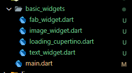

# PEMROGRAMAN DART - WEEK 5 - PRAKTIKUM*

**Nama  :** Ahmad Naufal Ilham  
**NIM   :** 2341720047  
**Absen :** 04  

# Soal 1
## Selesaikan Praktikum 1 sampai 5, lalu dokumentasikan dan push ke repository Anda berupa screenshot setiap hasil pekerjaan beserta penjelasannya di file README.md!

## Praktikum 1 : Membuat Project Flutter Baru
**Langkah 1**

Tekan tombol **Ctrl + Shift + P** maka akan tampil Command Palette, lalu ketik **Flutter**. Pilih **New Application Project**.

**Langkah 2**

Kemudian buat folder sesuai style laporan praktikum yang Anda pilih. Disarankan pada folder dokumen atau desktop atau alamat folder lain yang tidak terlalu dalam atau panjang. Lalu pilih **Select a folder to create the project in**.

**Langkah 3**

Buat nama project flutter **hello_world** seperti berikut, lalu tekan Enter. Tunggu hingga proses pembuatan project baru selesai.

**Langkah 4**

Jika sudah selesai proses pembuatan project baru, pastikan tampilan seperti berikut. Pesan akan tampil berupa "Your Flutter Project is ready!" artinya Anda telah berhasil membuat project Flutter baru.


## Praktikum 2 : Menghubungkan Perangkat Android atau Emulator
Melanjutkan dari praktikum 1, Anda diminta untuk menjalankan aplikasi ke perangkat fisik (device Android atau iOS). Silakan ikuti langkah-langkah pada codelab tautan berikut ini.

https://developer.android.com/codelabs/basic-android-kotlin-compose-connect-device?hl=id#0


## Praktikum 3 : Membuat Repository GitHub dan Laporan Praktikum

**Perhatian:** Diasumsikan Anda telah mempunyai akun GitHub dan Anda telah memahami konsep dasar dalam bekerja menggunakan Git pada pertemuan pertama.

Praktikum ini dapat Anda lewati langsung ke langkah 11 jika sudah paham cara membuat laporan praktikum sesuai style yang Anda pilih.

**Langkah 11**

Kembali ke VS Code, ubah platform di pojok kanan bawah ke emulator, device, atau browser Chrome. Lalu coba jalankan project hello_world dengan menekan F5 atau melalui menu Run > Start Debugging. Tunggu proses kompilasi hingga selesai, maka aplikasi Flutter pertama Anda akan tampil seperti berikut.


**Langkah 12**

Silakan screenshot seperti pada Langkah 11, namun teks yang ditampilkan dalam aplikasi berupa nama lengkap Anda. Simpan file screenshot dengan nama 01.png pada folder images (buat folder baru jika belum ada) di project hello_world Anda. Lalu ubah isi README.md seperti berikut, sehingga tampil hasil screenshot pada file README.md. Kemudian push ke repository Anda.


## Praktikum 4 : Menerapkan Widget Dasar
**Langkah 1**

Buat folder baru basic_widgets di dalam folder lib. Kemudian buat file baru di dalam basic_widgets dengan nama text_widget.dart. Ketik atau salin kode program berikut ke project hello_world Anda pada file text_widget.dart.


**Langkah 2**

Buat sebuah file image_widget.dart di dalam folder basic_widgets dengan isi kode berikut.


## Praktikum 5 : Menerapkan Widget Material Design dan iOS Cupertino
**Langkah 1**

Buat file di basic_widgets > loading_cupertino.dart. Import stateless widget dari material dan cupertino. Lalu isi kode di dalam method Widget build adalah sebagai berikut.
``` dart
import 'package:flutter/material.dart';
import 'package:flutter/cupertino.dart';

class LoadingCupertino extends StatelessWidget {
  const LoadingCupertino({Key? key}) : super(key: key);

  @override
  Widget build(BuildContext context) {
    return MaterialApp(
      home: Container(
        margin: const EdgeInsets.only(top: 30),
        color: Colors.white,
        child: Column(
          children: <Widget>[
            CupertinoButton(
              child: const Text("Contoh button"),
              onPressed: () {},
            ),
            const CupertinoActivityIndicator(),
          ],
        ),
      ),
    );
  }
}
```


**Langkah 2**

Button widget terdapat beberapa macam pada flutter yaitu ButtonBar, DropdownButton, TextButton, FloatingActionButton, IconButton, OutlineButton, PopupMenuButton, dan ElevatedButton.

Buat file di basic_widgets > fab_widget.dart. Import stateless widget dari material. Lalu isi kode di dalam method Widget build adalah sebagai berikut.
``` dart
import 'package:flutter/material.dart';

class FabWidget extends StatelessWidget {
  const FabWidget({super.key});

  @override
  Widget build(BuildContext context) {
    return MaterialApp(
      home: Scaffold(
        floatingActionButton: FloatingActionButton(
          onPressed: () {
            // Add your onPressed code here!
          },
          child: const Icon(Icons.thumb_up),
          backgroundColor: Colors.pink,
        ),
      ),
    );
  }
}
```


**Langkah 3**

Scaffold widget digunakan untuk mengatur tata letak sesuai dengan material design.

Ubah isi kode main.dart seperti berikut.
``` dart
import 'package:flutter/material.dart';

void main() {
  runApp(const MyApp());
}

class MyApp extends StatelessWidget {
  const MyApp({Key? key}) : super(key: key);

  @override
  Widget build(BuildContext context) {
    return MaterialApp(
      title: 'Flutter Demo',
      debugShowCheckedModeBanner: false,
      theme: ThemeData(
        primarySwatch: Colors.red,
        fontFamily: 'Roboto',
        scaffoldBackgroundColor: Colors.grey[50],
      ),
      home: const MyHomePage(
        title: 'Increment App - Ahmad Naufal Ilham - 2341720047',
      ),
    );
  }
}

class MyHomePage extends StatefulWidget {
  const MyHomePage({Key? key, required this.title}) : super(key: key);

  final String title;

  @override
  State<MyHomePage> createState() => _MyHomePageState();
}

class _MyHomePageState extends State<MyHomePage> {
  int _counter = 0;

  void _incrementCounter() {
    setState(() {
      _counter++;
    });
  }

  @override
  Widget build(BuildContext context) {
    return Scaffold(
      appBar: AppBar(
        title: Text(widget.title),
      ),
      body: Center(
        child: Column(
          mainAxisAlignment: MainAxisAlignment.center,
          children: <Widget>[
            const Text(
              'You have pushed the button this many times:',
            ),
            Text(
              '$_counter',
              style: Theme.of(context).textTheme.headlineLarge,
            ),
          ],
        ),
      ),
      bottomNavigationBar: BottomAppBar(
        child: Container(
          height: 50.0,
        ),
      ),
      floatingActionButton: FloatingActionButton(
        onPressed: _incrementCounter,
        tooltip: 'Increment Counter',
        child: const Icon(Icons.add),
      ),
      floatingActionButtonLocation: FloatingActionButtonLocation.centerDocked,
    );
  }
}
```


**Langkah 4**

Dialog widget pada flutter memiliki dua jenis dialog yaitu AlertDialog dan SimpleDialog.

Ubah isi kode main.dart seperti berikut.
``` dart
// Praktikum 5 - Langkah 4
import 'package:flutter/material.dart';

void main() {
  runApp(const MyApp());
}

/// Root widget aplikasi Langkah 5
class MyApp extends StatelessWidget {
  const MyApp({Key? key}) : super(key: key);

  @override
  Widget build(BuildContext context) {
    return MaterialApp(
      home: Scaffold(
        appBar: AppBar(title: const Text("Contoh TextField")),
        body: const TextField(
          obscureText: false,
          decoration: InputDecoration(
            border: OutlineInputBorder(),
            labelText: 'Nama',
          ),
        ),
      ),
    );
  }
}

/// Layout utama berisi tombol
class MyLayout extends StatelessWidget {
  const MyLayout({Key? key}) : super(key: key);

  @override
  Widget build(BuildContext context) {
    return Center(
      child: Padding(
        padding: const EdgeInsets.all(16.0),
        child: ElevatedButton.icon(
          icon: const Icon(Icons.notifications),
          label: const Text('Show Alert'),
          style: ElevatedButton.styleFrom(
            padding: const EdgeInsets.symmetric(horizontal: 20, vertical: 12),
            textStyle: const TextStyle(fontSize: 16),
          ),
          onPressed: () => showAlertDialog(context),
        ),
      ),
    );
  }
}

void showAlertDialog(BuildContext context) {
  final okButton = TextButton(
    child: const Text("OK"),
    onPressed: () => Navigator.pop(context),
  );

  final alert = AlertDialog(
    shape: RoundedRectangleBorder(borderRadius: BorderRadius.circular(12)),
    title: const Text("My Title"),
    content: const Text("INI ADALAH ALERT DIALOG - Ahmad Naufal Ilham - 2341720047"),
    actions: [okButton],
  );

  showDialog(
    context: context,
    builder: (context) => alert,
  );
}

```


**Langkah 5**

Flutter menyediakan widget yang dapat menerima input dari pengguna aplikasi yaitu antara lain Checkbox, Date and Time Pickers, Radio Button, Slider, Switch, TextField.

Contoh penggunaan TextField widget adalah sebagai berikut:
``` dart
// Praktikum 5 - Langkah 5
import 'package:flutter/material.dart';

void main() {
  runApp(const MyApp());
}

class MyApp extends StatelessWidget {
  const MyApp({Key? key}) : super(key: key);

  @override
  Widget build(BuildContext context) {
    return MaterialApp(
      home: Scaffold(
        appBar: AppBar(title: const Text("Contoh TextField")),
        body: const TextField(
          obscureText: false,
          decoration: InputDecoration(
            border: OutlineInputBorder(),
            labelText: 'Nama',
          ),
        ),
      ),
    );
  }
}
```


**Langkah 6**

Date and Time Pickers termasuk pada kategori input dan selection widget, berikut adalah contoh penggunaan Date and Time Pickers.
``` dart
// Praktikum 5 - Langkah 6
import 'dart:async';
import 'package:flutter/material.dart';

void main() => runApp(const MyApp());

class MyApp extends StatelessWidget {
  const MyApp({Key? key}) : super(key: key);

  @override
  Widget build(BuildContext context) {
    return const MaterialApp(
      title: 'Contoh Date Picker - Ahmad Naufal Ilham - 2341720047',
      home: MyHomePage(title: 'Contoh Date Picker - Ahmad Naufal Ilham - 2341720047'),
    );
  }
}

class MyHomePage extends StatefulWidget {
  const MyHomePage({Key? key, required this.title}) : super(key: key);

  final String title;

  @override
  _MyHomePageState createState() => _MyHomePageState();
}

class _MyHomePageState extends State<MyHomePage> {
  // Variable/State untuk mengambil tanggal
  DateTime selectedDate = DateTime.now();

  //  Initial SelectDate FLutter
  Future<void> _selectDate(BuildContext context) async {
    // Initial DateTime FIinal Picked
    final DateTime? picked = await showDatePicker(
        context: context,
        initialDate: selectedDate,
        firstDate: DateTime(2015, 8),
        lastDate: DateTime(2101));
    if (picked != null && picked != selectedDate) {
      setState(() {
        selectedDate = picked;
      });
    }
  }

  @override
  Widget build(BuildContext context) {
    return Scaffold(
      appBar: AppBar(
        title: Text(widget.title),
      ),
      body: Center(
        child: Column(
          mainAxisSize: MainAxisSize.min,
          children: <Widget>[
            Text("${selectedDate.toLocal()}".split(' ')[0]),
            const SizedBox(
              height: 20.0,
            ),
            ElevatedButton(
              onPressed: () => {
                _selectDate(context),
                // ignore: avoid_print
                print(selectedDate.day + selectedDate.month + selectedDate.year)
              },
              child: const Text('Pilih Tanggal'),
            ),
          ],
        ),
      ),
    );
  }
}
```


# Soal 2
## Selesaikan Praktikum 2 dan Anda wajib menjalankan aplikasi hello_world pada perangkat fisik (device Android/iOS) agar Anda mempunyai pengalaman untuk menghubungkan ke perangkat fisik. Capture hasil aplikasi di perangkat, lalu buatlah laporan praktikum pada file README.md.


**Menggunakan HP INFINIX GT 30 PRO**


# Soal 3
## Pada praktikum 5 mulai dari Langkah 3 sampai 6, buatlah file widget tersendiri di folder basic_widgets, kemudian pada file main.dart cukup melakukan import widget sesuai masing-masing langkah tersebut!

DONE ( Gabung Sama Praktikum )



# Soal 4
## Selesaikan Codelabs: Your first Flutter app, lalu buatlah laporan praktikumnya dan push ke repository GitHub Anda!


# Soal 5
## README.md berisi: capture hasil akhir tiap praktikum (side-by-side, bisa juga berupa file GIF agar terlihat proses perubahan ketika ada aksi dari pengguna) dengan menampilkan NIM dan Nama Anda sebagai ciri pekerjaan Anda.

DONE ( Gabung Sama Praktikum )

# Soal 6
## Kumpulkan berupa link repository/commit GitHub Anda kepada dosen yang telah disepakati!

