# PEMROGRAMAN DART - WEEK 6 - PRAKTIKUM*

**Nama  :** Ahmad Naufal Ilham  
**NIM   :** 2341720047  
**Absen :** 04  


# TUGAS PRAKTIKUM 1
# Soal 1
## Selesaikan Praktikum 1 sampai 4, lalu dokumentasikan dan push ke repository Anda berupa screenshot setiap hasil pekerjaan beserta penjelasannya di file README.md!

## Praktikum 1
**Langkah 1**
Buatlah sebuah project flutter baru dengan nama layout_flutter. Atau sesuaikan style laporan praktikum yang Anda buat.

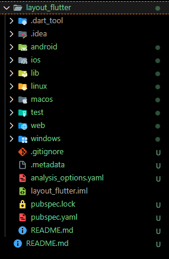

**Langkah 2**
Buka file main.dart lalu ganti dengan kode berikut. Isi nama dan NIM Anda di text title.
``` dart
import 'package:flutter/material.dart';

void main() => runApp(const MyApp());

class MyApp extends StatelessWidget {
  const MyApp({super.key});

  @override
  Widget build(BuildContext context) {
    return MaterialApp(
      title: 'Flutter layout: Ahmad Naufal Ilham - 2341720047',
      home: Scaffold(
        appBar: AppBar(
          title: const Text('Ahmad Naufal Ilham - 2341720047'),
        ),
        body: const Center(
          child: Text('Hello World'),
        ),
      ),
    );
  }
}
```

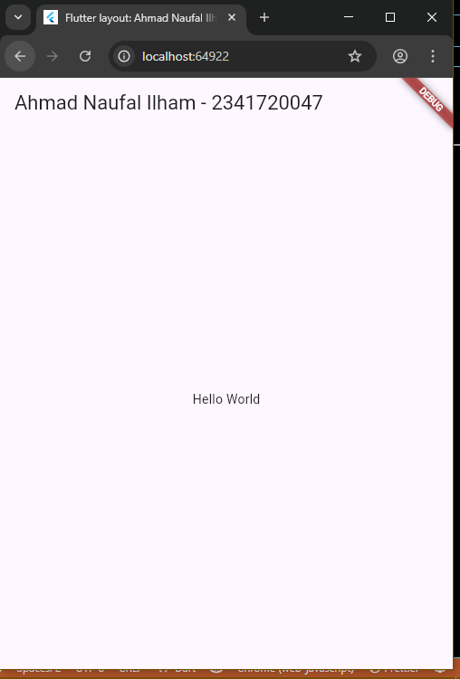

**Langkah 3**
1. Identifikasi Baris dan Kolom
- Bagian judul (Title section) → dibangun dengan Row berisi 3 elemen:
    - Expanded(Column) → memuat 2 teks:
        - Judul utama: Text('Oeschinen Lake Campground', style: bold)
        - Subjudul: Text('Kandersteg, Switzerland', color: Colors.black54)
    - Icon: Icons.star, berwarna merah.
    - Text: angka '41'.
- Expanded di sini bertugas agar kolom teks mengambil ruang tersisa, sehingga ikon bintang dan angka secara otomatis terdorong ke sisi kanan baris.
- Bagian tombol (Button section) → dibuat dengan Row yang memiliki 3 anak, masing-masing berupa Column (dengan mainAxisSize: MainAxisSize.min), isinya:
    - Ikon dengan warna tema utama (biru).
    - SizedBox(height: 8) sebagai jarak.
    - Label teks (warna biru, tebal sedang).
- Row menggunakan mainAxisAlignment: spaceEvenly sehingga ketiga tombol tersebar merata.

2. Apakah menggunakan Grid?
- Tidak, karena layout hanya memanfaatkan kombinasi Row dan Column, tanpa GridView.

3. Apakah ada elemen bertumpuk?
- Tidak ada. Karena tidak digunakan Stack atau Positioned, maka elemen ditampilkan berurutan tanpa overlap.

4. Apakah memerlukan tab navigasi?
- Tidak perlu, karena di sini tidak dipakai TabBar atau TabBarView.

5. Alignment, Padding, dan Border
- Alignment
    - Title → kolom teks diatur dengan crossAxisAlignment.start, sedangkan Expanded memastikan ikon dan angka menempel di kanan.
    - Tombol → baris memakai MainAxisAlignment.spaceEvenly agar setiap tombol berada pada posisi rata.
- Padding
    - Title diberi EdgeInsets.all(16).
    - Tombol diberi EdgeInsets.symmetric(horizontal: 24, vertical: 8).
    - Teks tambahan menggunakan EdgeInsets.all(24).
- Borders
    - Tidak ada bingkai khusus. Jika ingin styling, bisa dibungkus Card atau Container dengan BoxDecoration.

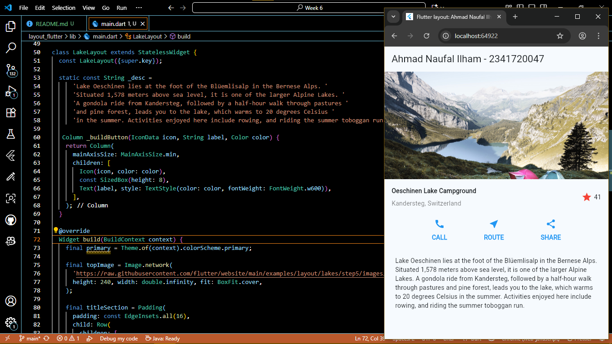

**Langkah 4**
``` dart
import 'package:flutter/material.dart';

void main() => runApp(const MyApp());

class MyApp extends StatelessWidget {
  const MyApp({super.key});

  @override
  Widget build(BuildContext context) {
    // ===== titleSection =====
    final Widget titleSection = Container(
      padding: const EdgeInsets.all(32),
      child: Row(
        children: [
          Expanded(
            child: Column(
              crossAxisAlignment: CrossAxisAlignment.start,
              children: [
                Container(
                  padding: const EdgeInsets.only(bottom: 8),
                  child: const Text(
                    'Kebun Apel',
                    style: TextStyle(fontWeight: FontWeight.bold),
                  ),
                ),
                const Text(
                  'Batu, Malang, Indonesia',
                  style: TextStyle(color: Colors.grey),
                ),
              ],
            ),
          ),
          const Icon(Icons.star, color: Colors.red),
          const SizedBox(width: 8),
          const Text('4.1'),
        ],
      ),
    );

    return MaterialApp(
      title: 'Flutter layout: Ahmad Naufal Ilham - 2341720047',
      home: Scaffold(
        appBar: AppBar(
          title: const Text('Ahmad Naufal Ilham - 2341720047'),
        ),
        body: ListView(
          children: [
            titleSection,
          ],
        ),
      ),
    );
  }
}
```


## Praktikum 2
**Langkah 1**
``` dart
Column _buildButtonColumn(Color color, IconData icon, String label) {
    return Column(
      mainAxisSize: MainAxisSize.min,
      mainAxisAlignment: MainAxisAlignment.center,
      children: [
        Icon(icon, color: color),
        Container(
          margin: const EdgeInsets.only(top: 8),
          child: Text(
            label,
            style: TextStyle(
              fontSize: 12,
              fontWeight: FontWeight.w400,
              color: color,
            ),
          ),
        ),
      ],
    );
  }
```

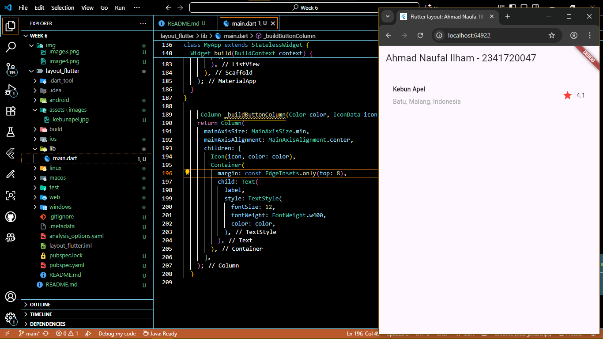

**Langkah 2**
``` dart
Widget buttonSection = Row(
  mainAxisAlignment: MainAxisAlignment.spaceEvenly,
  children: [
    _buildButtonColumn(color, Icons.call, 'CALL'),
    _buildButtonColumn(color, Icons.near_me, 'ROUTE'),
    _buildButtonColumn(color, Icons.share, 'SHARE'),
  ],
);
```

**Langkah 3**
Tambahkan variabel buttonSection ke dalam body seperti berikut:
``` dart
return MaterialApp(
      title: 'Flutter layout: Ahmad Naufal Ilham - 2341720047',
      home: Scaffold(
        appBar: AppBar(
          title: const Text('Ahmad Naufal Ilham - 2341720047'),
        ),
        body: ListView(
          children: [
            titleSection,
            buttonSection,
          ],
        ),
      ),
    );
```

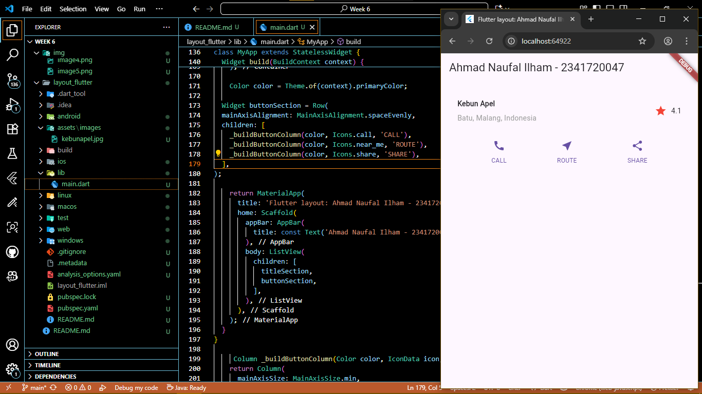

## Praktikum 3
**Langkah 1**
``` dart
Widget textSection = Container(
  padding: const EdgeInsets.all(32),
  child: const Text(
    'Apel Malang merupakan simbol dari pariwisata kota Malang itu sendiri.'
    'Kebun apel mudah ditemukan di kawasan ini, tersebar di beberapa kecamatan, terutama di provinsi Pujon dan Batu.'
    'Rasa buah apel yang manis dan segar dengan ukuran yang kecil-kecil menjadi oleh-oleh yang pas saat berkunjung ke Malang.'
    'Tambahkan nama dan NIM Anda sebagai '
    '\n\nNama : Ahmad Naufal Ilham'
    '\nNIM : 2341720047',
    softWrap: true,
  ),
);
```

**Langkah 2**
Tambahkan widget variabel textSection ke dalam body seperti berikut:
``` dart
return MaterialApp(
      title: 'Flutter layout: Ahmad Naufal Ilham - 2341720047',
      home: Scaffold(
        appBar: AppBar(
          title: const Text('Ahmad Naufal Ilham - 2341720047'),
        ),
        body: ListView(
          children: [
            titleSection,
            buttonSection,
            textSection,
          ],
        ),
      ),
    );
```

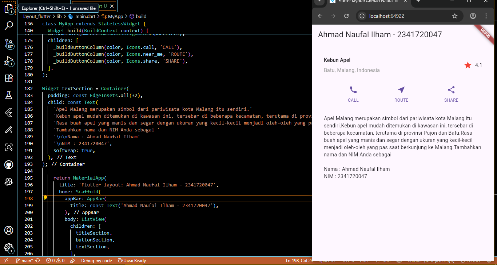

## Praktikum 4
**Langkah 1**
Anda dapat mencari gambar di internet yang ingin ditampilkan. Buatlah folder images di root project layout_flutter. Masukkan file gambar tersebut ke folder images, lalu set nama file tersebut ke file pubspec.yaml seperti berikut:
``` dart
flutter:

  # The following line ensures that the Material Icons font is
  # included with your application, so that you can use the icons in
  # the material Icons class.
  uses-material-design: true

  # To add assets to your application, add an assets section, like this:
  assets:
    - images/kebunapel.jpg
```

**Langkah 2**
Tambahkan aset gambar ke dalam body seperti berikut:
``` dart
return MaterialApp(
      title: 'Flutter layout: Ahmad Naufal Ilham - 2341720047',
      home: Scaffold(
        appBar: AppBar(
          title: const Text('Ahmad Naufal Ilham - 2341720047'),
        ),
        body: Column(
          children: [
            Image.asset(
              'images/kebunapel.jpg',
              width: 600,
              height: 240,
              fit: BoxFit.cover,
            ),
            titleSection,
            buttonSection,
            textSection,
          ],
        ),
      ),
    );
```

**Langkah 3**
Pada langkah terakhir ini, atur semua elemen dalam ListView, bukan Column, karena ListView mendukung scroll yang dinamis saat aplikasi dijalankan pada perangkat yang resolusinya lebih kecil.
``` dart
return MaterialApp(
      title: 'Flutter layout: Ahmad Naufal Ilham - 2341720047',
      home: Scaffold(
        appBar: AppBar(
          title: const Text('Ahmad Naufal Ilham - 2341720047'),
        ),
        body: ListView(
          children: [
            Image.asset(
              'images/kebunapel.jpg',
              width: 600,
              height: 240,
              fit: BoxFit.cover,
            ),
            titleSection,
            buttonSection,
            textSection,
          ],
        ),
      ),
    );
```

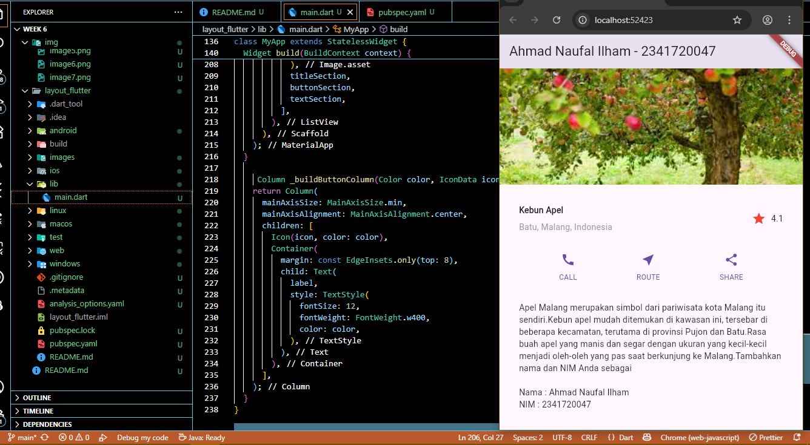


# Soal 2
## Silakan implementasikan di project baru "basic_layout_flutter" dengan mengakses sumber ini: https://docs.flutter.dev/codelabs/layout-basics

``` dart
import 'package:flutter/material.dart';

void main() => runApp(const MyApp());

class MyApp extends StatelessWidget {
  const MyApp({super.key});

  @override
  Widget build(BuildContext context) {
    Widget titleSection = ListTile(
      title: const Text(
        'Air Terjun Coban Rondo',
        style: TextStyle(fontWeight: FontWeight.bold),
      ),
      subtitle: Text(
        'Kecamatan Pujon, Kabupaten Malang, Jawa Timur.',
        style: TextStyle(color: Colors.grey[500]),
      ),
      trailing: Row(
        mainAxisSize: MainAxisSize.min,
        children: [
          Icon(Icons.star, color: Colors.red[500]),
          const Text('5.0'),
        ],
      ),
      contentPadding: const EdgeInsets.all(32),
    );

    Color color = Theme.of(context).primaryColor;

    Widget buttonSection = Row(
      mainAxisAlignment: MainAxisAlignment.spaceEvenly,
      children: [
        _buildButtonColumn(color, Icons.call, 'REVIEW'),
        _buildButtonColumn(color, Icons.near_me, 'ROUTE'),
        _buildButtonColumn(color, Icons.share, 'SHARE'),
      ],
    );

    Widget textSection = const Padding(
      padding: EdgeInsets.all(32),
      child: Text(
          'Air Terjun Coban Rondo merupakan air terjun yang terletak di Kecamatan Pujon, Kabupaten Malang, Jawa Timur.'
          'Air terjun ini mudah dijangkau oleh kendaraan umum. '
          'Akses yang paling mudah adalah dengan melalui jalan raya dari Malang ke Batu di sebelah timur atau dari Kediri ke Pare menuju Malang dari arah barat.',
        softWrap: true,
      ),
    );

    return MaterialApp(
      title: 'Flutter layout demo',
      home: Scaffold(
        appBar: AppBar(title: const Text('Wisata Jawa Timur')),
        body: ListView(
          children: [
            Stack(
              alignment: Alignment.bottomLeft,
              children: [
                Image.asset(
                  'images/cobanrondo.jpg',
                  width: 600,
                  height: 240,
                  fit: BoxFit.cover,
                ),
                Positioned(
                  bottom: 16,
                  left: 16,
                  child: Container(
                    padding: const EdgeInsets.symmetric(
                      vertical: 8,
                      horizontal: 12,
                    ),
                    color: Colors.black54,
                    child: const Text(
                      'Coban Rondo',
                      style: TextStyle(
                        fontSize: 20,
                        fontWeight: FontWeight.bold,
                        color: Colors.white,
                      ),
                    ),
                  ),
                ),
              ],
            ),
            titleSection,
            Card(
              margin: const EdgeInsets.all(16.0),
              elevation: 4.0,
              child: Column(children: [buttonSection, textSection]),
            ),
          ],
        ),
      ),
    );
  }

  Column _buildButtonColumn(Color color, IconData icon, String label) {
    return Column(
      mainAxisSize: MainAxisSize.min,
      mainAxisAlignment: MainAxisAlignment.center,
      children: [
        Icon(icon, color: color),
        Container(
          margin: const EdgeInsets.only(top: 8, bottom: 8),
          child: Text(
            label,
            style: TextStyle(
              fontSize: 12,
              fontWeight: FontWeight.w400,
              color: color,
            ),
          ),
        ),
      ],
    );
  }
}  
```

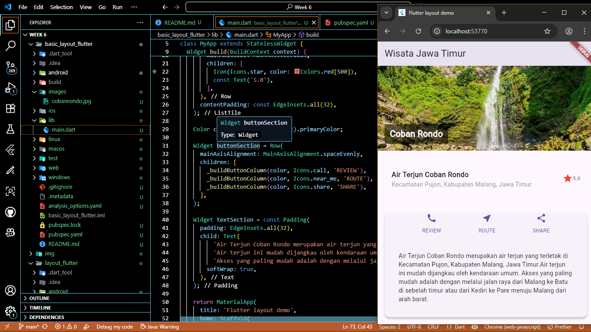

# Soal 3
## Kumpulkan link commit repository GitHub Anda kepada dosen yang telah disepakati!

## Praktikum 5
**Langkah1**
Sebelum melanjutkan praktikum, buatlah sebuah project baru Flutter dengan nama belanja dan susunan folder seperti pada gambar berikut. Penyusunan ini dimaksudkan untuk mengorganisasi kode dan widget yang lebih mudah.

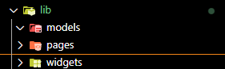

**Langkah2**
Buatlah dua buah file dart dengan nama home_page.dart dan item_page.dart pada folder pages. Untuk masing-masing file, deklarasikan class HomePage pada file home_page.dart dan ItemPage pada item_page.dart. Turunkan class dari StatelessWidget. Gambaran potongan kode dapat anda lihat sebagai berikut.

**home_Page**
``` dart
import 'package:flutter/material.dart';
import 'item_page.dart';

class HomePage extends StatelessWidget {
  const HomePage({super.key});

  @override
  Widget build(BuildContext context) {
    return Scaffold(
      appBar: AppBar(title: const Text('Home Page')),
      body: Center(
        child: ElevatedButton.icon(
          onPressed: () {
            Navigator.of(context).push(
              MaterialPageRoute(builder: (_) => const ItemPage()),
            );
          },
          icon: const Icon(Icons.arrow_forward),
          label: const Text('Go to Item Page'),
        ),
      ),
    );
  }
}
```

**item_page**
``` dart
import 'package:flutter/material.dart';

class ItemPage extends StatelessWidget {
  const ItemPage({super.key});

  @override
  Widget build(BuildContext context) {
    return Scaffold(
      appBar: AppBar(title: const Text('Item Page')),
      body: const Center(
        child: Text('This is the Item Page'),
      ),
    );
  }
}
```

**Langkah3**
Setelah kedua halaman telah dibuat dan didefinisikan, bukalah file main.dart. Pada langkah ini anda akan mendefinisikan Route untuk kedua halaman tersebut. Definisi penamaan route harus bersifat unique. Halaman HomePage didefinisikan sebagai /. Dan halaman ItemPage didefinisikan sebagai /item. Untuk mendefinisikan halaman awal, anda dapat menggunakan named argument initialRoute. Gambaran tahapan ini, dapat anda lihat pada potongan kode berikut.

``` dart
import 'package:flutter/material.dart';
import 'pages/home_page.dart';
import 'pages/item_page.dart';

void main() => runApp(const MyApp());

class MyApp extends StatelessWidget {
  const MyApp({super.key});

  @override
  Widget build(BuildContext context) {
    return MaterialApp(
      debugShowCheckedModeBanner: false,
      title: 'Marketplace Demo',
      theme: ThemeData(
        colorScheme: ColorScheme.fromSeed(seedColor: Colors.deepPurple),
        useMaterial3: true,
      ),
      initialRoute: '/',
      routes: {
        '/': (context) => HomePage(),
        '/item': (context) => const ItemPage(),
      },
    );
  }
}
```

**Langkah4**
Sebelum melakukan perpindahan halaman dari HomePage ke ItemPage, dibutuhkan proses pemodelan data. Pada desain mockup, dibutuhkan dua informasi yaitu nama dan harga. Untuk menangani hal ini, buatlah sebuah file dengan nama item.dart dan letakkan pada folder models. Pada file ini didefinisikan pemodelan data yang dibutuhkan. Ilustrasi kode yang dibutuhkan, dapat anda lihat pada potongan kode berikut.

``` dart
class Item {
  String name;
  int price;

  Item({this.name, this.price});
}
```

**Langkah5**
Pada halaman HomePage terdapat ListView widget. Sumber data ListView diambil dari model List dari object Item. Gambaran kode yang dibutuhkan untuk melakukan definisi model dapat anda lihat sebagai berikut.

``` dart
class HomePage extends StatelessWidget {
  HomePage({super.key});

  // Sumber data ListView dari model Item
  final List<Item> items = const [
    Item(name: 'Sugar', price: 5000),
    Item(name: 'Salt',  price: 2000),
  ];
```

**Langkah6**
Untuk menampilkan ListView pada praktikum ini digunakan itemBuilder. Data diambil dari definisi model yang telah dibuat sebelumnya. Untuk menunjukkan batas data satu dan berikutnya digunakan widget Card. Kode yang telah umum pada bagian ini tidak ditampilkan. 


**Langkah7**
Item pada ListView saat ini ketika ditekan masih belum memberikan aksi tertentu. Untuk menambahkan aksi pada ListView dapat digunakan widget InkWell atau GestureDetector. Perbedaan utamanya InkWell merupakan material widget yang memberikan efek ketika ditekan. Sedangkan GestureDetector bersifat umum dan bisa juga digunakan untuk gesture lain selain sentuhan. Pada praktikum ini akan digunakan widget InkWell.

Untuk menambahkan sentuhan, letakkan cursor pada widget pembuka Card. Kemudian gunakan shortcut quick fix dari VSCode (Ctrl + . pada Windows atau Cmd + . pada MacOS). Sorot menu wrap with widget... Ubah nilai widget menjadi InkWell serta tambahkan named argument onTap yang berisi fungsi untuk berpindah ke halaman ItemPage. Ilustrasi potongan kode dapat anda lihat pada potongan berikut.

``` dart
return Card(
  child: InkWell(
    onTap: () {
  // ke ItemPage via named route + kirim data
  Navigator.pushNamed(context, '/item', arguments: item);
  },
```

**home_page**

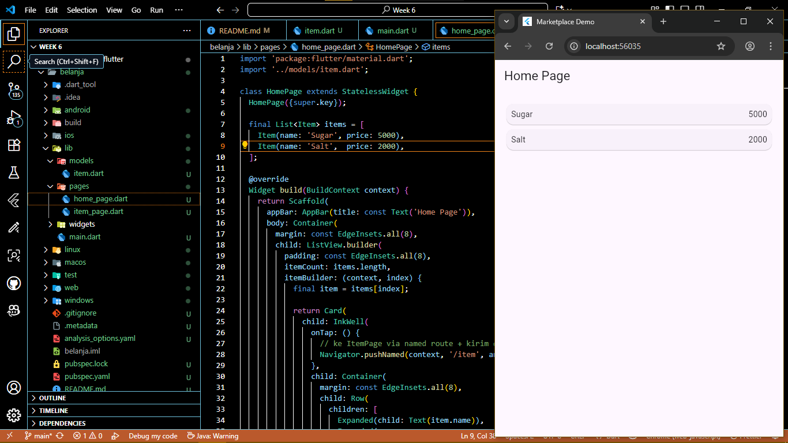

**item_page**

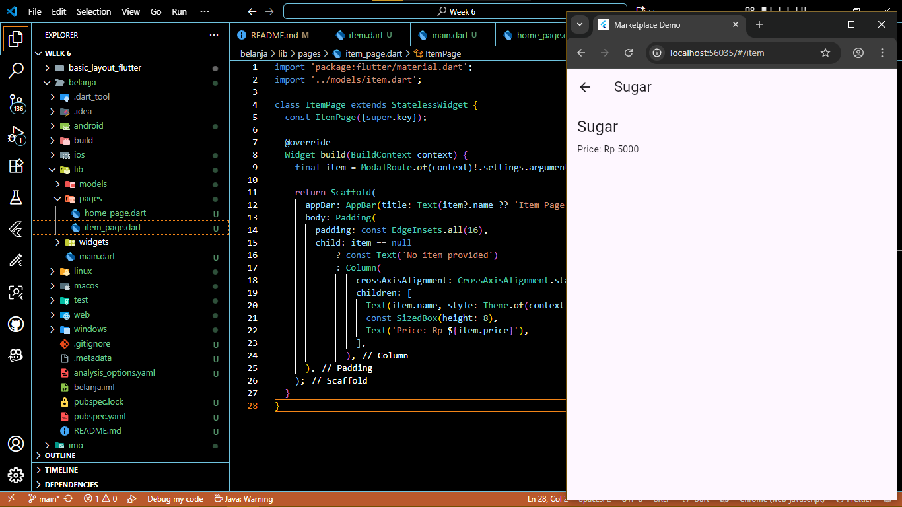


# TUGAS PRAKTIKUM 2
# Soal 1
Untuk melakukan pengiriman data ke halaman berikutnya, cukup menambahkan informasi arguments pada penggunaan Navigator. Perbarui kode pada bagian Navigator menjadi seperti berikut.

``` dart
Navigator.pushNamed(context, '/item', arguments: item);
```

# Soal 2
Pembacaan nilai yang dikirimkan pada halaman sebelumnya dapat dilakukan menggunakan ModalRoute. Tambahkan kode berikut pada blok fungsi build dalam halaman ItemPage. Setelah nilai didapatkan, anda dapat menggunakannya seperti penggunaan variabel pada umumnya. (https://docs.flutter.dev/cookbook/navigation/navigate-with-arguments)

``` dart
final itemArgs = ModalRoute.of(context)!.settings.arguments as Item;
```

# Soal 3
Pada hasil akhir dari aplikasi belanja yang telah anda selesaikan, tambahkan atribut foto produk, stok, dan rating. Ubahlah tampilan menjadi GridView seperti di aplikasi marketplace pada umumnya.

**pubspec.yaml**
``` dart
flutter:

  # The following line ensures that the Material Icons font is
  # included with your application, so that you can use the icons in
  # the material Icons class.
  uses-material-design: true

  # To add assets to your application, add an assets section, like this:
  assets:
  - images/
```

**item.dart**
``` dart
class Item {
  final String name;
  final int price;
  final String imageUrl;
  final int stock;
  final double rating;

  const Item({
    required this.name,
    required this.price,
    required this.imageUrl,
    required this.stock,
    required this.rating,
  });
}
```

**home_page**
``` dart
import 'package:flutter/material.dart';

import '../models/item.dart';

class HomePage extends StatelessWidget {
  HomePage({super.key});

  final List<Item> items = [
    Item(
      name: 'Gula',
      price: 5000,
      imageUrl: 'images/gula.jpg',
      stock: 25,
      rating: 4.5,
    ),
    Item(
      name: 'Garam',
      price: 2000,
      imageUrl: 'images/garam.jpg',
      stock: 15,
      rating: 4.2,
    ),
  ];

  Widget _getProductIcon(String productName) {
    IconData iconData = Icons.shopping_bag;
    Color iconColor = Colors.grey;

    switch (productName.toLowerCase()) {
      case 'gula':
        iconData = Icons.grain;
        iconColor = Colors.white;
        break;
      case 'garam':
        iconData = Icons.scatter_plot;
        iconColor = Colors.grey[300]!;
        break;
    }

    return Center(child: Icon(iconData, size: 48, color: iconColor));
  }

  @override
  Widget build(BuildContext context) {
    return Scaffold(
      appBar: AppBar(
        title: const Text(
          'Warung Naufal',
          style: TextStyle(fontWeight: FontWeight.bold),
        ),
        backgroundColor: Colors.deepPurple,
        foregroundColor: Colors.white,
        elevation: 2,
      ),
      body: Container(
        color: Colors.grey[50],
        child: Column(
          children: [
            // Header section with greeting
            Container(
              padding: const EdgeInsets.all(16),
              color: Colors.white,
              child: Column(
                crossAxisAlignment: CrossAxisAlignment.start,
                children: [
                  Text(
                    'Selamat datang di Warung Naufal!',
                    style: TextStyle(
                      fontSize: 18,
                      fontWeight: FontWeight.w600,
                      color: Colors.grey[800],
                    ),
                  ),
                  const SizedBox(height: 4),
                  Text(
                    'Temukan produk terbaik dengan harga murah',
                    style: TextStyle(fontSize: 14, color: Colors.grey[600]),
                  ),
                ],
              ),
            ),
            // Products grid
            Expanded(
              child: Padding(
                padding: const EdgeInsets.all(8),
                child: GridView.builder(
                  gridDelegate: const SliverGridDelegateWithFixedCrossAxisCount(
                    crossAxisCount: 2,
                    childAspectRatio: 0.7,
                    crossAxisSpacing: 8,
                    mainAxisSpacing: 8,
                  ),
                  itemCount: items.length,
                  itemBuilder: (context, index) {
                    final item = items[index];
                    final heroTag = 'item-hero-${item.name}';

                    return GestureDetector(
                      onTap: () {
                        Navigator.pushNamed(context, '/item', arguments: item);
                      },
                      child: AnimatedContainer(
                        duration: const Duration(milliseconds: 200),
                        child: Card(
                          elevation: 6,
                          shadowColor: Colors.black26,
                          shape: RoundedRectangleBorder(
                            borderRadius: BorderRadius.circular(12),
                          ),
                          child: Column(
                            crossAxisAlignment: CrossAxisAlignment.start,
                            children: [
                              // Product Image
                              Expanded(
                                flex: 3,
                                child: Container(
                                  width: double.infinity,
                                  child: Hero(
                                    tag: heroTag,
                                    child: ClipRRect(
                                      borderRadius: const BorderRadius.vertical(
                                        top: Radius.circular(12),
                                      ),
                                      child: Image.asset(
                                        item.imageUrl,
                                        fit: BoxFit.cover,
                                        width: double.infinity,
                                        height: double.infinity,
                                        errorBuilder:
                                            (context, error, stackTrace) {
                                              return Container(
                                                color: Colors.grey[200],
                                                child: _getProductIcon(
                                                  item.name,
                                                ),
                                              );
                                            },
                                      ),
                                    ),
                                  ),
                                ),
                              ),
                              // Product Details
                              Expanded(
                                flex: 2,
                                child: Padding(
                                  padding: const EdgeInsets.all(8.0),
                                  child: Column(
                                    crossAxisAlignment:
                                        CrossAxisAlignment.start,
                                    mainAxisAlignment:
                                        MainAxisAlignment.spaceBetween,
                                    children: [
                                      // Product Name
                                      Text(
                                        item.name,
                                        style: const TextStyle(
                                          fontWeight: FontWeight.bold,
                                          fontSize: 14,
                                        ),
                                        maxLines: 1,
                                        overflow: TextOverflow.ellipsis,
                                      ),
                                      const SizedBox(height: 4),
                                      // Price
                                      Text(
                                        'Rp ${item.price.toString().replaceAllMapped(RegExp(r'(\d{1,3})(?=(\d{3})+(?!\d))'), (Match m) => '${m[1]}.')}',
                                        style: const TextStyle(
                                          color: Colors.green,
                                          fontWeight: FontWeight.w600,
                                          fontSize: 13,
                                        ),
                                      ),
                                      const SizedBox(height: 4),
                                      // Rating and Stock
                                      Row(
                                        children: [
                                          const Icon(
                                            Icons.star,
                                            size: 14,
                                            color: Colors.amber,
                                          ),
                                          const SizedBox(width: 2),
                                          Text(
                                            item.rating.toString(),
                                            style: const TextStyle(
                                              fontSize: 11,
                                            ),
                                          ),
                                          const Spacer(),
                                          Text(
                                            'Stok: ${item.stock}',
                                            style: TextStyle(
                                              fontSize: 11,
                                              color: item.stock > 10
                                                  ? Colors.green
                                                  : Colors.orange,
                                              fontWeight: FontWeight.w500,
                                            ),
                                          ),
                                        ],
                                      ),
                                    ],
                                  ),
                                ),
                              ),
                            ],
                          ),
                        ),
                      ),
                    );
                  },
                ),
              ),
            ),
          ],
        ),
      ),
    );
  }
}
```

**home_page**

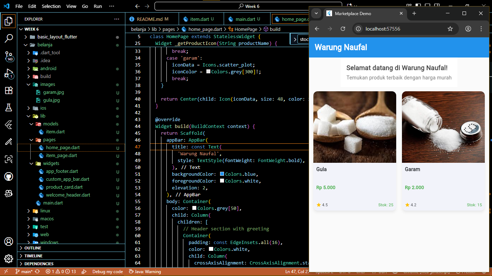

**item_page**

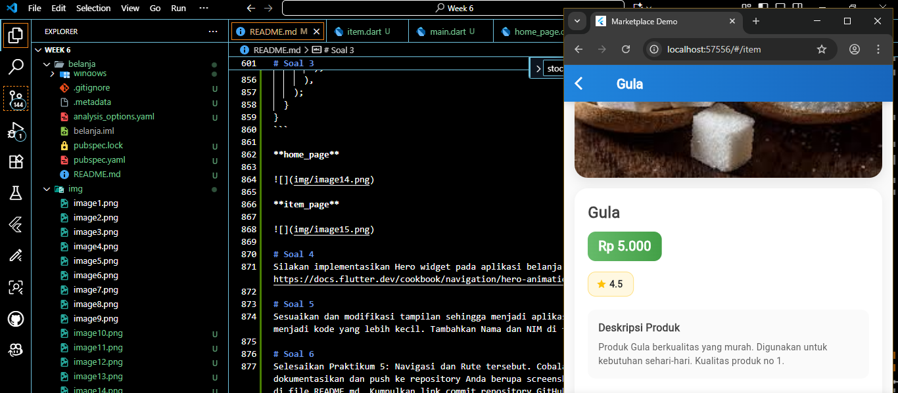

# Soal 4
Silakan implementasikan Hero widget pada aplikasi belanja Anda dengan mempelajari dari sumber ini: https://docs.flutter.dev/cookbook/navigation/hero-animations

``` dart
                  itemCount: items.length,
                  itemBuilder: (context, index) {
                    final item = items[index];
                    final heroTag = 'item-hero-${item.name}';

                    return GestureDetector(
                      onTap: () {
                        Navigator.pushNamed(context, '/item', arguments: item);
                      },
                      child: AnimatedContainer(
                        duration: const Duration(milliseconds: 200),
                        child: Card(
                          elevation: 6,
                          shadowColor: Colors.black26,
                          shape: RoundedRectangleBorder(
                            borderRadius: BorderRadius.circular(12),
                          ),
                          child: Column(
                            crossAxisAlignment: CrossAxisAlignment.start,
                            children: [
                              Expanded(
                                flex: 3,
                                child: Container(
                                  width: double.infinity,
                                  child: Hero(
                                    tag: heroTag,
```

``` dart
  Widget build(BuildContext context) {
    final item = ModalRoute.of(context)!.settings.arguments as Item;
    final heroTag = 'item-hero-${item.name}';

    return Scaffold(
      appBar: AppBar(title: Text(item.name)),
      body: SingleChildScrollView(
        padding: const EdgeInsets.all(16),
        child: Column(
          crossAxisAlignment: CrossAxisAlignment.start,
          children: [
            AspectRatio(
              aspectRatio: 1.3,
              child: Hero(
                tag: heroTag,
```

# Soal 5
Sesuaikan dan modifikasi tampilan sehingga menjadi aplikasi yang menarik. Selain itu, pecah widget menjadi kode yang lebih kecil. Tambahkan Nama dan NIM di footer aplikasi belanja Anda.

**app_footer**
``` dart
import 'package:flutter/material.dart';

class AppFooter extends StatelessWidget {
  const AppFooter({super.key});

  @override
  Widget build(BuildContext context) {
    return Container(
      width: double.infinity,
      padding: const EdgeInsets.symmetric(vertical: 20, horizontal: 16),
      decoration: BoxDecoration(
        gradient: LinearGradient(
          begin: Alignment.topCenter,
          end: Alignment.bottomCenter,
          colors: [Colors.blue.shade600, Colors.blue.shade800],
        ),
        boxShadow: [
          BoxShadow(
            color: Colors.black.withOpacity(0.1),
            blurRadius: 8,
            offset: const Offset(0, -2),
          ),
        ],
      ),
      child: Column(
        mainAxisSize: MainAxisSize.min,
        children: [
          // Logo or App Name
          Row(
            mainAxisAlignment: MainAxisAlignment.center,
            children: [
              const SizedBox(width: 8),
              Text(
                'Warung Naufal',
                style: TextStyle(
                  color: Colors.white,
                  fontSize: 16,
                  fontWeight: FontWeight.bold,
                ),
              ),
            ],
          ),
          const SizedBox(height: 12),
          // Divider
          Container(
            height: 1,
            width: 100,
            color: Colors.white.withOpacity(0.3),
          ),
          const SizedBox(height: 12),
          // Student Info
          Column(
            children: [
              Text(
                'Ahmad Naufal Ilham',
                style: TextStyle(
                  color: Colors.white,
                  fontSize: 14,
                  fontWeight: FontWeight.w600,
                ),
                textAlign: TextAlign.center,
              ),
              const SizedBox(height: 5),
              Row(
                mainAxisAlignment: MainAxisAlignment.center,
                children: [
                  _buildInfoChip('NIM: 2341720047'),
                  const SizedBox(width: 10),
                  _buildInfoChip('TI3G'),
                  const SizedBox(width: 10),
                  _buildInfoChip('04'),
                ],
              ),
            ],
          ),
          const SizedBox(height: 12),
        ],
      ),
    );
  }

  Widget _buildInfoChip(String text) {
    return Container(
      padding: const EdgeInsets.symmetric(horizontal: 8, vertical: 4),
      decoration: BoxDecoration(
        color: Colors.white.withOpacity(0.15),
        borderRadius: BorderRadius.circular(12),
        border: Border.all(color: Colors.white.withOpacity(0.3), width: 0.5),
      ),
      child: Text(
        text,
        style: TextStyle(
          color: Colors.white,
          fontSize: 11,
          fontWeight: FontWeight.w500,
        ),
      ),
    );
  }
}
```

**custom_app_bar**
``` dart
import 'package:flutter/material.dart';

class CustomAppBar extends StatelessWidget implements PreferredSizeWidget {
  final String title;
  final bool showBackButton;

  const CustomAppBar({
    super.key,
    required this.title,
    this.showBackButton = false,
  });

  @override
  Widget build(BuildContext context) {
    return Container(
      decoration: BoxDecoration(
        gradient: LinearGradient(
          begin: Alignment.topLeft,
          end: Alignment.bottomRight,
          colors: [Colors.blue.shade600, Colors.blue.shade800],
        ),
        boxShadow: [
          BoxShadow(
            color: Colors.black.withOpacity(0.15),
            blurRadius: 8,
            offset: const Offset(0, 2),
          ),
        ],
      ),
      child: AppBar(
        title: Row(
          children: [
            const SizedBox(width: 8),
            Text(
              title,
              style: const TextStyle(
                fontWeight: FontWeight.bold,
                fontSize: 20,
                color: Colors.white,
              ),
            ),
          ],
        ),
        backgroundColor: Colors.transparent,
        foregroundColor: Colors.white,
        elevation: 0,
        leading: showBackButton
            ? IconButton(
                icon: const Icon(Icons.arrow_back_ios, color: Colors.white),
                onPressed: () => Navigator.of(context).pop(),
              )
            : null,
      ),
    );
  }

  @override
  Size get preferredSize => const Size.fromHeight(kToolbarHeight);
}
```

**product_card**
``` dart
import 'package:flutter/material.dart';

import '../models/item.dart';

class ProductCard extends StatelessWidget {
  final Item item;
  final VoidCallback onTap;

  const ProductCard({super.key, required this.item, required this.onTap});

  Widget _getProductIcon(String productName) {
    String imageUrl;

    switch (productName.toLowerCase()) {
      case 'gula':
        imageUrl = 'assets/images/gula.jpg';
        break;
      case 'garam':
        imageUrl = 'assets/images/garam.jpg';
        break;
      default:
        return Center(
          child: Icon(Icons.shopping_basket, size: 48, color: Colors.grey),
        );
    }

    return Center(
      child: Image.asset(
        imageUrl,
        width: 48,
        height: 48,
        fit: BoxFit.cover,
        errorBuilder: (context, error, stackTrace) {
          return Icon(Icons.shopping_basket, size: 48, color: Colors.grey);
        },
      ),
    );
  }

  @override
  Widget build(BuildContext context) {
    final heroTag = 'item-hero-${item.name}';

    return GestureDetector(
      onTap: onTap,
      child: Container(
        decoration: BoxDecoration(
          borderRadius: BorderRadius.circular(16),
          gradient: LinearGradient(
            begin: Alignment.topLeft,
            end: Alignment.bottomRight,
            colors: [Colors.white, Colors.grey.shade50],
          ),
          boxShadow: [
            BoxShadow(
              color: Colors.black.withOpacity(0.08),
              blurRadius: 12,
              offset: const Offset(0, 4),
            ),
          ],
        ),
        child: ClipRRect(
          borderRadius: BorderRadius.circular(16),
          child: Column(
            crossAxisAlignment: CrossAxisAlignment.start,
            children: [
              // Product Image with gradient overlay
              Expanded(
                flex: 3,
                child: Stack(
                  children: [
                    Container(
                      width: double.infinity,
                      child: Hero(
                        tag: heroTag,
                        child: ClipRRect(
                          borderRadius: const BorderRadius.vertical(
                            top: Radius.circular(16),
                          ),
                          child: Image.asset(
                            item.imageUrl,
                            fit: BoxFit.cover,
                            width: double.infinity,
                            height: double.infinity,
                            errorBuilder: (context, error, stackTrace) {
                              return Container(
                                color: Colors.grey[200],
                                child: _getProductIcon(item.name),
                              );
                            },
                          ),
                        ),
                      ),
                    ),
                    // Gradient overlay for better text readability
                    Positioned(
                      bottom: 0,
                      left: 0,
                      right: 0,
                      child: Container(
                        height: 30,
                        decoration: BoxDecoration(
                          gradient: LinearGradient(
                            begin: Alignment.topCenter,
                            end: Alignment.bottomCenter,
                            colors: [
                              Colors.transparent,
                              Colors.black.withOpacity(0.2),
                            ],
                          ),
                        ),
                      ),
                    ),
                  ],
                ),
              ),
              // Product Details
              Expanded(
                flex: 2,
                child: Padding(
                  padding: const EdgeInsets.all(12.0),
                  child: Column(
                    crossAxisAlignment: CrossAxisAlignment.start,
                    mainAxisAlignment: MainAxisAlignment.spaceBetween,
                    children: [
                      // Product Name
                      Text(
                        item.name,
                        style: const TextStyle(
                          fontWeight: FontWeight.bold,
                          fontSize: 15,
                          color: Colors.black87,
                        ),
                        maxLines: 1,
                        overflow: TextOverflow.ellipsis,
                      ),
                      const SizedBox(height: 4),
                      // Price with better styling
                      Container(
                        padding: const EdgeInsets.symmetric(
                          horizontal: 8,
                          vertical: 2,
                        ),
                        decoration: BoxDecoration(
                          color: Colors.green.shade50,
                          borderRadius: BorderRadius.circular(8),
                        ),
                        child: Text(
                          'Rp ${item.price.toString().replaceAllMapped(RegExp(r'(\d{1,3})(?=(\d{3})+(?!\d))'), (Match m) => '${m[1]}.')}',
                          style: TextStyle(
                            color: Colors.green.shade700,
                            fontWeight: FontWeight.w700,
                            fontSize: 13,
                          ),
                        ),
                      ),
                      const SizedBox(height: 6),
                      // Rating and Stock
                      Row(
                        children: [
                          Container(
                            padding: const EdgeInsets.symmetric(
                              horizontal: 6,
                              vertical: 2,
                            ),
                            decoration: BoxDecoration(
                              color: Colors.amber.shade50,
                              borderRadius: BorderRadius.circular(6),
                            ),
                            child: Row(
                              mainAxisSize: MainAxisSize.min,
                              children: [
                                const Icon(
                                  Icons.star,
                                  size: 12,
                                  color: Colors.amber,
                                ),
                                const SizedBox(width: 2),
                                Text(
                                  item.rating.toString(),
                                  style: const TextStyle(
                                    fontSize: 10,
                                    fontWeight: FontWeight.w600,
                                  ),
                                ),
                              ],
                            ),
                          ),
                          const Spacer(),
                          Container(
                            padding: const EdgeInsets.symmetric(
                              horizontal: 6,
                              vertical: 2,
                            ),
                            decoration: BoxDecoration(
                              color: item.stock > 10
                                  ? Colors.green.shade50
                                  : Colors.orange.shade50,
                              borderRadius: BorderRadius.circular(6),
                            ),
                          ),
                        ],
                      ),
                    ],
                  ),
                ),
              ),
            ],
          ),
        ),
      ),
    );
  }
} 
```

**welcome_header**
``` dart
import 'package:flutter/material.dart';

class WelcomeHeader extends StatelessWidget {
  const WelcomeHeader({super.key});

  @override
  Widget build(BuildContext context) {
    return Container(
      width: double.infinity,
      decoration: BoxDecoration(
        gradient: LinearGradient(
          begin: Alignment.topLeft,
          end: Alignment.bottomRight,
          colors: [Colors.white, Colors.blue.shade50],
        ),
        boxShadow: [
          BoxShadow(
            color: Colors.black.withOpacity(0.05),
            blurRadius: 8,
            offset: const Offset(0, 2),
          ),
        ],
      ),
      child: Padding(
        padding: const EdgeInsets.all(20),
        child: Column(
          crossAxisAlignment: CrossAxisAlignment.start,
          children: [
            Row(
              children: [
                Container(
                  padding: const EdgeInsets.all(12),
                  decoration: BoxDecoration(
                    color: Colors.blue.shade100,
                    borderRadius: BorderRadius.circular(12),
                  ),
                ),
                const SizedBox(width: 12),
                Expanded(
                  child: Column(
                    crossAxisAlignment: CrossAxisAlignment.start,
                    children: [
                      Text(
                        'Selamat datang di Warung Naufal!',
                        style: TextStyle(
                          fontSize: 18,
                          fontWeight: FontWeight.bold,
                          color: Colors.grey[800],
                        ),
                      ),
                      const SizedBox(height: 4),
                      Text(
                        'Temukan produk terbaik dengan harga terjangkau',
                        style: TextStyle(fontSize: 14, color: Colors.grey[600]),
                      ),
                    ],
                  ),
                ),
              ],
            ),
          ],
        ),
      ),
    );
  }
}
```

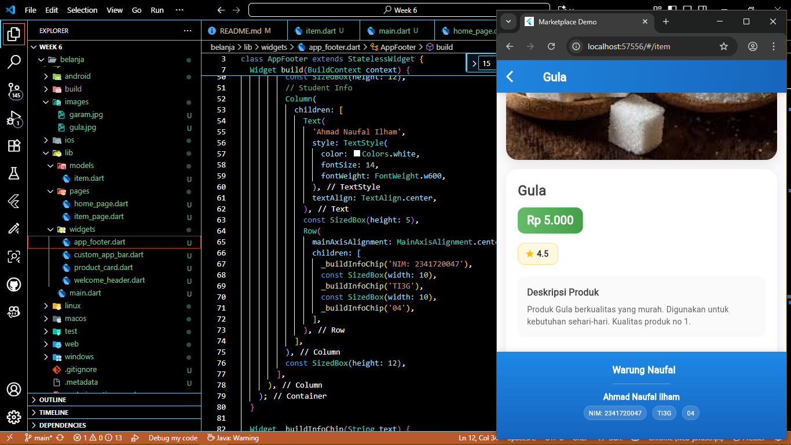


# Soal 6
Selesaikan Praktikum 5: Navigasi dan Rute tersebut. Cobalah modifikasi menggunakan plugin go_router, lalu dokumentasikan dan push ke repository Anda berupa screenshot setiap hasil pekerjaan beserta penjelasannya di file README.md. Kumpulkan link commit repository GitHub Anda kepada dosen yang telah disepakati!

``` dart
dependencies:
  flutter:
    sdk: flutter
  cupertino_icons: ^1.0.6
  go_router: ^14.2.7 # Tambahkan dependency go_router
```

**main**
``` dart
import 'package:flutter/material.dart';
import 'package:go_router/go_router.dart';

import 'models/item.dart';
import 'pages/home_page.dart';
import 'pages/item_page.dart';

// GoRouter configuration
final _router = GoRouter(
  routes: [
    GoRoute(
      path: '/',
      builder: (context, state) => HomePage(),
    ),
    GoRoute(
      path: '/item',
      builder: (context, state) {
        final item = state.extra as Item;
        return ItemPage(item: item);
      },
    ),
  ],
);

void main() {
  runApp(const MyApp());
}

class MyApp extends StatelessWidget {
  const MyApp({super.key});

  @override
  Widget build(BuildContext context) {
    return MaterialApp.router(
      debugShowCheckedModeBanner: false,
      title: 'CakraMarketplace - Go Router',
      theme: ThemeData(
        colorScheme: ColorScheme.fromSeed(seedColor: Colors.deepPurple),
        useMaterial3: true,
      ),
      routerConfig: _router, // Using go_router instead of traditional routes
    );
  }
}
```

**home_page**
``` dart
return ProductCard(
  item: item,
  onTap: () {
    context.go('/item', extra: item);
  },
);
```

**item_page**
``` dart
class ItemPage extends StatelessWidget {
  final Item item;

  const ItemPage({super.key, required this.item});

  @override
  Widget build(BuildContext context) {
    // No need for ModalRoute.of(context)!.settings.arguments
    // Item is directly available as this.item
    ...
  }
}
```

Fungsi utama go_router
- Navigasi lebih simpel → Tidak perlu Navigator.of(context).push(...), cukup pakai context.go('/path') atau context.push('/path').
- Deklaratif → Semua rute didefinisikan di awal, jadi lebih rapi.
- Mendukung URL → Bagus untuk Flutter Web, karena URL di browser bisa sinkron dengan rute.
- State restoration → Mendukung back/forward browser button.
- Nested routes → Bisa punya struktur halaman bertingkat.

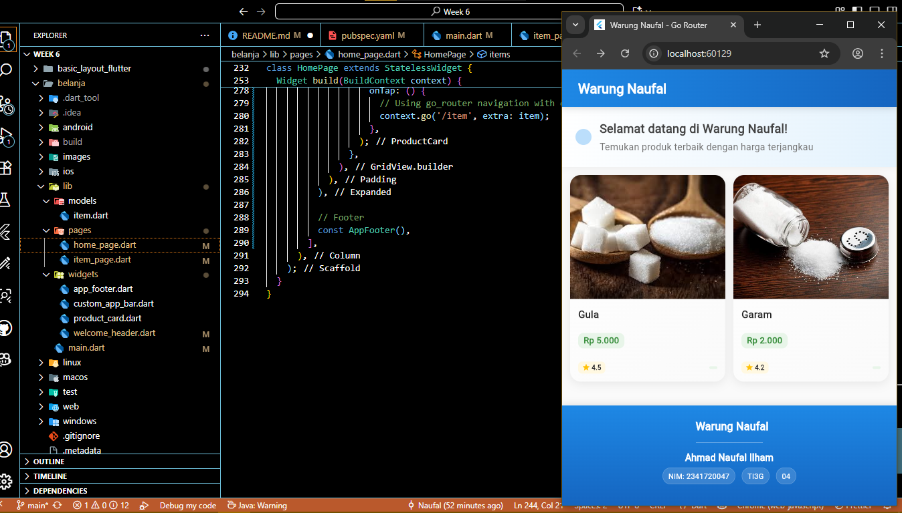