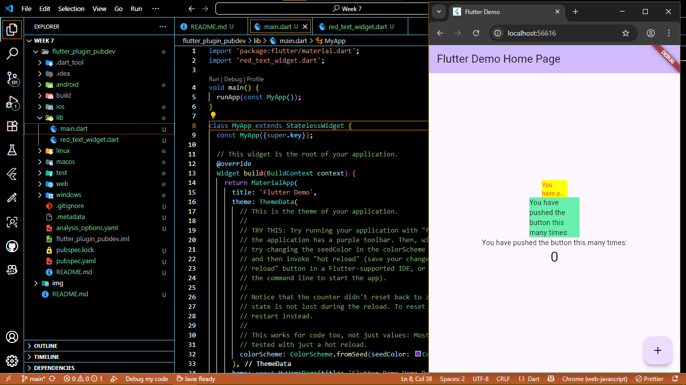

# PEMROGRAMAN DART - WEEK 7 - PRAKTIKUM

**Nama  :** Ahmad Naufal Ilham  
**NIM   :** 2341720047  
**Absen :** 04  

# Tugas Praktikum
# Soal 1
Selesaikan Praktikum tersebut, lalu dokumentasikan dan push ke repository Anda berupa screenshot hasil pekerjaan beserta penjelasannya di file README.md!

**Langkah 1**

Buatlah sebuah project flutter baru dengan nama flutter_plugin_pubdev. Lalu jadikan repository di GitHub Anda dengan nama flutter_plugin_pubdev.

**Langkah 2**

Tambahkan plugin auto_size_text menggunakan perintah berikut di terminal
``` dart
flutter pub add auto_size_text
```
Jika berhasil, maka akan tampil nama plugin beserta versinya di file pubspec.yaml pada bagian dependencies.

**Langkah 3**

Buat file baru bernama red_text_widget.dart di dalam folder lib lalu isi kode seperti berikut.
``` dart
import 'package:flutter/material.dart';

class RedTextWidget extends StatelessWidget {
  const RedTextWidget({Key? key}) : super(key: key);

  @override
  Widget build(BuildContext context) {
    return Container();
  }
}
```

**Langkah 4**

Masih di file red_text_widget.dart, untuk menggunakan plugin auto_size_text, ubahlah kode return Container() menjadi seperti berikut.
``` dart
return AutoSizeText(
      text,
      style: const TextStyle(color: Colors.red, fontSize: 14),
      maxLines: 2,
      overflow: TextOverflow.ellipsis,
);
```
Setelah Anda menambahkan kode di atas, Anda akan mendapatkan info error. Mengapa demikian? Jelaskan dalam laporan praktikum Anda!

Error 
1. The method 'AutoSizeText' isn't defined
Penyebab : Widget AutoSizeText belum di-import ke dalam file
Perbaikan :
``` dart
import 'package:auto_size_text/auto_size_text.dart';
```

2. Undefined name 'text'
Penyebab : Parameter text tidak didefinisikan dalam widget ini
Perbaikan :
``` dart
class RedTextWidget extends StatelessWidget {
  final String text;

  const RedTextWidget({Key? key, required this.text}) : super(key: key);
  // ...
}
```

**Langkah 5**

Tambahkan variabel text dan parameter di constructor seperti berikut.
``` dart
final String text;

const RedTextWidget({Key? key, required this.text}) : super(key: key);
```

**Langkah 6**

Buka file main.dart lalu tambahkan di dalam children: pada class _MyHomePageState
``` dart
Container(
   color: Colors.yellowAccent,
   width: 50,
   child: const RedTextWidget(
             text: 'You have pushed the button this many times:',
          ),
),
Container(
    color: Colors.greenAccent,
    width: 100,
    child: const Text(
           'You have pushed the button this many times:',
          ),
),
```

Output



# Soal 2
Jelaskan maksud dari langkah 2 pada praktikum tersebut!

Jawab

flutter pub add auto_size_text digunakan untuk menambahkan package (library) bernama auto_size_text ke dalam proyek Flutter secara otomatis.

- Menambahkan entri auto_size_text pada file pubspec.yaml.
- Mengunduh package dari situs resmi pub.dev.
- Menjalankan flutter pub get untuk mengintegrasikan package ke proyek.

# Soal 3
Jelaskan maksud dari langkah 5 pada praktikum tersebut!

Jawab

Langkah 5 bertujuan untuk memperbaiki error yang terjadi pada langkah 4 

- final String text;
Membuat variabel text bertipe String, yang akan menyimpan tulisan yang ingin ditampilkan oleh widget.

- const RedTextWidget({Key? key, required this.text}) : super(key: key);
Mengubah constructor menjadi const RedTextWidget({Key? key, required this.text}) agar widget dapat menerima parameter text dari parent widget


# Soal 4
Pada langkah 6 terdapat dua widget yang ditambahkan, jelaskan fungsi dan perbedaannya!

Jawab

Fungsi
1. Container Pertama (Kuning dengan RedTextWidget)
- Warna latar: Colors.yellowAccent
- Lebar: 50 piksel (cukup sempit)
- Isi: Widget RedTextWidget yang memakai AutoSizeText
- Tujuan: Menunjukkan kemampuan teks untuk menyesuaikan ukuran huruf secara otomatis
- Perilaku: Teks akan mengecil agar seluruh isi tetap terlihat di ruang sempit, dengan warna tulisan merah

2. Container Kedua (Hijau dengan Text)
- Warna latar: Colors.greenAccent
- Lebar: 100 piksel (lebih lebar dari yang pertama)
- Isi: Widget Text bawaan Flutter
- Tujuan: Sebagai perbandingan dengan teks biasa yang tidak menyesuaikan ukuran otomatis
- Perilaku: Jika teks terlalu panjang, bagian yang tidak muat akan terpotong atau meluap, menggunakan gaya standar

Perbedaan :
Container pertama secara otomatis mengatur ukuran teks agar pas di dalam ruangnya.
Container kedua tidak mengubah ukuran teks, sehingga bisa terjadi overflow jika teks terlalu panjang.

# Soal 5
Jelaskan maksud dari tiap parameter yang ada di dalam plugin auto_size_text berdasarkan tautan pada dokumentasi ini !

Jawab

- key → Kunci unik widget dalam tree (sama seperti di Text).
- textKey → Kunci yang diterapkan ke widget Text internal di dalam AutoSizeText.
- style → Mengatur gaya teks (warna, font, ukuran awal, ketebalan, dll).
- minFontSize → Ukuran font terkecil yang diizinkan agar teks tetap muat. Default: 12.
- maxFontSize → Ukuran font terbesar yang diizinkan saat teks menyesuaikan ukuran. (Akan diabaikan jika presetFontSizes digunakan.)
- stepGranularity → Langkah perubahan ukuran font saat menyesuaikan ukuran. Misal 1 berarti 20 → 19 → 18, dst.
- presetFontSizes → Daftar ukuran font tertentu yang boleh digunakan. Harus diurutkan menurun (contoh: [30, 20, 15]). Jika digunakan, maka minFontSize, maxFontSize, dan stepGranularity diabaikan.
- group → Menyinkronkan ukuran font beberapa AutoSizeText agar semua punya ukuran sama (menggunakan AutoSizeGroup).
- textAlign → Menentukan perataan teks secara horizontal (kiri, kanan, tengah, dsb).
- textDirection → Menentukan arah teks (ltr atau rtl).
- locale → Menentukan lokal (bahasa/negara) untuk rendering teks.
- softWrap → Jika true, teks akan membungkus ke baris berikutnya saat melebihi lebar. Sama seperti softWrap di Text.
- wrapWords → Jika true, kata yang panjang akan dibungkus. Jika false, kata panjang bisa meluap (overflow).
- overflow → Mengatur cara teks yang meluap ditampilkan (misal ellipsis, clip, dll).
- overflowReplacement → Widget pengganti yang ditampilkan jika teks tidak bisa muat meski sudah diperkecil.
- textScaleFactor → Faktor skala teks (misalnya untuk aksesibilitas).
- maxLines → Jumlah maksimum baris yang diizinkan untuk teks.
- semanticsLabel → Label khusus untuk pembaca layar (aksesibilitas). Bisa berbeda dari teks yang ditampilkan.

# Soal 6
Kumpulkan laporan praktikum Anda berupa link repository GitHub kepada dosen!